# C/C++ 互操作与库导出：addTranslateC 与 linkLibrary

Zig 在语言层面支持 C ABI，并在构建系统中提供了头文件转译和包含路径传播机制。

> 💡 **配套可运行示例**
> 关于 C/C++ 源码混合编译与 `addTranslateC` 的完整工程实现，可参考 GitHub 示例：[`examples/02-mixed-c-zig`](https://github.com/jiacai2050/x/tree/main/zig-build/examples/02-mixed-c-zig)，以及后续实战章节 [实战二：Zig 与 C/C++ 混合编程工程结构](../practices/practice-mixed-c-zig.md)。

---

## 1. 显式头文件转译：`b.addTranslateC`

早期 Zig 曾允许在源码中使用 `@cImport` 隐式转译 C 头文件，但该机制会导致编译期语义分析与宿主环境发生隐式绑定。随着构建系统架构的解耦，Zig 已完全移除了语言内置的 `@cImport` 原语。所有 C 头文件的转译均由构建脚本通过 `b.addTranslateC` 显式定义为独立 Step，并将转译产物作为模块注入业务源码。

```mermaid
graph LR
    H_File["C 头文件 (*.h)"]
    TC_Step["b.addTranslateC 步骤<br/>- 包含路径与宏定义<br/>- 目标平台 target"]
    Z_AST["转译生成的 Zig 源码<br/>.zig-cache/o/.../c.zig"]
    Mod["translate_c.createModule()<br/>导出 Zig Module"]
    Exe["exe.root_module.addImport('c', mod)"]
    Code["Zig 业务代码: const c = @import('c')"]

    H_File --> TC_Step
    TC_Step -- "执行转译" --> Z_AST
    Z_AST --> Mod
    Mod --> Exe
    Exe --> Code

    classDef default stroke:#495057;
    style H_File stroke:#ff9900,stroke-width:2px;
    style TC_Step stroke:#0066cc,stroke-width:2px;
    style Z_AST stroke:#ffc107,stroke-width:2px;
    style Mod stroke:#009900,stroke-width:2px;
    style Exe stroke:#495057,stroke-width:2px;
    style Code stroke:#495057,stroke-width:2px;
```



### 使用范式：

```zig
// 1. 声明 TranslateC 头文件转译步骤
const translate_c = b.addTranslateC(.{
    .root_source_file = b.path("include/my_c_lib.h"),
    .target = target,
    .optimize = optimize,
});

// 为转译步骤添加头文件包含路径
translate_c.addIncludePath(b.path("include"));

// 2. 将转译结果封装为 Zig 模块
const c_module = translate_c.createModule();

// 3. 将转译后的模块挂载至主程序
exe.root_module.addImport("c", c_module);
```

### 使用 `addTranslateC` 的优势：
1. **独立缓存**：转译结果写入 `.zig-cache/o/`，头文件未修改时不会重复转译；
2. **多模块共享**：同一个转译出的 `c_module` 可供给多个子模块同时导入；
3. **统一编译器配置**：与工程共享相同的目标架构、编译宏与包含路径。

---

## 2. 头文件自动传播机制：`linkLibrary`

当将 C 源码打包为静态库供下游使用时，下游通常需要同时引入头文件搜索路径。

Zig 的 `linkLibrary` 具备自动传播头文件包含路径的能力。查看 [lib/std/Build/Module.zig:L537-L553](https://codeberg.org/ziglang/zig/src/tag/0.17.0/lib/std/Build/Module.zig#L537-L553)：

```zig
// 摘自 lib/std/Build/Module.zig:L537-L553
fn linkLibraryOrObject(m: *Module, other: *Step.Compile) void {
    const allocator = m.owner.allocator;
    _ = other.getEmittedBin();

    m.link_objects.append(allocator, .{ .other_step = other }) catch @panic("OOM");
    // 自动将静态库导出的头文件树追加到当前模块的包含路径中
    m.include_dirs.append(allocator, .{ .other_step = other }) catch @panic("OOM");
}
```

当调用 `linkLibrary` 时，该库包含的公共头文件路径会自动注入到当前模块中，下游不需要再针对该库重复调用 `addIncludePath`。

---

## 3. 模块级 C/C++ 与平台配置

除了基础的 C 源码挂载与头文件包含，`std.Build.Module` 还内置了一系列细粒度的编译配置 API：

### 3.1 预处理宏直接注入：`addCMacro`
当只需配置少量编译宏，无需生成 CMake 风格的 `config.h` 时，可通过 [lib/std/Build/Module.zig:L530](https://codeberg.org/ziglang/zig/src/tag/0.17.0/lib/std/Build/Module.zig#L530) 注入预处理宏：

```zig
module.addCMacro("SQLITE_ENABLE_JSON1", "1");
module.addCMacro("BUFFER_SIZE", "4096");
```

### 3.2 独立汇编源文件挂载：`addAssemblyFile`
在加密算法、操作系统内核或 SIMD 高性能计算中，经常包含单独编写的手写汇编文件（`.s` 或 `.S`）。通过 [lib/std/Build/Module.zig:L442](https://codeberg.org/ziglang/zig/src/tag/0.17.0/lib/std/Build/Module.zig#L442) 直接挂载：

```zig
module.addAssemblyFile(b.path("src/asm/sha256_avx2.s"));
```

### 3.3 macOS 系统 Framework 链接：`linkFramework`
在 macOS / iOS 平台开发图形、音频或系统工具时，常需链接 Apple 官方的系统框架（如 `Metal`、`Cocoa`、`IOKit`）。通过 [lib/std/Build/Module.zig:L374](https://codeberg.org/ziglang/zig/src/tag/0.17.0/lib/std/Build/Module.zig#L374) 声明链接：

```zig
if (target.result.os.tag.isDarwin()) {
    module.linkFramework("Metal", .{ .needed = true });
    module.linkFramework("Cocoa", .{});
}
```

### 3.4 Windows 资源文件编译嵌入：`addWin32ResourceFile`
在 Windows 平台上分发桌面软件时，必须嵌入包含软件图标（Icon）、版本声明（Version Info）以及高 DPI / UAC 清单的 `.rc` 脚本。通过 [lib/std/Build/Module.zig:L429](https://codeberg.org/ziglang/zig/src/tag/0.17.0/lib/std/Build/Module.zig#L429) 自动调用内置工具链编译并打包进二进制：

```zig
if (target.result.os.tag == .windows) {
    module.addWin32ResourceFile(.{
        .file = b.path("res/app.rc"),
    });
}
```

---

## 4. 上游导出与下游消费范式

### 4.1 上游库导出头文件与 Artifact
库提供方在构建静态库时，将静态头文件目录及动态生成的配置头安装到该产物中：

```zig
// 上游库 build.zig
const lib = b.addLibrary(.{
    .name = "foo",
    .linkage = .static,
    .root_module = b.createModule(.{
        .target = target,
        .optimize = optimize,
    }),
});

// 1. 导出静态公共头文件目录
lib.installHeadersDirectory(b.path("include"), "", .{});

// 2. 导出动态生成的配置头文件
lib.installConfigHeader(config_h);

// 3. 导出库产物供下游消费
b.installArtifact(lib);
```

### 4.2 下游消费场景

#### 场景 A：下游是 C/Zig 混编工程（直接链接）
```zig
// 下游依赖项目 build.zig
const foo_dep = b.dependency("foo", .{ .target = target, .optimize = optimize });
const foo_lib = foo_dep.artifact("foo");

// 链接静态库，并自动继承其导出的头文件路径
exe.root_module.linkLibrary(foo_lib);
```
下游的 C 源文件可直接 `#include <foo.h>`。

#### 场景 B：下游是纯 Zig 工程（配合 `addTranslateC`）
纯 Zig 项目通过 `addTranslateC` 转译头文件时，由于转译属于前置步骤，需先从上游库产物中提取头文件树路径：

```zig
// 1. 提取静态库导出的头文件树
const lib_artifact = foo_dep.artifact("foo");
translate_c.addIncludePath(lib_artifact.getEmittedIncludeTree());

// 2. 将转译后的头文件模块导入 Zig 源码
exe.root_module.addImport("foo", translate_c.createModule());

// 3. 链接静态库二进制
exe.root_module.linkLibrary(lib_artifact);
```

> **注意**：`addTranslateC` 仅生成符号声明（`extern fn`）。如果只添加了模块导入而未通过 `linkLibrary` 链接静态库，链接阶段会报符号未定义错误（`undefined reference`）。

---

## 5. C 互操作的优势与限制

### 5.1 包含路径传播与转译缓存

Zig 在处理 C 代码互操作时有以下机制：
- **包含树自动传播**：调用 `exe.root_module.linkLibrary(foo_lib)` 时，构建系统会自动将 `foo_lib` 导出的头文件路径追加到当前模块中，减少了重复配置搜索路径的负担；
- **转译结果独立缓存**：`addTranslateC` 作为独立的 Step 节点运行，转译生成的 Zig AST 享受构建系统的哈希缓存，避免了每次构建重复解析大型 C 头文件。

### 5.2 局限与不足

1. **复杂宏转译受限**：
   C 预处理器基于文本替换，而 Zig 语法要求严格的静态类型。当 C 头文件中包含复杂变参宏、GCC 语句表达式扩展 `({ ... })` 或指针操作宏时，`translate-c` 往往无法自动生成对应的 Zig 代码，而是输出 `@compileError("unable to translate macro: ...")`。遇到此类宏时，通常需要编写 `shim.h` 过滤或手动补充 Zig 接口声明；
2. **不支持转译 C++ 头文件**：
   虽然 Zig 内置的 Clang 可以编译 `.cpp` 源文件，但 `addTranslateC` **不支持 C++ 头文件**（无法解析类结构、模板、重载等特性）。在 Zig 中使用 C++ 库时，仍需在 C++ 侧编写基于 `extern "C"` 的纯 C ABI 包装层。
