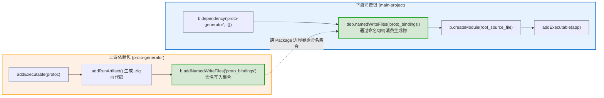

# 代码生成与配置注入：ConfigHeader、Options、WriteFiles 与 UpdateSourceFiles

构建系统除了编译源码，通常还需要动态生成中间代码、渲染平台配置文件（如 CMake 模板）、跨依赖边界共享生成物，以及将 Golden File 回写到版本库中。Zig 标准库提供了一整套基于 DAG 数据流的代码生成与同步 API。

> 💡 **配套可运行示例**
> 本章中关于 `addConfigHeader`（CMake 模板渲染）和 `addWriteFiles`（动态源码生成）的完整可运行代码位于 GitHub：[`examples/03-code-generation`](https://github.com/jiacai2050/x/tree/main/zig-build/examples/03-code-generation)。
> 你可以进入该目录验证构建期代码生成：
> ```bash
> cd examples/03-code-generation
> zig build run
> ```

---

## 1. 配置头文件生成：`b.addConfigHeader`

在 C/C++ 库移植或混合编程中，项目通常依赖 CMake 的 `configure_file(config.h.in config.h)` 根据编译平台宏替换变量。Zig 通过 [lib/std/Build/Step/ConfigHeader.zig](https://codeberg.org/ziglang/zig/src/tag/0.17.0/lib/std/Build/Step/ConfigHeader.zig#L1-L70) 的 `b.addConfigHeader` 提供了原生替代方案，无需在宿主机安装 CMake 或 Python 解释器。

### 1.1 核心用法

```zig
// 1. 声明 ConfigHeader 步骤
const config_h = b.addConfigHeader(
    .{
        .style = .{ .cmake = b.path("include/config.h.in") },
        .include_path = "config.h",
    },
    .{
        // 布尔值：生成 #define HAVE_UNISTD_H 1 或 /* #undef HAVE_UNISTD_H */
        .HAVE_UNISTD_H = target.result.os.tag != .windows,
        .HAVE_PTHREAD = true,

        // 数值类型：生成 #define SIZEOF_SIZE_T 8
        .SIZEOF_SIZE_T = @as(i64, target.result.ptrBitWidth() / 8),

        // 字符串：生成 #define DEFAULT_CHARSET "utf8mb4"
        .DEFAULT_CHARSET = "utf8mb4",
    },
);

// 2. 安装到库产物中，或作为包含路径传递给下游模块
lib.installConfigHeader(config_h);
```

### 1.2 关键特性
- **支持标准 CMake 模板语法**：自动解析 `#cmakedefine VAR`、`#cmakedefine01 VAR` 和 `@VAR@`，并替换为对应的 C 宏定义；
- **强类型编译期检查**：所有宏替换值均通过 Zig 匿名结构体传入，编译器在构建配置阶段进行严格类型校验。

---

## 2. 动态生成文件集合：`b.addWriteFiles`

当构建过程中需要动态拼装源码片段、聚合多个输入文件、或者生成包含构建元数据的 `.zig` 文件时，使用 `b.addWriteFiles`。

### 场景一：生成构建期版本与元数据
```zig
const write_files = b.addWriteFiles();

// 在构建缓存中动态生成 version.zig
const version_zig = write_files.add("version.zig", b.fmt(
    \\pub const app_name = "CodegenDemo";
    \\pub const version = "{s}";
    \\pub const build_mode = "{s}";
    ,
    .{ "1.0.0", @tagName(optimize) },
));

// 作为内部模块提供给主程序直接导入
const version_mod = b.createModule(.{
    .root_source_file = version_zig,
});
exe.root_module.addImport("version", version_mod);
```

### 场景二：聚合文件或复制物理文件到虚拟根目录
```zig
const asset_pack = b.addWriteFiles();
// 复制物理文件到虚拟集合
_ = asset_pack.addCopyFile(b.path("assets/icon.png"), "icon.png");
// 动态写入文本内容
_ = asset_pack.add("manifest.txt", "name=my_app\nversion=1.0.0\n");

// 获取整个虚拟根目录对应的 LazyPath
const assets_dir = asset_pack.getDirectory();
```

---

## 3. 强类型配置常量注入：`b.addOptions`

在纯 Zig 项目中，若需要将构建期配置（如语义化版本、Git Commit Hash、编译模式、Feature Flags）注入到源代码中，手动使用 `addWriteFiles` 拼接 Zig 字符串容易出现转义或类型拼写错误。

Zig 标准库在 [lib/std/Build/Step/Options.zig:L1-L490](https://codeberg.org/ziglang/zig/src/tag/0.17.0/lib/std/Build/Step/Options.zig#L1-L490) 中提供了类型安全的专用步骤 `b.addOptions`。

### 3.1 核心用法

```zig
const std = @import("std");

pub fn build(b: *std.Build) void {
    const target = b.standardTargetOptions(.{});
    const optimize = b.standardOptimizeOption(.{});

    // 1. 声明强类型选项步骤
    const options = b.addOptions();

    // 注入基本标量类型
    options.addOption([]const u8, "version", "1.2.0");
    options.addOption(bool, "enable_logging", true);
    options.addOption(u32, "max_connections", 1024);

    // 注入标准语义化版本
    options.addOption(std.SemanticVersion, "semver", .{ .major = 1, .minor = 2, .patch = 0 });

    // 注入枚举或自定义结构体
    const Environment = enum { development, staging, production };
    options.addOption(Environment, "env", .production);

    // 注入带自动依赖追踪的文件路径 (自动建立 DAG 依赖边)
    options.addOptionPath("default_config_path", b.path("config/default.json"));

    // 2. 将选项模块直接注入至应用程序中
    const exe = b.addExecutable(.{
        .name = "app",
        .root_module = b.createModule(.{
            .root_source_file = b.path("src/main.zig"),
            .target = target,
            .optimize = optimize,
        }),
    });

    // 挂载为名为 "build_options" 的内部模块
    exe.root_module.addOptions("build_options", options);
    b.installArtifact(exe);
}
```

### 3.2 业务源码中直接导入

在 `src/main.zig` 中，直接以模块名导入并使用强类型的编译期常量：

```zig
const std = @import("std");
const build_options = @import("build_options");

pub fn main() void {
    std.debug.print("App Version: {s} (SemVer: {})\n", .{
        build_options.version,
        build_options.semver,
    });

    if (build_options.enable_logging) {
        std.debug.print("Logging is enabled for environment: {s}\n", .{
            @tagName(build_options.env),
        });
    }
}
```

### 3.3 核心优势
1. **编译期严格类型保障**：键值对全部经过 Zig 编译器的类型系统检查，杜绝文本拼接引起的语法错误；
2. **文件依赖自动追踪（`addOptionPath`）**：使用 `options.addOptionPath` 传入 `LazyPath` 时，构建系统会自动将该文件作为依赖项挂载。当该外部文件被修改时，构建图能准确感知并触发重编。

---

## 4. 跨包动态生成物共享：`addNamedWriteFiles`

在模块化工程中，经常需要由上游依赖包通过自定义工具生成代码（如 Protocol Buffers、RPC 桩代码或 SQL 结构体），下游项目直接导入这些生成物。

传统做法往往需要下游直接引用上游的磁盘缓存路径，容易出现硬编码和并发读写冲突。Zig 通过 [lib/std/Build.zig:L862-L880](https://codeberg.org/ziglang/zig/src/tag/0.17.0/lib/std/Build.zig#L862-L880) 的 `addNamedWriteFiles` 与 [lib/std/Build.zig:L1880-L1895](https://codeberg.org/ziglang/zig/src/tag/0.17.0/lib/std/Build.zig#L1880-L1895) 的 `dep.namedWriteFiles` 支持跨包声明式共享生成文件。

### 4.1 跨包命名导出与消费模式



### 4.2 完整代码实现范式

**上游库（`proto-generator/build.zig`）命名导出：**
```zig
const std = @import("std");

pub fn build(b: *std.Build) void {
    // 1. 构建并运行 IDL 代码生成工具
    const protoc_exe = b.addExecutable(.{
        .name = "protoc",
        .root_module = b.createModule(.{
            .root_source_file = b.path("src/compiler.zig"),
            .target = b.graph.host,
            .optimize = .ReleaseFast,
        }),
    });
    const run_protoc = b.addRunArtifact(protoc_exe);
    const generated_msg = run_protoc.addOutputFileArg("messages.zig");

    // 2. 将生成的文件放入具有全局命名标识的 WriteFiles 步骤中
    const named_files = b.addNamedWriteFiles("proto_bindings");
    _ = named_files.addCopyFile(generated_msg, "messages.zig");
}
```

**下游项目（`main-project/build.zig`）跨包消费：**
```zig
const std = @import("std");

pub fn build(b: *std.Build) void {
    const target = b.standardTargetOptions(.{});
    const optimize = b.standardOptimizeOption(.{});

    // 1. 获取上游依赖
    const proto_dep = b.dependency("proto-generator", .{});

    // 2. 声明式获取上游导出的命名集合
    const proto_files = proto_dep.namedWriteFiles("proto_bindings");
    const msg_zig = proto_files.files.get("messages.zig").?;

    // 3. 基于上游动态产物组装模块
    const msg_module = b.createModule(.{
        .root_source_file = msg_zig,
        .target = target,
        .optimize = optimize,
    });

    // 4. 主应用程序直接导入该模块
    const exe = b.addExecutable(.{
        .name = "app",
        .root_module = b.createModule(.{
            .root_source_file = b.path("src/main.zig"),
            .target = target,
            .optimize = optimize,
            .imports = &.{
                .{ .name = "proto_messages", .module = msg_module },
            },
        }),
    });
    b.installArtifact(exe);
}
```

> 💡 **说明**：
> 命名写入集合将跨包文件引用收敛为显式导出，同时将依赖关系注册到 DAG 中：下游编译步骤会自动等待上游代码生成完成。

---

## 5. 源码树同步回写模式：`b.addUpdateSourceFiles`

### 5.1 适用场景与工程权衡（Golden File 模式）

大多数代码生成操作（如 `addConfigHeader` 或 `addWriteFiles`）生成的都是临时中间文件，存放在 `.zig-cache/` 中。但在以下场景中，通常需要将生成代码**提交到 Git 源码树**：

1. **避免构建机依赖复杂工具**：生成代码由特定主机工具产出（如复杂 IDL 编译器），预先提交生成文件可免去其他环境安装该工具的负担；
2. **源码可读性与 IDE 补全**：方便在编辑器中直接跳转到生成代码的定义；
3. **自举编译器构建（Bootstrapping）**：例如 Zig 自身构建 WASM 编译器时，通过生成产物直接覆盖 `stage1/zig1.wasm` 并提交到版本库。

### 5.2 核心实现范式

严禁在 `build(b)` 的配置期直接通过 `std.fs.cwd().writeFile()` 篡改源码，这会引发配置缓存污染和文件竞争。

标准方案是使用 [lib/std/Build/Step/UpdateSourceFiles.zig:L1-L60](https://codeberg.org/ziglang/zig/src/tag/0.17.0/lib/std/Build/Step/UpdateSourceFiles.zig#L1-L60) 的专用步骤：

```zig
const std = @import("std");

pub fn build(b: *std.Build) void {
    const target = b.standardTargetOptions(.{});
    const optimize = b.standardOptimizeOption(.{});

    // 1. 声明代码生成步骤（运行外部工具或 Zig 生成程序）
    const generator = b.addExecutable(.{
        .name = "table_gen",
        .root_module = b.createModule(.{
            .root_source_file = b.path("tools/table_gen.zig"),
            .target = b.graph.host,
            .optimize = .ReleaseSafe,
        }),
    });
    const run_gen = b.addRunArtifact(generator);
    const generated_table = run_gen.addOutputFileArg("lookup_table.zig");

    // 2. 声明专用回写步骤：Step.UpdateSourceFiles
    const update_source = b.addUpdateSourceFiles();
    // 将缓存中生成的文件回写至源码树中的 "src/generated/lookup_table.zig"
    update_source.addCopyFileToSource(generated_table, "src/generated/lookup_table.zig");

    // 3. 注册顶层命令："zig build update"
    const update_step = b.step("update", "Regenerate code and write back to src/ repository");
    update_step.dependOn(&update_source.step);

    // 4. 常规构建直接使用已在源码树中存在的稳定文件
    const exe = b.addExecutable(.{
        .name = "app",
        .root_module = b.createModule(.{
            .root_source_file = b.path("src/main.zig"),
            .target = target,
            .optimize = optimize,
        }),
    });
    b.installArtifact(exe);
}
```

> 💡 **提示**：
> 常规执行 `zig build` 时不会触发 `update` 步骤；只有在协议定义或数据表更新时，才执行 `zig build update` 显式生成并提交到版本库。

---

## 6. 防御性配置缓存细粒度追踪：`dependOnFileContents`

如果构建配置逻辑（`build.zig` 函数体内部）需要直接读取外部文件（例如项目根目录下的 `VERSION` 文件或配置文件）来决定编译参数，必须向构建引擎显式声明依赖，防止配置缓存产生静默过时：

```zig
const version_path = b.path("VERSION");

// 1. 显式告知构建系统配置期依赖该文件的内容哈希
b.dependOnFileContents(version_path);

// 2. 其它细粒度声明 API
b.dependOnFileMetadata(b.path("assets/logo.png"));    // 仅依赖文件元数据 (inode/mtime/size)
b.dependOnDirectoryContents(b.path("plugins/"));     // 依赖目录下所有文件内容
b.dependOnDirectoryMetadata(b.path("templates/"));   // 仅依赖目录元数据 (增删文件)
```

通过显式声明，`Maker` 会将这些文件或目录的哈希纳入配置缓存凭据（Configure Cache Digest）。只要外部文件未发生修改，配置缓存继续命中，直接跳过 `configurer` 进程。

---

## 7. 内置生成机制与局限分析

### 7.1 优势
1. **基于 LazyPath 的增量构建**：生成文件输出到 `.zig-cache/` 的内容寻址路径中，仅当输入发生改变时才重新执行生成步骤；
2. **无需外部脚本环境**：内置模板渲染与 Zig 动态拼接，无需在构建机安装 Python、CMake 或 Bash 环境；
3. **时序与数据流依赖明确**：调度器根据路径依赖自动编排拓扑顺序，避免并发构建下的文件读写冲突。

### 7.2 局限与工程建议
1. **模板语法支持有限**：`addConfigHeader` 目前主要支持常见 CMake 宏模式（`#cmakedefine` 等）；若 C 库采用 Autotools 风格的宏替换（依赖 `#undef`），通常需要先整理为 `.h.in` 模板；
2. **生成代码调试定位**：通过 `write_files.add` 拼装的 Zig 源码在报错时指向缓存目录下的临时文件，排查类型错误时链路较长；对于核心逻辑，建议优先使用静态 Zig 代码结合编译期泛型（Comptime），减少纯文本拼接。
