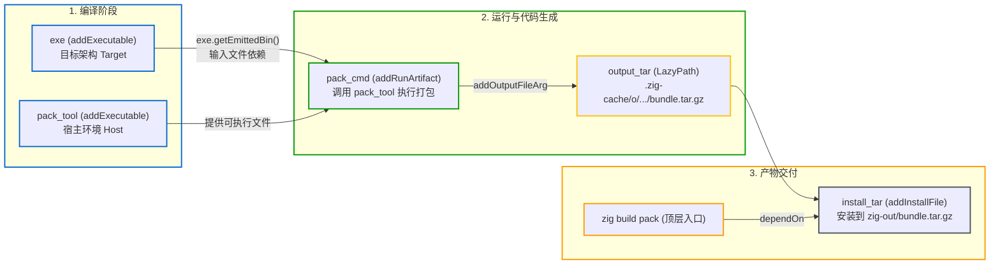

# 编写辅助工具与扩展构建管线：从自定义 Step 到 Host Tool

当内置的 Step（如编译、代码生成等）无法满足特定任务（如打包发布归档、校验自定义元数据、生成格式化资产等）时，需要对构建管线进行扩展。

> 💡 **配套可运行示例**
> 本章对应的完整工程代码位于 GitHub：[`examples/05-custom-step`](https://github.com/jiacai2050/x/tree/main/zig-build/examples/05-custom-step)。
> 你可以进入该目录体验 Host 辅助工具与打包管线：
> ```bash
> cd examples/05-custom-step
> zig build pack
> zig build run
> ```

---

## 1. 架构设计：为什么采用 Host Tool 模式？

在早期版本中，扩展构建流程通常是在 `build.zig` 内部定义一个结构体，内嵌 `std.Build.Step` 并实现 `makeFn` 回调函数指针，借助 `@fieldParentPtr` 实现内联多态。

在 Maker 与 Configurer 双进程架构下，扩展构建管线的标准做法是采用 Host Tool 模式：

```mermaid
flowchart TD
    subgraph Legacy ["旧方式：内联 makeFn (已废弃)"]
        L_Build["build.zig: 定义结构体内联 makeFn"]
        L_Runner["单体 build_runner 与 build.zig 编在同一进程"]
        L_Call["调度器直接在内存中调用函数指针 step.makeFn()"]
        L_Build --> L_Runner --> L_Call
    end

    subgraph Modern ["标准模式：Host Tool + Run Step"]
        M_Tool["编写独立辅助工具: tools/pack.zig"]
        M_Conf["build.zig (configurer 进程):<br/>声明构建图并由 b.addExecutable 编译 Host 工具"]
        M_Run["b.addRunArtifact(pack_tool):<br/>将工具作为独立任务节点编排进 DAG"]
        M_Maker["Maker 进程 (ReleaseSafe):<br/>调度执行工具并享受增量缓存与输出追踪"]

        M_Tool --> M_Conf
        M_Conf --> M_Run --> M_Maker
    end

    style Legacy stroke:#dc3545,stroke-width:2px;
    style Modern stroke:#009900,stroke-width:2px;
    style L_Build stroke:#ff9900,stroke-width:2px;
    style L_Runner stroke:#495057,stroke-width:2px;
    style L_Call stroke:#dc3545,stroke-width:2px;
    style M_Tool stroke:#ff9900,stroke-width:2px;
    style M_Conf stroke:#0066cc,stroke-width:2px;
    style M_Run stroke:#009900,stroke-width:2px;
    style M_Maker stroke:#009900,stroke-width:2px;
```



### 设计原因：
1. **物理进程隔离与序列化**：
   `build.zig` 运行在生命周期极短的 `configurer` 进程中，其任务仅是把构建图序列化为紧凑二进制流写给 `Maker` 进程随后退出。**内存函数指针无法跨进程传输**，因此 `Step` 移除了 `makeFn` 字段；
2. **纯函数配置期与缓存命中**：
   把繁重的执行逻辑剥离出 `build.zig`，使得配置阶段能够保持绝对的纯函数性，从而在没有变动时直接命中配置缓存，跳过 `configurer` 进程；
3. **更高的执行性能**：
   辅助工具可以用 `-O ReleaseSafe` 甚至 `-O ReleaseFast` 独立编译并缓存，在执行大型打包或高密度计算时显著快于以 Debug 模式解释执行的内联脚本。

---

## 2. 标准实践：基于 `std.tar` + `std.compress` 的打包工具

下面以实现一个“将编译好的二进制程序打包为 `.tar.gz` 发布归档”为例，展示标准的扩展模式。

### 2.1 第一步：编写独立打包工具（`tools/pack.zig`）

Zig 标准库内置了流式 Tar 归档与 Gzip 压缩器，无需调用宿主系统的 `tar` 命令：

```zig
// 打包辅助工具 tools/pack.zig
const std = @import("std");

pub fn main(init: std.process.Init) !void {
    const io = init.io;
    const allocator = init.arena.allocator();

    var it = init.minimal.args.iterate();
    _ = it.next(); // 跳过可执行文件自身路径 argv[0]
    const input_path = it.next() orelse return error.MissingInputPath;
    const output_path = it.next() orelse return error.MissingOutputPath;

    std.debug.print("Packaging release archive: {s} -> {s}\n", .{ input_path, output_path });

    // 1. 创建目标输出 tar.gz 文件
    const cwd = std.Io.Dir.cwd();
    if (std.fs.path.dirname(output_path)) |dir| {
        cwd.createDirPath(io, dir) catch {};
    }
    const tar_file = try cwd.createFile(io, output_path, .{});
    defer tar_file.close(io);

    // 2. 构造流式文件写入器
    var write_buffer: [4096]u8 = undefined;
    var file_writer = std.Io.File.Writer.initStreaming(tar_file, io, &write_buffer);

    // 3. 构造 gzip 压缩器
    var compress_buffer: [std.compress.flate.max_window_len]u8 = undefined;
    var compressor = try std.compress.flate.Compress.init(
        &file_writer.interface,
        &compress_buffer,
        .gzip,
        std.compress.flate.Compress.Options.default,
    );

    // 4. 构造基于压缩流的 tar 打包器
    var tar_writer: std.tar.Writer = .{ .underlying_writer = &compressor.writer };

    // 5. 打开待打包的输入二进制文件并写入 tar
    const bin_file = try cwd.openFile(io, input_path, .{});
    defer bin_file.close(io);

    var read_buffer: [4096]u8 = undefined;
    var bin_reader = std.Io.File.Reader.init(bin_file, io, &read_buffer);

    const bin_name = std.fs.path.basename(input_path);
    const tar_entry_path = try std.fmt.allocPrint(allocator, "bin/{s}", .{bin_name});

    try tar_writer.writeFile(tar_entry_path, &bin_reader, 0);
    try tar_writer.finishPedantically();

    // 6. 结束压缩并刷新缓冲区
    try compressor.finish();
    try file_writer.flush();

    std.debug.print("Successfully created {s}!\n", .{output_path});
}
```

---

### 2.2 第二步：在 `build.zig` 中编排构建管线

在项目的 `build.zig` 中，通过 `b.addExecutable` 将该工具编译为**宿主机本地执行程序**，并通过 `addRunArtifact` 接入构建拓扑：

```zig
// 编排逻辑 build.zig
const std = @import("std");

pub fn build(b: *std.Build) void {
    const target = b.standardTargetOptions(.{});
    const optimize = b.standardOptimizeOption(.{});

    // 1. 构建主应用程序
    const exe = b.addExecutable(.{
        .name = "custom_step_demo",
        .root_module = b.createModule(.{
            .root_source_file = b.path("src/main.zig"),
            .target = target,
            .optimize = optimize,
        }),
    });
    b.installArtifact(exe);

    // 2. 编译专用于宿主机的打包辅助工具（必须为 b.graph.host）
    const pack_tool = b.addExecutable(.{
        .name = "pack_tool",
        .root_module = b.createModule(.{
            .root_source_file = b.path("tools/pack.zig"),
            .target = b.graph.host, // 针对当前宿主机编译，必须可直接执行
            .optimize = .ReleaseSafe,
        }),
    });

    // 3. 配置运行步骤与数据流依赖
    const pack_cmd = b.addRunArtifact(pack_tool);
    // 传入主程序二进制 LazyPath 作为命令行输入
    pack_cmd.addFileArg(exe.getEmittedBin());
    // 声明工具生成的 tar.gz 输出文件（返回 LazyPath）
    const output_tar = pack_cmd.addOutputFileArg("bundle.tar.gz");

    // 4. 将打包好的归档安装到交付目录（zig-out/bundle.tar.gz）
    const install_tar = b.addInstallFile(output_tar, "bundle.tar.gz");

    // 5. 注册顶层命令："zig build pack"
    const top_pack = b.step("pack", "Package distribution archive into tar.gz using helper tool");
    top_pack.dependOn(&install_tar.step);

    // 6. 支持 "zig build run"
    const run_cmd = b.addRunArtifact(exe);
    run_cmd.step.dependOn(b.getInstallStep());
    run_cmd.addPassthruArgs();

    const run_step = b.step("run", "Run demo app");
    run_step.dependOn(&run_cmd.step);
}
```

### 依赖关系与数据流转：



---

## 3. 运行宿主系统已有命令（`addSystemCommand`）

若任务涉及调用宿主系统预装的工具（如 `git` 获取版本、调用外部 `codesign` 对二进制签名等），可以使用 `b.addSystemCommand`：

```zig
// 运行宿主系统已有命令
const sign_cmd = b.addSystemCommand(&.{
    "codesign",
    "--force",
    "--sign",
    "-",
});
// 将待签名二进制文件的 LazyPath 作为输入参数
sign_cmd.addFileArg(exe.getEmittedBin());

// 建立显式依赖：先编译完成主程序
sign_cmd.step.dependOn(&exe.step);
```

> **注意**：调用系统外部命令时，应尽量使用 `sign_cmd.addFileArg` 传递文件路径，以便构建系统正确记录文件依赖与变动追踪。

---

## 4. 核心设计原则与最佳实践

1. **宿主机目标明确（`b.graph.host`）**：
   在交叉编译场景中（例如在 macOS 上构建 Linux ARM64 程序），主程序 `exe` 的目标是 `-Dtarget=aarch64-linux`，但构建辅助工具 `pack_tool` 必须运行在 macOS 宿主机上。因此编写辅助工具时，其 target 必须显式指定为 `b.graph.host`；
2. **通过 `addOutputFileArg` 自动捕获生成物**：
   使用 `pack_cmd.addOutputFileArg("bundle.tar.gz")` 会自动在缓存目录中分配一个唯一的文件路径并传给辅助工具，返回的 `LazyPath` 可以直接安全地传递给 `b.addInstallFile`，兼顾增量缓存与安装路径定制；
3. **保持 `build.zig` 纯净**：
   尽量避免在 `build.zig` 的配置阶段做繁重的文件读写或同步子进程派生，把实际的业务逻辑下沉到由 `addRunArtifact` 调度的辅助工具中，保证构建图配置可被长期复用。
