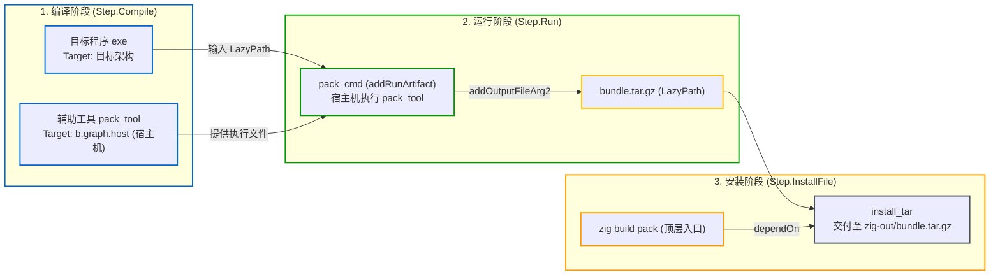

# 编写自定义 Step：扩展构建管线

当标准库内置的编译、测试和安装等 Step 无法覆盖所有构建任务时（例如：调用系统工具生成元数据、转换特定二进制格式、打包发布归档等），需要向构建图中接入自定义任务。

在 Zig 中，自定义任务主要通过 `Step.Run` 接入计算图。根据任务的复杂度与跨平台要求，通常有两种实现方式：
1. **直接运行宿主系统已有命令（`b.addSystemCommand`）**：调用系统预装的工具；
2. **编写自包含的辅助构建工具（Host Tool 模式）**：使用 Zig 编写专用工具，由构建系统自动编译为宿主机可执行程序并运行。

> 💡 **配套可运行示例**
> 本章对应的完整工程代码位于 GitHub：[`examples/05-custom-step`](https://github.com/jiacai2050/x/tree/main/zig-build/examples/05-custom-step)。
> 你可以进入该目录体验 Host 辅助工具与打包管线：
> ```bash
> cd examples/05-custom-step
> zig build pack
> zig build run
> ```

---

## 1. 方式一：运行宿主系统已有命令（`b.addSystemCommand`）

如果构建任务只需调用操作系统中已有的标准命令行工具（如 `git`、`tar` 或代码签名工具），可以使用 `b.addSystemCommand`。

### 1.1 基础用法

```zig
// 1. 声明执行系统命令
const sign_cmd = b.addSystemCommand(&.{
    "codesign",
    "--force",
    "--sign",
    "-",
});

// 2. 将待签名二进制文件的 LazyPath 作为命令行参数传入
sign_cmd.addFileArg(exe.getEmittedBin());

// 3. 建立显式依赖：必须先完成可执行文件的编译
sign_cmd.step.dependOn(&exe.step);

// 4. 注册顶层命令："zig build sign"
const sign_step = b.step("sign", "Sign the binary using system codesign");
sign_step.dependOn(&sign_cmd.step);
```

### 1.2 参数与文件传递
- **字面量参数**：通过 `sign_cmd.addArgs(&.{ "--verbose", "--deep" })` 追加固定参数；
- **文件路径参数**：传递文件时应使用 `sign_cmd.addFileArg(lazy_path)`，而不是直接传递相对路径字符串。这样构建系统能够自动记录文件输入并在该文件变更时触发重新执行；
- **捕获输出文件**：若外部命令会在磁盘生成新文件，可使用 `const out = sign_cmd.addOutputFileArg2("output.bin", .{})`，返回的 `LazyPath` 可直接供给下游任务消费。

### 1.3 适用场景与局限
- **适用场景**：临时调用开发机环境中特有的本地工具（如 macOS 的 `codesign`、Windows 的 `signtool`，或开发阶段调用本地 `git` 提取提交信息）；
- **主要局限**：强依赖宿主环境是否安装了对应程序。在跨平台编译或精简 CI 容器环境中，不同操作系统的命令名称、参数格式或路径往往存在差异，容易导致构建失败，无法保证跨环境的自包含构建。

---

## 2. 方式二：跨平台推荐——Host Tool + Run Step 模式

若要保证自定义任务在各平台（Linux、macOS、Windows）行为一致，且不依赖宿主机预装软件，可以使用 **Host Tool 模式**。

### 2.1 核心思路
Zig 本身具备全平台的编译能力。因此，可以直接在工程中用 Zig 编写辅助工具的源码（例如 `tools/pack.zig`）：
1. 在 `build.zig` 中，指定目标平台为宿主机（`b.graph.host`），将该工具编译为本机可执行程序；
2. 通过 `b.addRunArtifact(tool)` 获得运行步骤并接入计算图；
3. 将业务编译产物作为输入传给该工具，工具执行完成后输出目标文件。



### 2.2 核心优势
1. **零外部环境依赖**：任何拉取该代码仓库的开发者只要安装了 Zig，即可直接完成构建，无需事先安装 Python、Bash 或特定版本的系统命令行工具；
2. **跨平台行为一致**：工具直接使用 Zig 标准库（如 `std.tar`、`std.compress`、`std.fs` 等），在 Windows、macOS 和 Linux 上均有一致的文件系统与压缩处理行为；
3. **独立可测试与高性能**：辅助工具是一个独立的 Zig 程序，可以单独编写单元测试；构建系统可以按 `-O ReleaseSafe` 编译该工具，保证处理大文件时的执行效率。

---

## 3. 实战案例：跨平台发布归档打包管线

下面以工程 [`examples/05-custom-step`](https://github.com/jiacai2050/x/tree/main/zig-build/examples/05-custom-step) 为例，演示如何编写一个将编译产物打包为 `.tar.gz` 格式的辅助工具并接入管线。

### 3.1 第一步：编写独立打包工具（`tools/pack.zig`）

利用 Zig 标准库内置的流式 Tar 与 Gzip 功能，直接在 Zig 代码中完成归档：

```zig
// tools/pack.zig
const std = @import("std");

pub fn main(init: std.process.Init) !void {
    const io = init.io;
    const allocator = init.arena.allocator();

    var it = try init.minimal.args.iterateAllocator(allocator);
    defer it.deinit();
    _ = it.next(); // 跳过 argv[0]
    const input_path = it.next() orelse return error.MissingInputPath;
    const output_path = it.next() orelse return error.MissingOutputPath;

    std.debug.print("Packaging release archive: {s} -> {s}\n", .{ input_path, output_path });

    // 1. 创建目标输出目录与文件
    const cwd = std.Io.Dir.cwd();
    if (std.fs.path.dirname(output_path)) |dir| {
        cwd.createDirPath(io, dir) catch {};
    }
    const tar_file = try cwd.createFile(io, output_path, .{});
    defer tar_file.close(io);

    // 2. 构造流式写入器与 gzip 压缩器
    var write_buffer: [4096]u8 = undefined;
    var file_writer = std.Io.File.Writer.initStreaming(tar_file, io, &write_buffer);

    var compress_buffer: [std.compress.flate.max_window_len]u8 = undefined;
    var compressor = try std.compress.flate.Compress.init(
        &file_writer.interface,
        &compress_buffer,
        .gzip,
        std.compress.flate.Compress.Options.default,
    );

    // 3. 构造 tar 打包器并将输入文件写入归档
    var tar_writer: std.tar.Writer = .{ .underlying_writer = &compressor.writer };

    const bin_file = try cwd.openFile(io, input_path, .{});
    defer bin_file.close(io);

    var read_buffer: [4096]u8 = undefined;
    var bin_reader = std.Io.File.Reader.init(bin_file, io, &read_buffer);

    const bin_name = std.fs.path.basename(input_path);
    const tar_entry_path = try std.fmt.allocPrint(allocator, "bin/{s}", .{bin_name});
    const bin_size = try bin_reader.getSize();

    // 显式指定可执行权限 (0o755: rwxr-xr-x)
    try tar_writer.writeFileStream(
        tar_entry_path,
        bin_size,
        &bin_reader.interface,
        .{ .mode = 0o755 },
    );
    try tar_writer.finishPedantically();

    // 4. 刷新并完成压缩
    try compressor.finish();
    try file_writer.flush();

    std.debug.print("Successfully created {s}!\n", .{output_path});
}
```

---

### 3.2 第二步：在 `build.zig` 中编排构建管线

在 `build.zig` 中，将 `pack_tool` 针对宿主机编译，并通过 `addRunArtifact` 编排入构建流：

```zig
const std = @import("std");

pub fn build(b: *std.Build) void {
    const target = b.standardTargetOptions(.{});
    const optimize = b.standardOptimizeOption(.{});

    // 1. 声明待发布的目标应用程序（按用户指定的目标平台交叉编译）
    const exe = b.addExecutable(.{
        .name = "custom_step_demo",
        .root_module = b.createModule(.{
            .root_source_file = b.path("src/main.zig"),
            .target = target,
            .optimize = optimize,
        }),
    });
    b.installArtifact(exe);

    // 2. 编译辅助工具：目标平台必须固定为宿主机 b.graph.host
    const pack_tool = b.addExecutable(.{
        .name = "pack_tool",
        .root_module = b.createModule(.{
            .root_source_file = b.path("tools/pack.zig"),
            .target = b.graph.host, // 确保在当前编译机上可直接执行
            .optimize = .ReleaseSafe,
        }),
    });

    // 3. 声明运行步骤，连接输入与输出 LazyPath
    const pack_cmd = b.addRunArtifact(pack_tool);
    // 传入待打包的二进制文件（建立输入数据依赖）
    pack_cmd.addFileArg(exe.getEmittedBin());
    // 声明输出文件位置（由调度器分配缓存路径并传递给工具命令行）
    const output_tar = pack_cmd.addOutputFileArg2("bundle.tar.gz", .{});

    // 4. 将输出归档安装到交付目录（zig-out/bundle.tar.gz）
    const install_tar = b.addInstallFile(output_tar, "bundle.tar.gz");

    // 5. 注册顶层命令入口："zig build pack"
    const top_pack = b.step("pack", "Package distribution archive into tar.gz using helper tool");
    top_pack.dependOn(&install_tar.step);
}
```

---

## 4. 核心设计原则

1. **宿主目标明确（`b.graph.host`）**：
   在交叉编译场景中（例如在 macOS 上构建 Linux aarch64 程序），主程序 `exe` 的目标是 `aarch64-linux`，但辅助构建工具 `pack_tool` 必须在 macOS 上直接执行。因此辅助工具的 target 必须显式传入 `b.graph.host`；
2. **通过 `addOutputFileArg2` 管理生成路径**：
   使用 `pack_cmd.addOutputFileArg2("bundle.tar.gz", .{})` 会自动在 `.zig-cache/` 中分配唯一的内容寻址路径，并将该路径作为参数传给辅助工具。返回的 `LazyPath` 可安全传递给 `b.addInstallFile`，确保增量缓存与输出目录的确定性；
3. **保持 `build.zig` 配置纯净**：
   `build.zig` 的函数体只负责构建 DAG 拓扑描述，不应包含耗时的数据处理或繁重的同步文件读写。具体逻辑下沉到独立的辅助工具中执行，有利于提升配置阶段的性能与缓存命中率。

---

## 5. 架构原理：为什么采用子进程而非内存函数回调？

为什么不能直接在 `build.zig` 中定义函数并在 Step 中回调执行？这源于 Zig 构建系统的双进程隔离设计：

- **物理进程隔离与序列化**：
  `build.zig` 运行在生命周期极短的 `configurer` 进程中，其任务是将计算图拓扑结构序列化为紧凑二进制数据流，传给常驻主控进程 `Maker` 后退出。在两个独立进程之间，**内存中的函数指针无法跨进程序列化与调用**；
- **配置纯净性与缓存复用**：
  若在配置期执行具体的构建任务，配置缓存将难以追踪副作用。将执行逻辑剥离为子进程后，未修改 `build.zig` 时 `Maker` 可以直接复用已有的配置缓存，跳过 `configurer` 阶段；
- **环境隔离与可靠性**：
  每个辅助工具在独立的子进程中运行，享有独立的内存空间、命令行参数与退出状态码。即便某个工具发生异常崩溃，也不会导致主控调度器 `Maker` 发生段错误，同时支持 `max_rss` 等细粒度资源限制。
