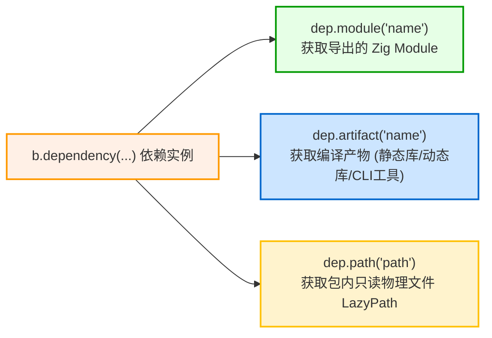

# 第三方依赖引入与消费：b.dependency 与惰性解析

在 `build.zig.zon` 中声明第三方依赖后，可在 `build.zig` 中通过 `b.dependency` 与 `b.lazyDependency` API 获取并消费依赖导出的模块与产物。

---

## 1. 实例化依赖：`b.dependency` 与参数透传

在 `build(b: *std.Build)` 中，通过调用 `b.dependency` 传入依赖名称与构建参数：

```zig
pub fn build(b: *std.Build) void {
    const target = b.standardTargetOptions(.{});
    const optimize = b.standardOptimizeOption(.{});

    // 实例化常规依赖项，并透传编译选项
    const mariadb_dep = b.dependency("mariadb", .{
        .target = target,
        .optimize = optimize,
        // 透传上游 build.zig 定义的自定义配置选项
        .enable_tls = true,
    });
}
```

### 关键机制：
- **选项继承与对齐**：通过结构体字面量将当前项目的 `target` 与 `optimize` 传递给上游包，保证依赖库与主程序使用严格一致的目标架构和优化模式；
- **子构建沙箱隔离**：Zig 构建引擎会在独立的上下文沙箱中执行上游包的 `build.zig`，并将其暴露的产物和模块封装在 `*std.Build.Dependency` 句柄中返回。

---

## 2. 惰性依赖按需解析：`b.lazyDependency`

如果某个依赖项在 `build.zig.zon` 中被标记为 `.lazy = true`，应使用 `b.lazyDependency` 进行获取：

```zig
// 仅当启用特定功能或针对特定平台时才实例化依赖
const enable_gui = b.option(bool, "enable-gui", "Build with GUI support") orelse false;

if (enable_gui) {
    if (b.lazyDependency("heavy_gui_toolkit", .{
        .target = target,
        .optimize = optimize,
    })) |gui_dep| {
        const gui_module = gui_dep.module("gui");
        exe.root_module.addImport("gui", gui_module);
    }
}
```

### 机制说明：
1. **返回值类型为可选指针**：`b.lazyDependency` 返回 `?*std.Build.Dependency`；
2. **零网络开销**：当未满足条件分支（如 `-Denable-gui=false`）时，该调用根本不会被执行，构建系统绝不会触发对该依赖的网络下载或磁盘解压。

---

## 3. 消费依赖项的三种常见方式

通过依赖实例句柄（`dep`），主要通过以下三种方法消费上游资源：



### 3.1 获取模块：`dep.module`
若上游包通过 `b.addModule("foo", ...)` 导出了 Zig 模块：
```zig
const foo_module = dep.module("foo");
exe.root_module.addImport("foo", foo_module);
```

### 3.2 获取产物：`dep.artifact`
若上游包构建了静态库、动态库或辅助工具程序：
```zig
// 1. 链接依赖导出的静态库
const foo_lib = dep.artifact("foo");
exe.root_module.linkLibrary(foo_lib);

// 2. 作为代码生成工具直接在构建管线中运行
const codegen_tool = dep.artifact("codegen_cli");
const run_tool = b.addRunArtifact(codegen_tool);
```

### 3.3 获取包内物理路径：`dep.path`
若需要读取依赖包解压目录中的只读头文件、配置文件或模板：
```zig
const headers_path = dep.path("include");
module.addIncludePath(headers_path);
```

---

## 4. 包管理机制的特点与局限

### 4.1 沙箱子构建与按需拉取

- **显式参数传递**：Zig 通过函数调用向依赖传参，上游构建选项直接在当前 `build.zig` 中配置，不依赖隐式全局状态；
- **按需拉取（Lazy Dependencies）**：配合 `.lazy = true` 与 `b.lazyDependency`，仅在满足特定条件时才触发网络下载。例如平台专属预编译包，在其他操作系统构建时不会产生额外的下载流量。

### 4.2 局限与不足

1. **菱形依赖与 C 符号冲突**：
   对于纯 Zig 代码，因为模块具有独立命名空间且泛型按需单态化，依赖树中存在同一库的不同版本通常能编译通过。但若依赖包含**导出全局 C 符号的静态库（如 SQLite 或 OpenSSL）**，链接阶段会出现符号重复定义错误（`multiple definition of symbol`）。由于 Zig 不做类似 Cargo 的自动 SemVer 版本合并，遇到冲突时需要由根项目在 `build.zig.zon` 中显式统一版本；
2. **缺乏中心化注册表**：
   Zig 基于 Git 仓库与归档 URL 进行内容寻址，未设立中心化包仓库。这避免了对单点服务的依赖，但同时也缺少统一的包发现平台与生态指标（如版本索引、安全通告等）；
3. **缺少一键批量升级命令**：
   目前缺少类似 `cargo update` 的批量更新机制，更新依赖时需要通过 `zig fetch --save` 逐个处理，维护多依赖项目时较为繁琐。
