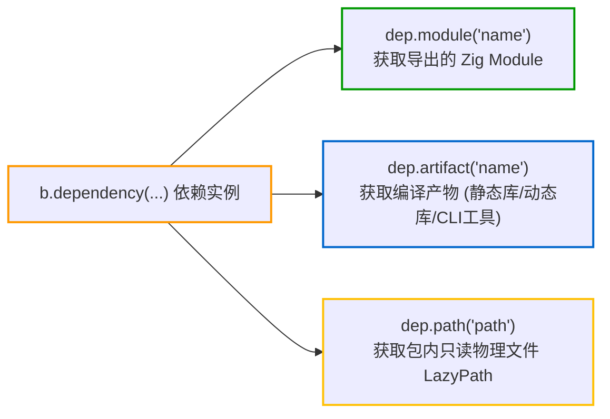

# 第三方依赖引入与消费：b.dependency、--fork 与系统包集成

在 `build.zig.zon` 中声明第三方依赖后，可在 `build.zig` 中通过 `b.dependency` 与 `b.dependencyLazy` API 获取并消费依赖导出的模块与产物。对于复杂工程，Zig 还提供了命令行快速分叉调试（`--fork`）与操作系统发行版双模集成机制（`systemIntegrationOption`）。

---

## 1. 实例化依赖：`b.dependency` 与参数透传

在 `build(b: *std.Build)` 中，通过调用 `b.dependency` 传入依赖名称与构建参数：

```zig
pub fn build(b: *std.Build) void {
    const target = b.standardTargetOptions(.{});
    const optimize = b.standardOptimizeOption(.{});

    // 实例化依赖并传递构建选项
    const mariadb_dep = b.dependency("mariadb", .{
        .target = target,
        .optimize = optimize,
        // 向上游透传 build.zig 暴露的自定义编译选项
        .enable_tls = true,
    });
}
```

### 关键机制：
- **选项继承与对齐**：通过结构体字面量将当前项目的 `target` 与 `optimize` 传递给上游包，保证依赖库与主程序使用严格一致的目标架构和优化模式；
- **子构建沙箱隔离**：Zig 构建引擎会在独立的上下文沙箱中执行上游包的 `build.zig`，并将其暴露的产物和模块封装在 `*std.Build.Dependency` 句柄中返回。

---

## 2. 惰性依赖按需解析：`b.dependencyLazy`

如果某个依赖项在 `build.zig.zon` 中被标记为 `.lazy = true`，应使用 `b.dependencyLazy` 进行获取：

```zig
// 按需条件实例化依赖（惰性拉取）
const enable_gui = b.option(bool, "enable-gui", "Build with GUI support") orelse false;

if (enable_gui) {
    const gui_dep = b.dependencyLazy("heavy_gui_toolkit", .{
        .target = target,
        .optimize = optimize,
    }) catch |err| switch (err) {
        // 若依赖尚未拉取，向构建系统标记需求并退出配置期，由主进程拉取后自动重试
        error.LazyDependencyNeeded => return,
    };

    const gui_module = gui_dep.module("gui");
    exe.root_module.addImport("gui", gui_module);
}
```

### 机制说明：
1. **强类型错误驱动重试**：`b.dependencyLazy` 返回 `error{LazyDependencyNeeded}!*Dependency`。若该依赖本地缓存尚未就绪，函数会向构建系统记录该需求并返回 `error.LazyDependencyNeeded`；
2. **零网络开销**：当未满足条件分支（如 `-Denable-gui=false`）时，该调用不会被执行，构建系统绝不会触发对该依赖的网络下载或磁盘解压；
3. **主进程自动重试**：当配置期退出后，常驻主进程 `Maker` 收到配置流中的 `unlazy_deps` 列表，在后台并发下载依赖包并解压，随后自动在外层循环中重新执行配置期；
4. **废弃 API 替代**：早期版本中的 `b.lazyDependency`（返回可选指针 `?*Dependency`）已被官方标记为废弃（Deprecated），推荐统一使用 `b.dependencyLazy`。详见 [构建自举与双进程：Maker 与 Configurer 架构流转 - 5. 惰性依赖的自动重试机制](../internals/build-runner-internals.md)。

---

## 3. 消费依赖项的三种常见方式

通过依赖实例句柄（`dep`），主要通过以下三种方法消费上游资源：



### 3.1 获取模块：`dep.module`
若上游包通过 `b.addModule("foo", ...)` 导出了 Zig 模块：
```zig
const foo_module = dep.module("foo");
exe.root_module.addImport("foo", foo_module);
```

### 3.2 获取产物：`dep.artifact`
若上游包构建了静态库、动态库或辅助工具程序：
```zig
// 1. 链接依赖中的静态库
const foo_lib = dep.artifact("foo");
exe.root_module.linkLibrary(foo_lib);

// 2. 将依赖产出的工具作为管线中的代码生成器运行
const codegen_tool = dep.artifact("codegen_cli");
const run_tool = b.addRunArtifact(codegen_tool);
```

### 3.3 获取包内物理路径：`dep.path`
若需要读取依赖包解压目录中的只读头文件、配置文件或模板：
```zig
const headers_path = dep.path("include");
module.addIncludePath(headers_path);
```

---

## 4. 菱形依赖与符号冲突应对

### 4.1 菱形依赖的本质区别
对于纯 Zig 代码，因为模块具有独立命名空间且泛型按需单态化，依赖树中存在同一库的不同版本通常能编译通过。但若依赖包含**导出全局 C 符号的静态库（如 SQLite 或 OpenSSL）**，链接阶段会出现符号重复定义错误（`multiple definition of symbol`）。

### 4.2 应对策略

1. **控制反转（解耦 C 库编译与链接）**：
   若依赖的两个库都需要使用某 C 静态库，上游库应在 `build.zig` 中暴露控制开关：
   ```zig
   // 子依赖允许关闭内部静态 C 库的重复编译链接
   const dep_a = b.dependency("dep_a", .{
       .target = target,
       .optimize = optimize,
       .embed_sqlite = false, // 关闭内部静态库编译
   });
   const dep_b = b.dependency("dep_b", .{
       .target = target,
       .optimize = optimize,
       .embed_sqlite = false,
   });

   // 顶层项目统一编译并链接一次 SQLite
   const sqlite = b.dependency("sqlite", .{ .target = target, .optimize = optimize });
   exe.root_module.linkLibrary(sqlite.artifact("sqlite"));
   ```

2. **顶层模块显式注入（Module Injection）**：
   若依赖 A 和 B 各自使用了库 D，且在接口中需要传递 D 的数据类型。为避免两份同名模块因独立编译导致的类型不兼容，根项目可在顶层统一获取 D 模块并注入给双方：
   ```zig
   const shared_d = b.dependency("d", .{ .target = target, .optimize = optimize });
   const d_mod = shared_d.module("d");

   const dep_a = b.dependency("dep_a", .{ .target = target, .optimize = optimize });
   const dep_b = b.dependency("dep_b", .{ .target = target, .optimize = optimize });
   dep_a.module("a").addImport("d", d_mod); // 将统一的 d 模块注入到 dep_a
   dep_b.module("b").addImport("d", d_mod); // 将同一份 d 模块注入到 dep_b
   ```

---

## 5. 本地依赖分叉调试：`--fork` 命令行替换

在日常开发、修补 bug 或联调上游依赖时，修改 `build.zig.zon` 中的依赖路径极易误将临时路径提交至版本库。Zig 原生提供了 `--fork` 命令行机制：

### 5.1 零侵入分叉工作流

无需修改任何工程文件，直接在执行构建命令时指定本地分叉源码路径：

```bash
# 单依赖分叉替换
zig build --fork ../my-patched-zlog

# 多依赖联合分叉调试
zig build --fork ../my-patched-zlog --fork ../zig-network
```

### 5.2 核心工作原理
1. **包名与指纹匹配**：`Maker` 读取本地分叉目录的 `build.zig.zon`，提取包名（`name`）与指纹（`fingerprint`），组合为项目标识（`Package.ProjectId`）。当依赖树中某个依赖的包名与指纹完全一致时，将其重定向至该本地目录；若任意一项不匹配，构建系统会报错提示分叉未被使用；
2. **绕过全局缓存与网络下载**：分叉依赖直接使用本地目录中的最新代码，支持实时修改与增量构建；
3. **退出调试**：调试完成后，只需在命令行中移除 `--fork` 参数即可恢复使用远程固定版本，无需改动代码仓库中的配置文件。

> 💡 **提示**：
> 仅当需要将本地相对路径**长期固化**在工程版本中（例如 Monorepo 内部子模块）时，才应在 `build.zig.zon` 中使用 `.path = "../local-pkg"`。日常调试请始终优先使用 `--fork`。

---

## 6. 发行版与系统包集成：`systemIntegrationOption`

### 6.1 Vendored vs System Package 矛盾

在开源软件分发中，经常存在两种冲突的诉求：
- **应用程序开发者与跨平台构建**：希望 `zig build` 零配置一键下载并静态编译所有 C/C++ 依赖（Vendored 模式），实现真正的自包含和开箱即用；
- **Linux 发行版维护者（Debian / Arch / Fedora / Alpine）**：打包规范**严格禁止使用内嵌第三方源码**，所有动态库（如 SQLite、zlib、OpenSSL）必须链接操作系统原生提供的系统包（System Library）。

### 6.2 声明式双模切换机制

Zig 通过 [lib/std/Build.zig:L2552-L2581](https://codeberg.org/ziglang/zig/src/tag/0.17.0/lib/std/Build.zig#L2552-L2581) 的 `systemIntegrationOption` 提供了标准解决方案：

```zig
const std = @import("std");

pub fn build(b: *std.Build) void {
    const target = b.standardTargetOptions(.{});
    const optimize = b.standardOptimizeOption(.{});

    // 1. 声明允许通过 --system / -fsys=sqlite 命令行选项替换为系统包
    // 运行 "zig build --help" 会自动出现该选项说明
    const sqlite_sys = b.systemIntegrationOption("sqlite", .{});

    const exe = b.addExecutable(.{
        .name = "app",
        .root_module = b.createModule(.{
            .root_source_file = b.path("src/main.zig"),
            .target = target,
            .optimize = optimize,
        }),
    });

    // 2. 根据用户配置动态选择链接策略
    if (sqlite_sys) {
        // Linux 发行版模式：通过 root_module 直接链接系统动态库 libsqlite3.so
        exe.root_module.linkSystemLibrary("sqlite3", .{});
        exe.root_module.link_libc = true;
    } else {
        // 自包含模式：从网络下载 Vendored 源码并静态编译构建
        const sqlite_dep = b.dependency("sqlite", .{
            .target = target,
            .optimize = optimize,
        });
        exe.linkLibrary(sqlite_dep.artifact("sqlite"));
    }

    b.installArtifact(exe);
}
```

### 6.3 命令行控制选项

与普通项目自定义选项（`-D` 选项）不同，`systemIntegrationOption` 是 Zig 构建系统原生内置的一级系统集成机制，在命令行通过 `-fsys` 与 `--system` 控制，而非 `-D` 选项：

```bash
# 1. 默认行为：下载 vendored 源码并静态编译，保证开箱即用
zig build

# 2. 单个包启用系统集成：优先链接宿主环境提供的系统库
zig build -fsys=sqlite

# 3. 单个包显式禁用系统集成：
zig build -fno-sys=sqlite

# 4. Linux 发行版全局接管：禁用网络包拉取，并自动启用所有已声明的系统集成
zig build --system
```

若错误地传入 `-Dsystem-sqlite=true`，构建系统会因未定义该项目选项而报错（`error: invalid option: "system-sqlite"`）。通过 `zig build -h`，可以在专用的 `System Integration Options` 与 `Available System Integrations` 分区中查看所有已声明的集成项及其当前启用状态。
