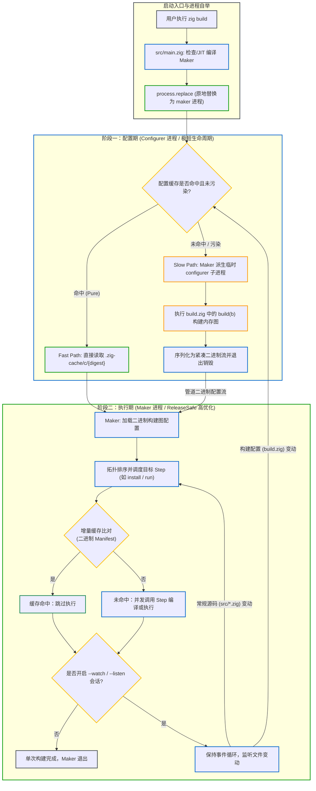

# 两阶段生命周期：配置期与执行期

编写 `build.zig` 时，理解配置期（Configuration Phase）与执行期（Execution Phase）的分界是掌握 Zig 构建系统的基石。

在现代 Zig 构建体系中，两阶段被赋予了**严格的物理进程隔离**，并依托**配置缓存（Configure Cache）** 与 **缓存污染追踪（Cache Poisoning）** 机制实现极低开销的增量评估与执行。

---

## 1. 双进程架构下的两阶段模型

执行 `zig build` 时，构建系统依次经历以下两阶段，并由两个职责正交的独立进程负责：



---

## 2. 阶段一：配置期（Configurer 进程）

配置期的核心任务是**估值构建脚本并构筑 DAG 计算图**。配置期由极短生命周期的临时子进程 `configurer` 承载：

```zig
// 示例 build.zig
const std = @import("std");

pub fn build(b: *std.Build) void {
    const target = b.standardTargetOptions(.{});
    const optimize = b.standardOptimizeOption(.{});

    // 在此处执行构建配置声明逻辑
    const exe = b.addExecutable(.{
        .name = "my_app",
        .root_module = b.createModule(.{
            .root_source_file = b.path("src/main.zig"),
            .target = target,
            .optimize = optimize,
        }),
    });
    b.installArtifact(exe);
}
```

### 核心特征：
1. **纯内存图拓扑声明**：
   在 `build(b)` 函数中调用的 `b.addExecutable`、`b.addLibrary` 或 `b.addConfigHeader` 等 API，**不会立即启动编译器**，也不会向磁盘输出生成文件。这些 API 仅仅在堆内存中分配 `Step` 描述结构，记录编译选项并连接输入输出依赖边；
2. **二进制序列化（Serialization）**：
   在 `build(b)` 执行完毕后，`configurer` 会调用 [`builder.serializeConfigurationExiting()`](https://codeberg.org/ziglang/zig/src/tag/0.17.0/lib/std/Build.zig#L2710-L2736)，将整张内存构建图序列化为紧凑二进制字节流，直接通过管道写入 `Maker` 进程，随后 `configurer` 进程立即调用 `process.exit(0)` 退出销毁；
3. **不能直接读取或依赖未生成物**：
   在配置期，目标文件在磁盘上尚未生成，严禁通过普通文件 API 直接读取：
   ```zig
   // ❌ 错误：在配置期直接读取执行期才会生成的文件
   const config_h = b.addConfigHeader(...);
   const file = try std.fs.cwd().openFile("config.h", .{}); // 抛出 FileNotFound
   ```
   传递生成物路径时，必须统一使用 `LazyPath`（详见后续章节）。

---

## 3. 阶段二：执行期（Maker 进程）

执行期由主控调度进程 `Maker` 独占负责。`Maker` 默认以 `-O ReleaseSafe` 高优化编译，包含多线程任务池与缓存校验引擎。

### 执行流程：
1. **构建图加载与依赖解析**：
   `Maker` 从管道或配置缓存中反序列化构建图配置，若发现尚未下载的第三方依赖包，自动在后台拉取并适时触发配置重试；
2. **确定目标子图与拓扑排序**：
   根据命令行指定的顶层任务（如默认的 `install`，或 `test`/`run`），调度器从目标节点开始反向遍历，截取所需的依赖子图并完成拓扑排序；
3. **增量缓存比对（Manifest Hash）**：
   每个 Step 在调度执行前，`Maker` 会根据输入文件内容、编译参数和工具链环境计算哈希签名。若命中缓存，直接跳过（Cache Hit）；
4. **并发调度与执行**：
   未命中缓存时，线程池并发启动就绪 Step，调度编译器子进程、执行辅助工具或运行测试用例。在单次普通构建中，所有 Step 调度完成后 `Maker` 正常退出；若开启 `--watch` 或 `--listen` 会话模式，`Maker` 则持续驻留，监听文件系统事件并在代码变更时重跑。

---

## 4. 配置缓存与污染追踪机制

构建图具备持久化配置缓存能力，旨在消除重复执行 `build()` 的开销：

### 4.1 纯函数配置与高速路径（Fast Path）

理想状态下，构建配置是一个纯函数：

```text
Configuration = build(CLI Flags, build.zig.zon)
```

当输入参数、依赖项以及显式声明的输入文件未变动时，`Maker` 会直接定位到 `.zig-cache/c/{digest}` 读取已序列化的构建图，**完全跳过编译和派生 `configurer` 子进程**，将空跑构建耗时压缩到毫秒级。

### 4.2 配置缓存污染（Cache Poisoning）
如果开发者在 `build.zig` 中执行了观察外部不可控环境的操作（例如在配置期调用系统 `findProgram` 扫描 host 的 `PATH` 环境变量）：
```zig
// 反模式：在配置期扫描主机 PATH 会污染配置缓存
const python_path = b.findProgram(&.{"python3", "python"}, &.{});
```
在标准库源码中，`findProgram` 会显式调用 `graph.poisonCache()`。一旦配置被标记为 **Poisoned（被污染）**：
- `Maker` 认为该构建图可能随外部不可控状态而变化；
- 本次构建结束后，`Maker` 会立即删除该配置缓存文件，下次构建必须重新派生 `configurer`；
- 用户可通过命令行参数 `--cache-poison=disallowed` 强制禁止污染，确保 CI 构建绝对纯净。

### 4.3 保持纯净配置的标准做法
为避免破坏配置缓存，标准库提供了对应的推荐方案：
1. **推迟工具查找**：改用 `b.findProgramLazy`，返回 `LazyPath` 将查找动作推迟到 Make 执行阶段；
2. **显式声明文件依赖**：若配置逻辑依赖外部文件内容，使用 `b.dependOnFileContents(b.path("version.txt"))` 显式将其纳入缓存签名计算；
3. **参数透传占位**：使用 `run_cmd.addPassthruArgs()` 取代在配置期读取 `b.args`。

---

## 5. 两阶段对比矩阵

| 架构维度 | 配置期（Configuration Phase） | 执行期（Execution Phase） |
| :--- | :--- | :--- |
| **承载进程** | **`configurer`**（短命临时子进程） | **`Maker`**（主控进程，编译一次全局复用） |
| **入口逻辑** | `pub fn build(b: *std.Build) void` | `Maker` 内部多线程调度引擎 |
| **主要职责** | 声明构建图、解析参数、序列化为二进制流 | 检查缓存、执行真实编译、产物落盘与测试运行 |
| **优化级别** | 调试/轻量模式编译（降低冷启动耗时） | **`-O ReleaseSafe`** 高度优化（加速任务拓扑与比对） |
| **缓存机制** | **配置二进制缓存**（`.zig-cache/c/`，纯净时跳过） | **增量产物缓存**（`.zig-cache/h/`，二进制 Manifest） |
| **状态约束** | 追求纯函数性，避免外部副作用（防污染） | 并发执行真实系统调用与进程派生 |

---

## 6. 常见踩坑与反模式

### 6.1 阶段越界：在配置期读取未生成文件
```zig
// ❌ 反模式：在配置期尝试打开生成物
const config_h = b.addConfigHeader(...);
const file = try std.fs.cwd().openFile("zig-out/include/config.h", .{}); 
```
**原因**：`b.addConfigHeader` 只在内存中记录了一个配置节点。直到配置期结束、`Maker` 调度执行该 Step 时，文件才会被写入磁盘。应始终通过 `LazyPath` 传递文件关系。

### 6.2 在配置期同步派生耗时进程
```zig
// ❌ 反模式：在 build() 中直接同步派生外部耗时进程
var child = std.process.Child.init(&.{ "git", "rev-parse", "HEAD" }, b.allocator);
const output = try child.spawnAndWait();
```
**问题**：这不仅会显著拖慢每次 `zig build` 的冷启动速度，而且如果引入了外部环境变量变动还会污染配置缓存。推荐使用 `b.addSystemCommand` 创建 `Step.Run`，由 DAG 自动参与并发调度与增量缓存。
