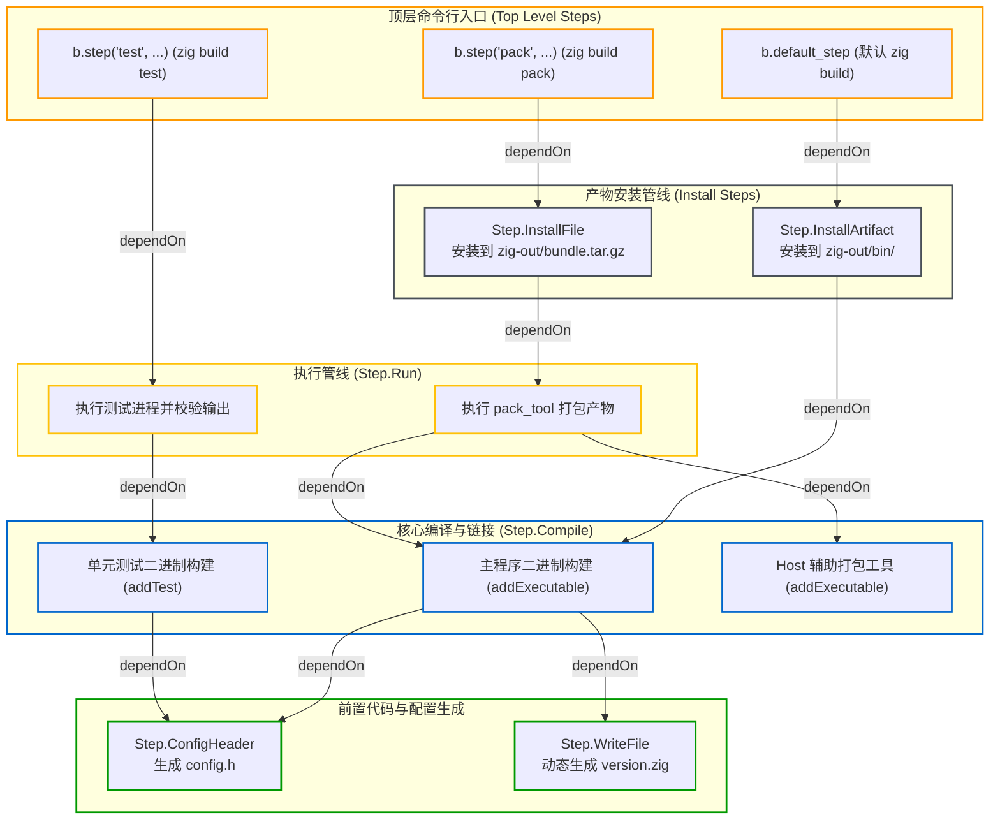

# 计算图抽象：Step 与有向无环图 (DAG)

在 Zig 构建系统中，构建任务被组织为一张有向无环图（DAG），图中的每个任务节点对应一个 `std.Build.Step`。

---

## 1. Step 核心抽象与结构

查看标准库源码 [lib/std/Build/Step.zig:L8-L38](https://codeberg.org/ziglang/zig/src/tag/0.17.0/lib/std/Build/Step.zig#L8-L38)，`Step` 核心结构体定义如下：

```zig
// 摘自 lib/std/Build/Step.zig:L8-L38
pub const Step = struct {
    tag: Configuration.Step.Tag,
    name: []const u8,
    owner: *Build,

    dependencies: std.ArrayList(*Step),

    /// 声明任务内存占用上限（0 表示无限制）
    max_rss: u64,

    debug_stack_trace: std.debug.StackTrace,
};
```

### 核心设计与属性：
1. **无函数指针设计（序列化友好）**：
   由于 `build.zig` 运行在短命的 `configurer` 子进程中，所有节点必须序列化为二进制流跨进程传送给 `Maker` 调度器，因此 `Step` 节点完全由结构化数据组成，不包含任何内存函数指针；
2. **基于 Tag 的类型矩阵（`Configuration.Step.Tag`）**：
   所有节点类型由确定性的 `tag` 枚举标识，`Maker` 进程接收到配置流后，通过内部的 `Extended` union 统一分发执行；
3. **内存上限声明（`max_rss`）**：
   `max_rss` 字段允许为高内存开销任务（如巨型测试套件或重度代码生成）声明内存占用上限。`Maker` 调度器会根据系统总内存动态限制并发数，避免多任务并发时触发系统 OOM Crash；
4. **依赖边列表（`dependencies`）**：
   记录当前节点依赖的前置任务集合。

---

## 2. 常见内置 Step 类型

标准库内置了 16 种特化的 Step 实现：

| Step 类型 (Tag) | 对应结构体 | 职责与常见场景 |
| :--- | :--- | :--- |
| `top_level` | `Step.TopLevel` | 命令行调用的顶层入口（如 `b.step("test", ...)` 或默认 `install`） |
| `compile` | `Step.Compile` | 编译与链接任务，生成可执行文件、静态库或动态库 |
| `install_artifact` | `Step.InstallArtifact` | 将编译产物从缓存目录安装到输出目录（`zig-out/`） |
| `install_file` | `Step.InstallFile` | 将任意 `LazyPath` 安装到输出目录（如 `zig-out/bin/` 或 `zig-out/` 根目录） |
| `install_dir` | `Step.InstallDir` | 将整个目录树安装到输出目录 |
| `run` | `Step.Run` | 运行编译产物或外部命令（运行测试、执行 Host 辅助构建工具） |
| `write_file` | `Step.WriteFile` | 在缓存目录动态创建并写入文件或目录 |
| `config_header` | `Step.ConfigHeader` | 解析 `.h.in` 模板并渲染生成配置头文件 |
| `translate_c` | `Step.TranslateC` | 调用编译器将 C 头文件转译为 Zig AST 与 Module |
| `check_file` | `Step.CheckFile` | 校验生成产物是否包含或匹配指定字符串特征 |
| `obj_copy` | `Step.ObjCopy` | 从编译产物中提取节区、转换二进制格式（如生成 `.hex` / `.bin`） |

---

## 3. Step 依赖拓扑图示例

典型的项目构建图拓扑如下：



### 建立依赖：`dependOn`

在代码中通过 `step_a.dependOn(step_b)` 指定先后顺序：

```zig
// 1. 创建顶层命令入口："zig build test"
const test_step = b.step("test", "Run library unit tests");

// 2. 创建单元测试编译步骤
const unit_tests = b.addTest(.{
    .root_module = my_module,
});

// 3. 创建测试执行步骤
const run_unit_tests = b.addRunArtifact(unit_tests);

// 4. 建立依赖边：test_step 依赖 run_unit_tests
test_step.dependOn(&run_unit_tests.step);
```

执行 `zig build test` 时，`Maker` 调度器定位到 `test_step`，沿依赖边发现其需要 `run_unit_tests`，而 `run_unit_tests` 依赖 `unit_tests` 编译出的测试二进制，从而按拓扑顺序调度执行。

---

## 4. 控制依赖与数据依赖

在任务图的构建中，Step 之间的依赖关系主要通过两种形式建立：

### 4.1 显式控制依赖（`dependOn`）
通过 `step_a.dependOn(step_b)` 建立的依赖属于纯控制流关系：它仅保证在执行 `step_a` 之前，`step_b` 必须已经成功完成，但不直接涉及具体文件的流动。例如：
- 顶层安装步骤依赖编译产物的安装步骤；
- 测试步骤（`test`）依赖运行测试产物的执行步骤。

### 4.2 隐式数据流依赖
在真实的构建场景中，许多任务不仅需要控制先后顺序，还需要把前置任务生成的文件传递给下游任务消费（例如将代码生成步骤输出的 `.zig` 文件作为编译步骤的源码输入）。

在 Zig 中，这种跨任务节点的数据流传递不是通过硬编码磁盘文件路径实现的，而是通过下一章将深入介绍的核心机制 —— **`LazyPath`（惰性路径）**。当下游 Step 消费上游 Step 产生的 `LazyPath` 时，构建系统会自动在计算图中推导并补全相应的依赖边。

> 💡 **提示**：
> 当内置的 Step 无法满足需求时，Zig 允许通过 `Step.Run` 运行外部命令或独立的辅助构建工具来扩展管线。具体用法将在后续 API 篇的 [编写自定义 Step：扩展构建管线](../api/custom-steps.md) 中展开介绍。
