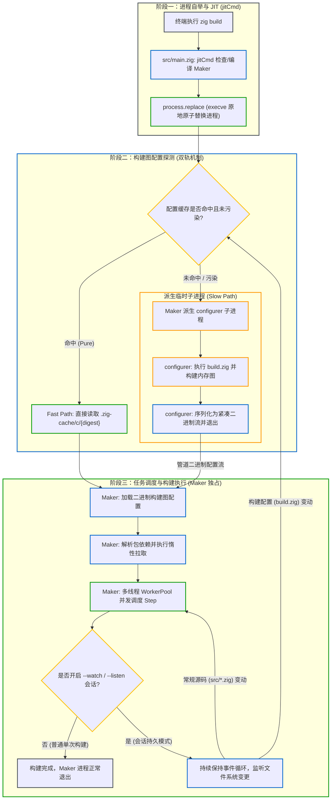

# 构建自举与双进程：Maker 与 Configurer 架构流转

构建系统的底层运行机制由两个职责正交的独立进程协同完成 —— **`Maker`**（主控调度与包管理引擎）与 **`Configurer`**（轻量短命配置序列化进程）。

本文深入分析 Zig 官方源码，揭示从终端执行 `zig build` 到构建图生成与多线程调度的全链路流转机制。

---

## 1. 架构总览：双进程解耦模型

Zig 构建系统将逻辑严格解耦为双独立进程与两阶段通信模型：



---

## 2. 阶段一：进程自举与 JIT (`jitCmd`)

在现代架构中，构建与包管理相关的子命令均通过 JIT 自举入口收敛：

查看 [src/main.zig:L352-L363](https://codeberg.org/ziglang/zig/src/tag/0.17.0/src/main.zig#L352-L363)：

```zig
.build, .fetch, .init, .libc, .@"cache-cat" => {
    return jitCmd(gpa, arena, io, cmd_args, environ_map, .{
        .cmd_name = "maker",
        .root_src_path = "Maker.zig",
        .prepend_cmd = cmd,
        .prepend_zig_lib_dir_path = true,
        .prepend_global_cache_path = true,
        .prepend_zig_exe_path = true,
        .prepend_seed = true,
        .release_mode = .safe,
    });
},
```

### 自举核心逻辑（`jitCmdInner`）：
1. **优化级别**：默认以 `.release_mode = .safe`（`-O ReleaseSafe`）编译，确保构建调度与文件比对具有极高的执行性能；
2. **全局缓存落盘**：`Maker.zig` 编译出的 `maker` 可执行文件存放在全局缓存中：
   ```zig
   const exe_path = try dirs.global_cache.join(arena, &.{
       "o",
       &Cache.binToHex(comp.digest.?),
       comp.emit_bin.?,
   });
   ```
   只要 Zig 版本与标准库未变动，该编译直接命中缓存；
3. **进程无缝替换（`process.replace`）**：
   在支持 `execve` 的现代操作系统上，Zig 进程直接调用 `process.replace` 将当前进程镜像原子替换为编译好的 `maker`，消除常驻父进程的内存与管理开销。

---

## 3. 阶段二：`Maker` 主控会话与双循环架构

启动 `maker` 进程后，其核心调度骨架由内外两层嵌套循环构成（提炼自 [lib/compiler/Maker.zig:L737-L1040](https://codeberg.org/ziglang/zig/src/tag/0.17.0/lib/compiler/Maker.zig#L737-L1040)）：

```zig
// lib/compiler/Maker.zig: 双循环调度会话骨架
configure: while (true) {
    // 阶段一：探测构建图配置（缓存命中走 Fast Path，未命中走 configurer）
    var scanned_config = try configure(&graph, ...);

    // 基于探测到的配置初始化 Maker 实例
    var maker: Maker = .{
        .graph = &graph,
        .scanned_config = &scanned_config,
        // ...
    };
    defer maker.deinit();

    rebuild: while (true) {
        // 阶段二：执行 DAG 任务调度
        try maker.makeSteps(main_progress_node, ...);

        // 单次构建模式：任务执行完毕直接退出！
        if (!maker.watch) return;

        // 会话模式（--watch / --listen）：等待文件变更或 RPC 请求
        switch (try watch.wait(timeout)) {
            error.MustReconfigure => {
                // build.zig / build.zig.zon 发生变更：回流至阶段一重新执行 configurer
                continue :configure;
            },
            .timeout => {
                // 普通源文件（src/*.zig）发生变更：回流至阶段二增量重跑脏 Step
                markFailedStepsDirty(&maker);
                continue :rebuild;
            },
        }
    }
}
```

### 事件分级回流机制：
- **常规源码修改（`src/*.zig`）**：触发 `continue :rebuild;`，`Maker` 实例与内存构建图继续复用，直接回到**阶段三（ExecSteps）**，仅增量重跑被标记为脏的 Step；
- **构建配置文件修改（`build.zig` / `build.zig.zon`）**：抛出 `error.MustReconfigure`，触发 `continue :configure;`，跳出内层循环并触发 `defer maker.deinit()`，回到**阶段二（Check）**重新探测配置并重建 `Maker` 实例。

---

## 4. 阶段三：`Configurer` 进程派生与二进制序列化

当 `Maker` 判定配置缓存未命中时，会派生一个极短生命周期的子进程 `configurer`：

### 4.1 编译 Configurer
在 [lib/compiler/Maker.zig:L1151-L1182](https://codeberg.org/ziglang/zig/src/tag/0.17.0/lib/compiler/Maker.zig#L1151-L1182) 中，`Maker` 组装参数并调用 `std.zig.buildExeSubprocess` 编译临时 `configurer`：
- `lib/compiler/configurer.zig` 映射为主模块；
- 用户项目的 `build.zig` 映射为 `@build` 模块；
- 包管理器生成的依赖元数据映射为 `@dependencies` 模块。

### 4.2 执行与二进制序列化
在 `configurer` 内部（见 [lib/compiler/configurer.zig:L138-L164](https://codeberg.org/ziglang/zig/src/tag/0.17.0/lib/compiler/configurer.zig#L138-L164)）：
1. 调用 `builder.runPackageScript(root)` 执行用户的 `build(b)` 函数；
2. 收集所有的 Step、Module、Artifact 及编译选项；
3. 调用 `builder.serializeConfigurationExiting()` 将整张构建图序列化为紧凑二进制字节流输出到标准输出管道，随后立刻调用 `process.exit(0)` 退出销毁；
4. `Maker` 接收到管道数据后，反序列化为内存中的 `Configuration` 实例；若未受污染（`!configuration.poisoned`），原子性存入 `.zig-cache/c/{digest}`，供后续构建直接复用。

---

## 5. 惰性依赖的自动重试机制

当构建配置中使用了尚未下载的惰性依赖时，双进程架构提供了高度优雅的自动重试支持：
在 [lib/compiler/Maker.zig:L1530-L1542](https://codeberg.org/ziglang/zig/src/tag/0.17.0/lib/compiler/Maker.zig#L1530-L1542) 中：
```zig
if (configuration.unlazy_deps.len != 0) {
    for (configuration.unlazy_deps) |hash_string| {
        log.info("fetching lazy dependency {s}", .{hash});
        try unlazy_set.put(arena, .fromSlice(hash), {});
    }
    // Maker 在后台并发拉取缺失的依赖包，拉取完成后重试配置循环
}
```
`configurer` 仅需在输出的二进制配置流中包含 `unlazy_deps` 列表。`Maker` 作为常驻主控进程，在后台并发拉取缺失的依赖包解压至全局缓存，随后直接在双循环架构的外层重新执行 `configure` 探测，整个过程**无需重启主进程**，对用户完全透明。

---

## 6. Build Server Protocol (BSP)

为支持 IDE 与语言服务器深度集成，Zig 官方推出了标准化的 **Build Server Protocol**：

- **服务端启动**：通过执行 `zig build --listen=-`，构建系统通过标准输入输出作为通信管道，提供基于 JSON-RPC 规范的结构化服务；
- **能力矩阵**：
  1. **构建图元数据直读**：IDE（如 ZLS）可直接查询构建图中所有的 Step 拓扑关系、暴露的选项与模块映射，无需触发实际编译；
  2. **细粒度进度事件推送**：实时推送每个 Step 的开始、完成、耗时以及详细的 `ErrorBundle` 诊断信息；
  3. **交互式构建控制**：语言服务器可主动下发指令，触发指定 Step 的重编或单元测试。

这标志着 IDE 与 Zig 构建系统的交互从以往的黑盒猜测与 Hack，转向了官方标准化的协议通信通道。
