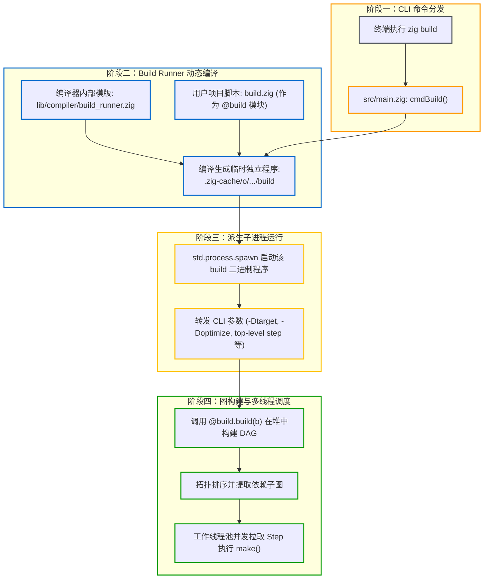

# 构建自举：Build Runner 的动态编译与调度

执行 `zig build` 时，Zig 既没有内置解释器来动态解释 `build.zig`，也没有将构建逻辑固化在编译器二进制中，而是采用自举动态编译（Bootstrap Dynamic Compilation）机制：先将 `build.zig` 编译为独立的构建运行器程序，再启动运行。

---

## 1. 架构总览：从命令路由到独立运行器

从执行 `zig build` 到构建图调度执行，主要分为四个阶段：

---

## 2. 源码级机制：运行器的动态组装

1. **命令路由**：
   在 Zig 编译器入口 [src/main.zig](https://codeberg.org/ziglang/zig/src/tag/0.16.0/src/main.zig) 中，命令行解析器识别到子命令 `build`，路由进入 `cmdBuild` 函数。
2. **装载 `build_runner.zig`**：
   Zig 内置了一个运行器模版文件 `lib/compiler/build_runner.zig`。编译器创建一个编译单元：
   - 将 `build_runner.zig` 作为根源文件；
   - 将用户工作区中的 `build.zig` 映射为一个特殊的模块名称 `@build`。
3. **编译为独立临时程序**：
   Zig 使用 Native Debug 后端快速将其编译为一个独立的可执行文件，落盘存放在：
   `.zig-cache/o/<hash>/build`
4. **子进程执行**：
   `cmdBuild` 随后调用操作系统的 `spawn` 接口，启动该 `build` 二进制程序，并将终端接收到的所有参数原封不动地转发过去。

---

## 3. 调度引擎：拓扑排序与多线程工作池

在编译好的 `build` 程序内部：

1. **执行 `@build.build(b)`**：
   在单线程中初始化 `std.Build` 上下文，调用用户的构建函数，生成内存 DAG。
2. **提取执行子图与拓扑排序**：
   如果用户指定了构建目标（例如 `zig build test`），运行器遍历图结构，裁剪出所有未执行的前置依赖节点。
3. **并发任务队列推进**：
   运行器内置了工作线程池（Worker Pool）。调度器循环扫描入度（In-degree）为 0 的节点：
   - 首先通过 `Cache.Manifest` 比对输入指纹，若完全一致则标记为已完成（Cache Hit）；
   - 若未命中，则派发到空闲的工作线程执行 `step.make()`；
   - 当某个节点执行完成，其依赖者的入度减 1；一旦入度降为 0，立即激活并推入并发执行队列。

这一机制确保了依赖图中的各个节点能够在无竞态的前提下全核并发执行。

---

## 4. 运行器自举机制与代价

### 4.1 机器码执行与环境一致性

Zig 构建运行器采用自举编译，直接生成原生可执行文件：
- **执行效率高**：运行器本身是原生二进制程序，图构建与 Manifest 序列化直接以机器码执行，无额外解释器或虚拟机开销；
- **环境一致**：编译 `build.zig` 的编译器与构建项目的编译器是同一套程序，无需依赖宿主机的外部脚本运行时。

### 4.2 局限与代价

1. **冷启动编译开销**：
   在干净环境或修改 `build.zig` 后，执行 `zig build` 时需要先完成运行器的编译与子进程启动，相比直接解析静态配置（如 Cargo.toml）存在短暂的冷启动耗时；
2. **错误堆栈混杂运行器代码**：
   若 `build.zig` 出现运行时 panic，报错堆栈中会包含 `lib/compiler/build_runner.zig` 的内部调度代码，初次排查时需要注意区分用户脚本逻辑与运行器调度代码。
