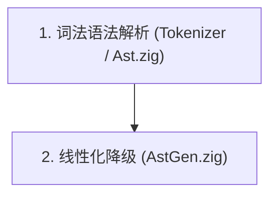
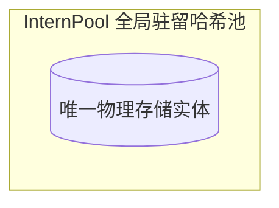
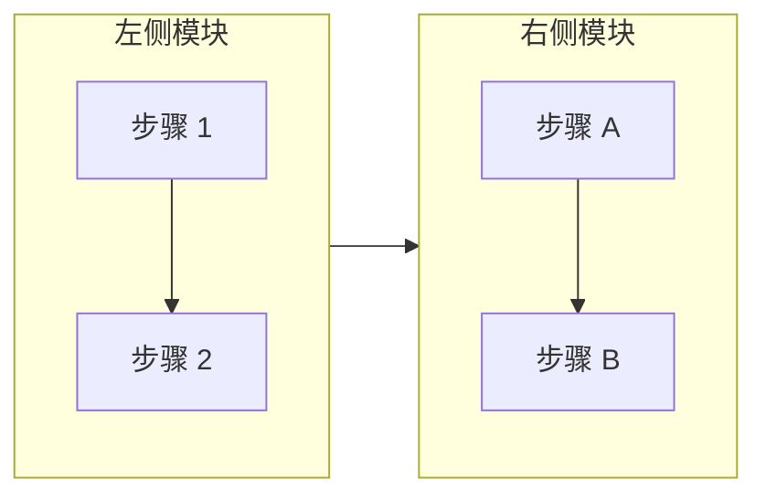

# mdBook 与 Mermaid 集成实践：常见语法错误与工程避坑指南

在为技术书籍与文档库编写复杂架构流程图时，Mermaid 是轻量且强大的工具。然而在实际工程应用中，受语法解析器严格性、版本迭代以及与静态站点生成器（如 mdBook）交互等因素的影响，常常会出现语法解析失败、渲染中断或样式异常等问题。

本文系统复盘在本项目中遇到的全部 Mermaid 核心问题、底层原理与最佳工程解决方案。

---

## 1. 节点定义中的空格陷阱（Square Bracket Start 错误）

### 错误现象
浏览器控制台或 Mermaid 报错窗口抛出类似如下的语法异常：
```text
Syntax error in text
mermaid version 12.1.0
Parse error on line 9: ...B Node_LexParse ["1. 词法语法解析 (Tokeniz
----------------------^ Expecting 'SEMI', 'NEWLINE', 'SPACE', 'EOF', 'AMP',
'COLON', 'START_LINK', 'LINK', 'LINK_ID', 'DOWN', 'DEFAULT', 'NUM',
'COMMA', 'NODE_STRING', 'BRKT', 'MINUS', 'MULT', 'UNICODE_TEXT', got 'SQS'
```

### 根因分析
- 在 Mermaid 词法解析器中，普通节点的定义语法必须是 `Node_ID["标签内容"]`，**节点标识符与定界括号（`[`、`(`、`{`）之间严禁出现空格**。
- 若书写为 `Node_LexParse ["..."]`（中间带空格）：
  1. 词法分析器会将 `Node_LexParse` 提前判定为一个独立的无标签空节点；
  2. 紧随其后的 `[`（在 Jison 解析器中记为 `SQS`, 即 Square Bracket Start）被视为非法标记；
  3. 解析器本期待看到连接符（如 `-->`）、语句分号或换行符，遇到 `[` 随即抛出解析中断。

### 正确写法


---

## 2. Subgraph 子图语法与容器括号规范

### 错误现象
```text
Parse error on line 13: ...bgraph SG_InternPool[("InternPool 全局驻留哈希
-----------------------^ Expecting 'SEMI', 'NEWLINE', 'SPACE', ..., got 'CYLINDERSTART'
```

### 根因分析
- 在 Mermaid 中，圆柱体语法 `[("...")]`（Cylinder）、菱形判断语法 `{"..."}`（Rhombus）仅适用于**普通节点（Node）**。
- **子图（Subgraph）容器只支持标准的文本中括号 `subgraph ID ["标题"]`**，不支持将形状定界符直接套用于子图声明。
- 此外，如果子图名称或节点文本中含有英文大括号 `{}` 或特殊标点，未加引号或嵌套使用时容易干扰解析。

### 正确写法


---

## 3. `graph` 与 `flowchart` 语法方言差异

### 语法演进与兼容性
Mermaid 历史上存在两代流程图解析器：
1. **`graph`**：早期语法规范，对现代高级指令的支持有限；
2. **`flowchart`**：推荐的现代规范，拥有更完善的嵌套子图支持和布局控制。

### 关键区别：子图内部局部流向（`direction`）
- 在 `flowchart` 中，可以在主图使用 `flowchart LR` 的同时，在子图内部显式声明局部垂直排布 `direction TB`；
- 在部分老版本或严格模式下的 `graph` 语法树中，`direction` 未被作为保留关键字处理，有时会被误解析为节点名称引发串线。

### 最佳实践


---

## 4. 暗黑模式与样式穿透（避免白色背景色块）

### 常见误区
为了在浅色主题下突出特定模块，常直接在源码末尾硬编码 `fill` 属性：
```mermaid
%% 反模式：硬编码浅色填充
classDef core fill:#e6f3ff,stroke:#0066cc;
style SubgraphID fill:#ffffff,stroke:#cccccc;
```
**后果**：由于内联 `fill` 的样式优先级高于 Mermaid 的主题配置，当用户切换至 mdBook 的深色主题（Navy / Coal / Ayu）时，这些节点依然会被强制填白，导致文字（已被主题自动反色为浅白）不可见，产生严重的视觉对比度问题。

### 正统解法
遵循“**边框定分类，底色随主题**”的原则，仅指定 `stroke` 与 `stroke-width`：
```mermaid
%% 推荐做法:
classDef core stroke:#0066cc,stroke-width:2px;
classDef middle stroke:#ff9900,stroke-width:2px;
classDef mem stroke:#009900,stroke-width:2px;
style SG_Container stroke:#0066cc,stroke-width:2px;
```
- **浅色模式**：Mermaid 自动填充柔和浅灰底色，搭配彩色边框；
- **深色模式**：Mermaid 自动填充深灰暗色背景（`#1f2428`），高亮边框和浅色文字均保持高对比度。

---

## 5. mdBook 客户端动态渲染与初始化陷阱

在静态站点生成器（mdBook）中动态集成 Mermaid CDN 脚本时，需注意以下运行期细节：

### 5.1 HTML 标签支持与安全级别（`securityLevel`）
如果图表节点中需要多行排版（使用 `<br/>`）：
```javascript
// 在客户端初始化配置中必须显式设置 loose
mermaid.initialize({
    startOnLoad: false,
    securityLevel: "loose", // 允许节点内部解析安全 HTML 标签 (如 <br/>)
    theme: isDark ? "dark" : "default"
});
```
若使用默认的 `securityLevel: "strict"`，节点内的 `<br/>` 标签可能会被剥离或转义，甚至导致渲染器解析报错。

### 5.2 避免重复渲染与内容重置机制
当用户在 mdBook 顶栏切换主题（Light / Navy / Coal）时，为了实现无刷新重新渲染，必须保证原始图表源码未丢失：
```javascript
// 在初次将 <pre><code class="language-mermaid"> 转换为 <div class="mermaid"> 时，
// 将原始 Markdown 源码保存在 dataset 中：
container.dataset.mermaidSrc = codeBlock.textContent;

// 主题切换重新渲染时，先还原原始内容并移除已处理标记：
containers.forEach((container) => {
    if (container.dataset.mermaidSrc) {
        container.removeAttribute("data-processed");
        container.textContent = container.dataset.mermaidSrc;
    }
});
```

### 5.3 打印长页面（`print.html`）的并发渲染
mdBook 默认会生成包含全书所有章节的 `print.html`。如果全书包含数十张 Mermaid 图表，单次执行 `mermaid.run()` 会同时创建数十个 SVG 渲染任务。
- 确保不要并发多次调用 `mermaid.run()`，建议通过全局锁 `isRendering` 进行防重入控制；
- 容器在未完全就绪前不要执行破坏性清空，确保长页面中的全部图表均能稳定生成。

---

## 6. 自动化校验清单

每次新增或修改 Mermaid 图表后，建议使用以下清单进行自查：

| 校验项 | 正确范式 | 错误范式 |
| :--- | :--- | :--- |
| **节点定义** | `NodeA["Text"]`、`NodeB{"Text"}` | `NodeA ["Text"]`（带空格） |
| **子图声明** | `subgraph SG_A ["Title"]` | `subgraph SG_A [("Title")]` |
| **连线标注** | `A -- "description" --> B` | `A -- description --> B`（含特殊字符未加引号） |
| **样式属性** | 仅声明 `stroke:#...,stroke-width:2px;` | 硬编码 `fill:#ffffff;` 或浅底色 |
| **流程图类型** | 优先推荐 `flowchart TD` / `flowchart LR` | 尽量避免依赖陈旧的 `graph` 语法 |
