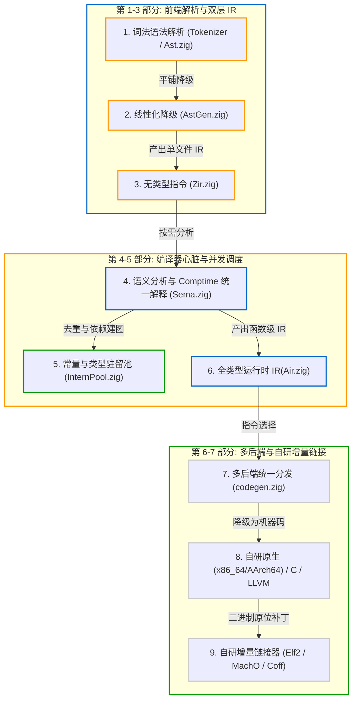

# Zig 编译器设计与源码深度剖析

> 面向编译初学者的系统级编译器架构全景书

本书以 **Zig 0.17.0** 源码为基础，介绍现代系统级编译器的设计与实现。

全书从基础概念讲起，结合对传统面向对象编译器（如 GCC、Clang、Rustc）常见瓶颈的分析，逐步展开 Zig 的核心设计：**数据导向设计（Data-Oriented Design）**、**无指针 AST**、**双层 IR（ZIR 与 AIR）**、**Comptime 编译期求值与语义分析的统一**、**细粒度增量依赖追踪**以及**内置增量链接器**。

> 🌐 网站：<https://jiacai2050.github.io/x/zig-compiler/>

---

## 本书内容与知识地图

---

## 本书特点与阅读建议

1. **面向初学者**：
   - 不预设深入的编译理论基础。对 SSA、CFG、指令选择、ABI 和重定位等概念，均给出直观的背景与工程原理解释。
2. **结合实际源码**：
   - 各章节均对应 Zig 0.17.0 仓库的具体文件，提供 [Codeberg Zig 0.17.0 官方源码库](https://codeberg.org/ziglang/zig/src/tag/0.17.0) 的链接和关键代码片段。
3. **对照主流实现**：
   - 对比 GCC、Clang 和 Rustc 在头文件展开、泛型单态化、中间表示与链接流程上的处理方式，说明 Zig 做出不同架构权衡的原因。

---

## 源码目录快速索引

在阅读本书时，可以参考工作空间或 Codeberg 在线仓库中的对应源码：

| 模块路径 | 对应章节 | 核心职责 |
| :--- | :--- | :--- |
| [`lib/std/zig/tokenizer.zig`](https://codeberg.org/ziglang/zig/src/tag/0.17.0/lib/std/zig/tokenizer.zig) | 2.4 节 | 零内存分配的词法分析器 |
| [`lib/std/zig/Ast.zig`](https://codeberg.org/ziglang/zig/src/tag/0.17.0/lib/std/zig/Ast.zig) | 2.3 节 | 13 字节紧凑节点、零指针 SoA 抽象语法树 |
| [`lib/std/zig/AstGen.zig`](https://codeberg.org/ziglang/zig/src/tag/0.17.0/lib/std/zig/AstGen.zig) | 3.3 节 | 将 AST 平铺为未类型化的线性 ZIR 字节码 |
| [`lib/std/zig/Zir.zig`](https://codeberg.org/ziglang/zig/src/tag/0.17.0/lib/std/zig/Zir.zig) | 3.2 节 | 单文件、无类型、支持磁盘缓存的中间表示 |
| [`src/Zcu.zig`](https://codeberg.org/ziglang/zig/src/tag/0.17.0/src/Zcu.zig) | 5.1 节 | Zig Compilation Unit，负责整个编译会话的模块与文件协调 |
| [`src/InternPool.zig`](https://codeberg.org/ziglang/zig/src/tag/0.17.0/src/InternPool.zig) | 4.4, 4.5 节 | 全局类型与常量去重池、并发分片哈希表与增量依赖图核心 |
| [`src/Sema.zig`](https://codeberg.org/ziglang/zig/src/tag/0.17.0/src/Sema.zig) | 4.2 节 | 语义分析与 Comptime 解释执行的统一引擎 |
| [`src/Air.zig`](https://codeberg.org/ziglang/zig/src/tag/0.17.0/src/Air.zig) | 3.5 节 | 函数级全类型中间表示，用于机器码生成与目标优化 |
| [`src/codegen.zig`](https://codeberg.org/ziglang/zig/src/tag/0.17.0/src/codegen.zig) | 6.1 节 | 多后端调度中心，连接 AIR 与各目标平台生成器 |
| [`src/codegen/x86_64/`](https://codeberg.org/ziglang/zig/src/tag/0.17.0/src/codegen/x86_64) | 6.2 节 | 自研 x86_64 原生机器码生成器（含 MIR、寄存器分配与编码） |
| [`src/codegen/aarch64/`](https://codeberg.org/ziglang/zig/src/tag/0.17.0/src/codegen/aarch64) | 6.2 节 | 自研 AArch64 原生机器码生成器 |
| [`src/codegen/c.zig`](https://codeberg.org/ziglang/zig/src/tag/0.17.0/src/codegen/c.zig) | 6.3 节 | ANSI C99 代码发射器，用于交叉编译与自举 |
| [`src/codegen/llvm.zig`](https://codeberg.org/ziglang/zig/src/tag/0.17.0/src/codegen/llvm.zig) | 6.4 节 | 桥接 LLVM C++ API，利用 LLVM 优化管道发射二进制 |
| [`src/link.zig`](https://codeberg.org/ziglang/zig/src/tag/0.17.0/src/link.zig) | 7.1-7.4 节 | 自研跨平台链接器入口与原位二进制增量修补框架 |
