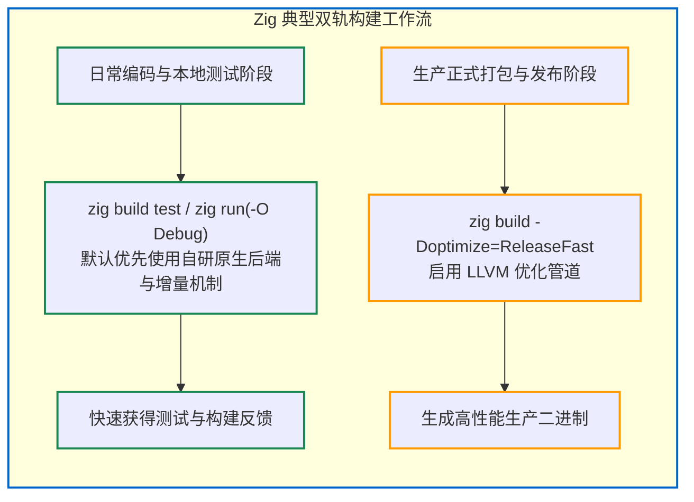

# 6.6 后端性能对比与工程实践建议

在了解了 Zig 0.17 的三大后端实现后，合理选择适用的后端是工程实践中的重要决策：
**在不同开发阶段，应如何配置构建选项以平衡编译时间与运行性能？**

本节我们将从多项技术指标对三大后端进行横向对比，并给出典型场景下的构建配置建议。

---

## 三大后端多维度特征对比

| 评估维度 | 自研原生后端 (Self-hosted) | C 语言转译后端 (C Backend) | LLVM 优化后端 (LLVM Backend) |
| :--- | :--- | :--- | :--- |
| **构建耗时** | **较短 (通常数百毫秒级)**<br/>适合频繁调试与单元测试 | **中等**<br/>生成 C 代码较快，但后续调用系统 C 编译器耗时视外部工具链而定 | **相对较长**<br/>LLVM 完整优化管线与代码生成带来较高的分析耗时 |
| **编译器内存占用** | **较低**<br/>基于 SoA 平平数组存储，临时分配较少 | **较低**<br/>以字符串流式输出为主 | **相对较高**<br/>LLVM 的 AST/IR 对象图占用内存较多 |
| **产物运行性能** | **标准水平**<br/>适合开发调试与常规验证 | **视下游 C 编译器而定**<br/>若经 GCC/Clang 高优化编译，可获得较好运行速度 | **高水平**<br/>支持完整的自动向量化、高级循环变换与过程间优化 |
| **目标二进制体积** | 偏大（未做激进的代码折叠与死代码剥离） | 中等 | 支持 `-O ReleaseSmall` 深度剥离与体积压缩 |
| **架构适配要求** | 需 Zig 内部针对该硬件指令集编写汇编器 | **门槛低**<br/>依赖目标环境已有的通用 C 编译器 | 依赖 LLVM 官方支持的目标架构清单 |
| **典型应用场景** | **本地快速迭代、单元测试、CI 快速校验** | **跨平台自举、专用嵌入式处理器、环境受限设备** | **正式版本发布、高性能生产服务** |

---

## 典型工作流配置建议



### 1. 开发与测试阶段：优先使用原生后端
执行 `zig build`、`zig test` 或 `zig run` 时，默认使用 `-O Debug` 模式。
在此模式下，Zig 默认优先启用自研原生代码生成器：
- 降低修改单行代码后的重新编译等待时间；
- 结合 `-fincremental` 开启增量支持，仅对受影响的函数执行重新分析与补丁写入。

### 2. 生产发布阶段：切换至 Release 优化模式
当准备交付生产部署或发布二进制产物时：
```bash
zig build -Doptimize=ReleaseFast
# 或针对嵌入式环境限制体积：
zig build -Doptimize=ReleaseSmall
```
此时编译器调用 LLVM 优化中后端，对全项目执行跨过程分析与指令级优化，以换取更高的运行期吞吐与更紧凑的代码体积。

---

## 阶段小结

通过本部分的分析，我们了解了 Zig 0.17 的多后端格局：
- 自研原生后端为日常调试提供了低延迟构建反馈；
- C 后端为跨平台自举与受限环境提供了通路；
- LLVM 后端保障了正式发布构建的指令优化深度。

在生成目标机器指令后，代码还需要经过最终的链接步骤才能形成可执行文件。

第 7 部分将深入剖析 Zig 编译器内部的另一项关键组件——**自研原生增量链接器**。
