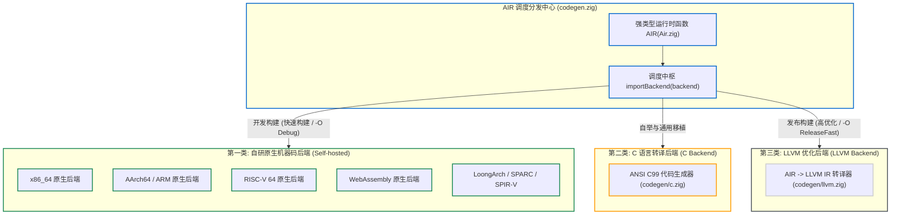

# 6.1 Zig 后端全景架构与统一调度

一个面向工业级应用的编译器，需要将高级语义转换为不同物理目标硬件支持的机器码：涵盖常见的 Intel/AMD x86-64、ARM/AArch64、RISC-V 以及浏览器的 WebAssembly 环境等。

部分现代系统级语言在实现上主要依赖 LLVM 作为统一代码生成后端。而 Zig 0.17 在架构上采用了**多层分级的多后端策略**。

在 [`src/codegen.zig`](https://codeberg.org/ziglang/zig/src/tag/0.17.0/src/codegen.zig) 中，Zig 建立了统一的后端调度分发接口。

---

## Zig 0.17 的三大后端体系



---

## 后端统一分发接口

查看 [`src/codegen.zig#L50-L67`](https://codeberg.org/ziglang/zig/src/tag/0.17.0/src/codegen.zig#L50-L67)：

```zig
fn importBackend(comptime backend: std.lang.CompilerBackend) type {
    return switch (backend) {
        .other, .stage1 => unreachable,
        .stage2_aarch64 => aarch64,
        .stage2_c => @import("codegen/c.zig"),
        .stage2_llvm => @import("codegen/llvm.zig"),
        .stage2_loongarch => loongarch,
        .stage2_riscv64 => @import("codegen/riscv64/CodeGen.zig"),
        .stage2_sparc64 => @import("codegen/sparc64/CodeGen.zig"),
        .stage2_spirv => @import("codegen/spirv/CodeGen.zig"),
        .zsf_spork8 => @import("codegen/spork8/CodeGen.zig"),
        .stage2_wasm => @import("codegen/wasm/CodeGen.zig"),
        .stage2_x86, .stage2_x86_64 => @import("codegen/x86_64/CodeGen.zig"),
        _ => unreachable,
    };
}
```

统一接口规范：
各后端模块均统一实现了关键接口：
1. `legalizeFeatures(target)`：向编译器声明当前硬件平台不支持的高级特性（指导 `Air/Legalize.zig` 展开特定指令）；
2. `generate(...)`：消费 `Air` 指令序列，生成目标机器指令或等价目标代码。

---

## 三大后端的定位与权衡

1. **自研原生机器码后端（用于提升日常开发构建速度）**：
   - 不依赖外部 LLVM 动态库，完全由 Zig 编写；
   - 采用单遍模式匹配指令选择与线性扫描寄存器分配；
   - 构建耗时与内存开销明显降低，适用于日常开发调试与测试迭代。
2. **C 代码生成后端（用于增强跨平台移植性与自举支撑）**：
   - 将 AIR 指令直接转译为 ANSI C99 代码；
   - 在缺乏原生后端或 LLVM 支持的目标平台上，可通过第三方 C 编译器完成最终构建；
   - 同时作为无外部前置依赖自举（Bootstrap）的核心链路。
3. **LLVM 后端（用于生产发布的高级优化）**：
   - 在生产发布构建（`-O ReleaseFast` 等）时，将 AIR 转译为 LLVM IR；
   - 启用 LLVM 的指令优化管道（自动向量化、跨过程内联等），产出高性能二进制。

接下来几节中，我们将依次分析各后端的内部实现细节。
