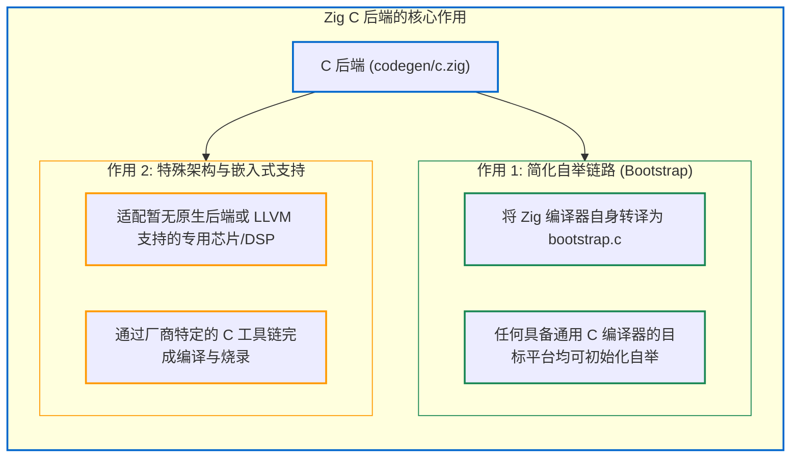

# 6.3 C 后端：可移植性与自举支持

在系统级语言编译器的演进过程中，自举（Bootstrap）是一个重要的工程课题。若最新版编译器深度依赖上一版本，往往会形成长链条的版本依赖。

Zig 0.17 在编译器内部内置了 C 源码生成后端（[`src/codegen/c.zig`](https://codeberg.org/ziglang/zig/src/tag/0.17.0/src/codegen/c.zig) 与 [`src/link/C.zig`](https://codeberg.org/ziglang/zig/src/tag/0.17.0/src/link/C.zig)）。

通过该后端，执行 `zig build-exe main.zig -ofmt=c` 时，编译器会直接输出规范的 ANSI C99 源代码。

---

## C 后端的两大核心作用



---

## C 代码作为目标输出

对于原生机器码后端，生成产物是二进制机器指令；而在 C 后端中，目标产物是结构化的 C 语言文本。

查看 [`src/codegen/c.zig#L51-L87`](https://codeberg.org/ziglang/zig/src/tag/0.17.0/src/codegen/c.zig#L51-L87)：

```zig
/// For most backends, MIR is basically a sequence of machine code instructions...
/// For the C backend, it is instead the generated C code for a single function.
pub const Mir = struct {
    fwd_decl: []u8,       // 前向声明区 (结构体/函数原型)
    code_header: []u8,    // 函数头声明
    code: []u8,           // 函数体 C 语句代码
    need_uavs: std.array_hash_map.Auto(InternPool.Index, Alignment),
    ctype_deps: CType.Dependencies,
    // ...
};
```

对于 C 后端，`generate()` 返回以下结构：
- `fwd_decl`：记录函数所需的结构体前向声明与类型定义；
- `code`：将函数体内的 AIR 指令翻译为等价的 C99 语句（例如将 `add_safe` 映射为带溢出检查的 C 宏，将切片访问规约为结构体操作）。

### 链接器在 C 后端中的职责（[`src/link/C.zig`](https://codeberg.org/ziglang/zig/src/tag/0.17.0/src/link/C.zig)）
在各函数的 C 代码生成完毕后，内部链接器 `link.File.C` 负责：
合并全局结构体定义、宏函数与常量声明，并按照依赖顺序将各函数组织为一个独立的 `.c` 源文件。

---

## 编译器自举流程（Bootstrap）

在 Zig 源码仓库中，包含了预生成的自举源文件 [`bootstrap.c`](https://codeberg.org/ziglang/zig/src/tag/0.17.0/bootstrap.c)。

当需要在尚未具备 Zig 二进制编译器的全新平台上初始化环境时：
1. 使用目标系统上的原生 C 编译器（如 GCC 或 Clang）编译 `bootstrap.c`；
2. 生成初始阶段的引导编译器 `zig1`；
3. 使用 `zig1` 编译完整的 Zig 编译器源码，获得功能完备的 `zig2` 编译器。

这种基于 C 后端的自举设计，降低了工具链向新平台移植的门槛。

下一节我们将分析 **LLVM 优化后端** 的协作机制。
