# 6.4 LLVM 后端：AIR 到 LLVM IR 的桥梁与深度优化

尽管 Zig 实现了原生机器码后端与 C 后端，但在面向生产环境的高性能构建（如 `-O ReleaseFast`、`-O ReleaseSmall`、`-O ReleaseSafe`）时，**LLVM 依然是实现高级优化的关键组成部分**。

在 [`src/codegen/llvm.zig`](https://codeberg.org/ziglang/zig/src/tag/0.17.0/src/codegen/llvm.zig) 与 [`src/codegen/llvm/FuncGen.zig`](https://codeberg.org/ziglang/zig/src/tag/0.17.0/src/codegen/llvm/FuncGen.zig) 中，Zig 实现了从 AIR 到 LLVM IR 的转译接口。

---

## 模块隔离设计：LLVM 作为可选插件

在部分深度依赖 LLVM 的语言中，前端 AST 结构可能直接持有 LLVM 的数据类型（如 `llvm::Type*`、`llvm::Value*`）。这种设计容易导致前端与特定版本的 LLVM C++ 运行时紧密绑定。

在 Zig 0.17 中，**前端、AST、ZIR、Sema 与 InternPool 独立于 LLVM 存在**：
LLVM 仅作为流水线末端的可选代码生成器：

```mermaid
graph LR
    %% Global styles and definitions
    classDef core stroke:#0066cc,stroke-width:2px;
    classDef middle stroke:#ff9900,stroke-width:2px;
    classDef edge stroke:#ccc,stroke-width:2px;
    classDef status stroke:#198754,stroke-width:2px;

    subgraph SG_Zig_Pure["Zig 核心阶段 (由 Zig 编写)"]
        direction TB
        Node_AST["AST(Ast.zig)"]
        Node_ZIR["ZIR(Zir.zig)"]
        Node_Sema["Sema(Sema.zig)"]
        Node_AIR["AIR(Air.zig)"]

        Node_AST --> Node_ZIR --> Node_Sema --> Node_AIR
    end

    subgraph SG_LLVM_Plugin["LLVM 代码生成 (可选接入)"]
        direction TB
        Node_FuncGen["FuncGen.zig(AIR -> LLVM IR 转译)"]
        Node_OptPipeline["LLVM 优化管道 (向量化/SROA/内联)"]
        Node_ObjOut["生成目标文件 (*.o)"]

        Node_FuncGen --> Node_OptPipeline --> Node_ObjOut
    end

    Node_AIR -- "当启用 -fLLVM 或 Release 模式" --> Node_FuncGen

    style SG_Zig_Pure stroke:#0066cc,stroke-width:2px;
    style SG_LLVM_Plugin stroke:#495057,stroke-width:2px;

    class Node_AST,Node_ZIR,Node_Sema,Node_AIR core;
    class Node_FuncGen,Node_OptPipeline middle;
    class Node_ObjOut status;
```

---

## AIR 到 LLVM IR 的映射实现

查看 [`src/codegen/llvm/FuncGen.zig`](https://codeberg.org/ziglang/zig/src/tag/0.17.0/src/codegen/llvm/FuncGen.zig)：
`FuncGen` 的核心功能是将强类型的 `Air.Inst` 映射至 LLVM 的指令构建调用：

| AIR 指令 | 映射的 LLVM IR 结构 | 优化考量 |
| :--- | :--- | :--- |
| **`add_safe`** | `@llvm.sadd.with.overflow.*` 内建函数 | LLVM 可将其与后续条件分支合并为硬件溢出检测指令（如 x86 的 `JO`） |
| **`add_optimized`** | 附带 `fast-math` 标记的 `fadd` 指令 | 允许 LLVM 执行代数化简与 FMA 乘加融合优化 |
| **`alloc` / `load` / `store`** | `alloca`、`load`、`store` | 便于触发 LLVM 的 SROA（标量替换）阶段，将结构体变量分配至寄存器 |
| **`call_always_tail`** | 附带 `tail` 或 `musttail` 标记的 `call` | 指导 LLVM 实施确定的尾调用消除 |

---

## 分层策略的工程考量

1. **按需调用，兼顾体验与性能**：
   日常开发调试时优先使用原生自研后端以缩短等待时间；生产发布时指定 `-O ReleaseFast`，利用 LLVM 成熟的自动向量化与跨过程分析提升运行效率。
2. **调试信息支持**：
   在 [`src/codegen/llvm.zig#L98-L100`](https://codeberg.org/ziglang/zig/src/tag/0.17.0/src/codegen/llvm.zig#L98-L100) 中，Zig 将自身语义符号与 LLVM 的 `DIBuilder` 对接，确保生成的目标文件能够与 GDB/LLDB 等标准调试器兼容。

下一节我们将分析原生后端的核心抽象——**机器中间表示（MIR）与合法化（Legalize）**。
