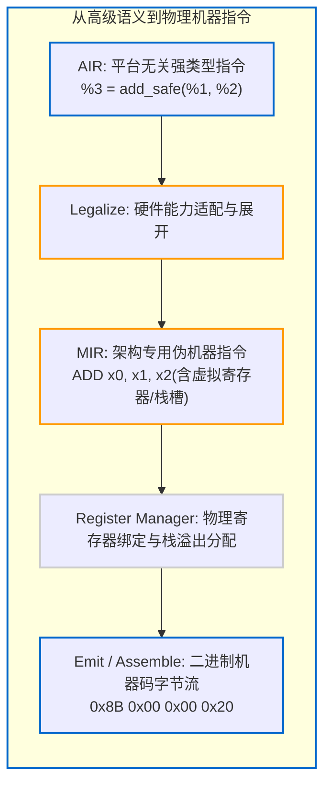

# 6.5 MIR 机器中间表示、寄存器分配与 Legalize

在代码生成过程中，编译器通常需要应对两项底层硬件约束：
1. **硬件指令支持的不对称性**：并非所有架构均原生支持宽整型运算（如 `i128`）或特定的向量指令；
2. **硬件物理寄存器资源受限**：函数内定义的局部变量数量通常多于 CPU 可用的物理通用寄存器数量。

本节我们将分析 Zig 0.17 是如何通过 **Legalize（合法化）**、**MIR（机器中间表示）** 与 **`register_manager.zig`（寄存器分配管理）** 处理上述约束的。

---

## 硬件能力规整：合法化处理（`Legalize.zig`）

在 [`src/Air/Legalize.zig`](https://codeberg.org/ziglang/zig/src/tag/0.17.0/src/Air/Legalize.zig) 中，定义了硬件平台特性描述 `Features`：

```zig
pub const Features = packed struct {
    expand_add_safe: bool = false,
    expand_sub_safe: bool = false,
    expand_mul_safe: bool = false,
    expand_int_from_float_safe: bool = false,
    expand_array_splat: bool = false,
    expand_packed_load: bool = false,
    // ...
};
```

各硬件后端在初始化时，向编译器声明当前平台的指令支持限制：
- 例如：若某微控制器缺少硬件浮点运算单元（FPU），可声明 `expand_int_from_float_safe = true`；
- `Legalize.zig` 会在指令进入后端前，将对应的复杂操作展开为软件模拟的指令序列。

这种机制将指令展开逻辑集中在统一中端，降低了各特定硬件后端代码生成器的复杂度。

---

## 硬件贴合层：机器中间表示（MIR）

AIR 经过合法化后，后端将其映射为针对具体 CPU 架构的 **MIR（Machine Intermediate Representation）**。

每个自研后端拥有独立的 `Mir.zig`（例如 [`src/codegen/aarch64/Mir.zig`](https://codeberg.org/ziglang/zig/src/tag/0.17.0/src/codegen/aarch64/Mir.zig) 或 [`src/codegen/x86_64/Mir.zig`](https://codeberg.org/ziglang/zig/src/tag/0.17.0/src/codegen/x86_64/Mir.zig)）。



MIR 指令与目标处理器的汇编指令结构基本对应（如 `MOV`, `ADD`, `B.NE` 等），但仍可包含虚拟寄存器或尚未分配绝对偏移的栈槽（Stack Slots）。

---

## 线性扫描寄存器分配：`register_manager.zig`

传统编译器通常采用基于图着色（Graph Coloring）的寄存器分配算法。该算法能够较好地利用寄存器，但在大函数下分析开销相对较高。

Zig 0.17 在 [`src/register_manager.zig`](https://codeberg.org/ziglang/zig/src/tag/0.17.0/src/register_manager.zig) 中实现了**线性扫描寄存器分配器**：

```zig
pub fn RegisterManager(
    comptime Self: type,
    comptime Register: type,
    comptime RegisterIndex: type,
) type {
    return struct {
        /// 物理寄存器状态位图：空闲 (free) 还是已占用 (allocated)
        registers: [registers_count]Status,
        // ...
    };
}
```

### 分配逻辑：
1. **结合变量生存期（`Air/Liveness.zig`）**：
   在单遍扫描过程中，当某个变量生命周期结束（Die Point）时，其占用的物理寄存器立即被标记为 `free` 供后续指令复用；
2. **寄存器溢出处理（Spill）**：
   若无空闲物理寄存器，选择一个生存期较长的变量暂时转存至当前栈帧（Stack Frame）；
3. **分配开销**：
   线性扫描算法以常数级别的计算开销完成寄存器分配，符合原生后端追求快速编译反馈的设计目标。

下一节我们将对三大后端的构建性能与产物质量进行综合对比。
