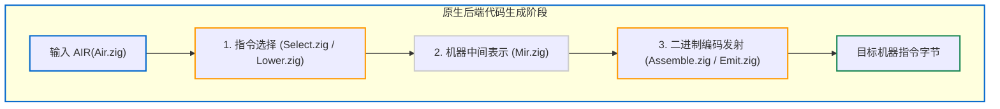

# 6.2 自研原生机器码后端：x86_64 与 AArch64 剖析

为了减少对体积庞大的外部 LLVM 依赖，并在 Debug 模式下获得更快的构建反馈，Zig 0.17 在源码中实现了针对主流 CPU 架构的**原生机器码生成后端（Self-hosted Backends）**。

本节我们将以 **x86_64 后端**（[`src/codegen/x86_64/`](https://codeberg.org/ziglang/zig/src/tag/0.17.0/src/codegen/x86_64)）与 **AArch64 后端**（[`src/codegen/aarch64/`](https://codeberg.org/ziglang/zig/src/tag/0.17.0/src/codegen/aarch64)）为例，解析其代码生成流程。

---

## 原生后端的处理管线：AIR -> MIR -> Emit

在原生后端内部，代码生成遵循标准化流程：



---

## AArch64 原生后端（ARM64）分析

AArch64 采用 32 位定长指令集，结构规整。查看 [`src/codegen/aarch64.zig#L16-L40`](https://codeberg.org/ziglang/zig/src/tag/0.17.0/src/codegen/aarch64.zig#L16-L40) 中的入口实现：

```zig
pub fn generate(
    _: *link.File,
    pt: Zcu.PerThread,
    func_index: InternPool.Index,
    air: *const Air,
    liveness: *const ?Air.Liveness,
) !Mir {
    // ...
    var isel: Select = .{
        .pt = pt,
        .target = &mod.resolved_target.result,
        .air = air.*,
        .nav_index = zcu.funcInfo(func_index).owner_nav,
        // 初始化寄存器分配跟踪表与符号重定位表
        .instructions = .empty,
        .nav_relocs = .empty,
        // ...
    };
```

### 1. 指令选择（`Select.zig`）
- 遍历传入的 `Air` 强类型指令；
- 根据平台 ABI（如 Darwin ARM64 ABI 或标准 System V ABI，参见 [`aarch64/abi.zig`](https://codeberg.org/ziglang/zig/src/tag/0.17.0/src/codegen/aarch64/abi.zig)）将函数参数分配至 `x0` ~ `x7` 等通用寄存器；
- 将 AIR 逻辑映射为底层架构的 `Mir.Inst`。

### 2. 机器码编码与发射（[`aarch64/Assemble.zig`](https://codeberg.org/ziglang/zig/src/tag/0.17.0/src/codegen/aarch64/Assemble.zig) 与 [`encoding.zig`](https://codeberg.org/ziglang/zig/src/tag/0.17.0/src/codegen/aarch64/encoding.zig)）
`Assemble.zig` 依据 ARMv8 指令编码规范，通过位运算直接组装出 32 位定长指令：
```zig
// 组装 AArch64 ADD 寄存器指令示例
const opcode: u32 = 0x8b000000 | (@as(u32, rm) << 16) | (@as(u32, rn) << 5) | rd;
try writer.writeInt(u32, opcode, .little);
```

---

## x86_64 原生后端（复杂变长指令集）

与 ARM 架构不同，x86-64 属于变长复杂指令集（CISC），单条指令长度从 1 字节到 15 字节不等，包含 REX 前缀、ModR/M 字节、SIB 比例因子以及偏移量等字段。

在 [`src/codegen/x86_64/`](https://codeberg.org/ziglang/zig/src/tag/0.17.0/src/codegen/x86_64) 中：
1. **多 ABI 支持（[`x86_64/abi.zig`](https://codeberg.org/ziglang/zig/src/tag/0.17.0/src/codegen/x86_64/abi.zig)）**：
   支持 Linux/macOS 的 System V AMD64 ABI（`rdi, rsi, rdx, rcx, r8, r9` 传参）与 Windows 的 Microsoft x64 调用约定（`rcx, rdx, r8, r9` 传参并预留 32 字节 Shadow Space）；
2. **高效指令发射（[`x86_64/Emit.zig`](https://codeberg.org/ziglang/zig/src/tag/0.17.0/src/codegen/x86_64/Emit.zig) 与 [`encoder.zig`](https://codeberg.org/ziglang/zig/src/tag/0.17.0/src/codegen/x86_64/encoder.zig)）**：
   基于紧凑的编码查找逻辑，将 MIR 指令直接编码为机器码，并记录跨函数的符号重定位位置（`nav_relocs`）。

---

## 原生后端与 LLVM 后端的对比

| 考量维度 | LLVM 机器码后端 | Zig 原生自研后端 |
| :--- | :--- | :--- |
| **指令选择机制** | 复杂的图匹配 SelectionDAG / GlobalISel（需多次构建 DAG） | **直接的单向模式匹配（Single-Pass Direct Lowering）** |
| **寄存器分配** | 迭代式数据流分析 + 图着色（Graph Coloring）算法 | **基于 `Liveness` 的快速线性扫描（Linear Scan）** |
| **内存开销** | 指令与基本块均对应 C++ 堆对象，常驻内存较高 | **基于平铺数组 SoA 存储，内存较为紧凑** |
| **设计定位** | 追求高质量指令级优化（适合发布构建） | **追求低延迟构建反馈（适合日常开发与测试）** |

这种分层设计使得日常使用 `zig build` 或执行测试时，能够快速获得编译反馈。

下一节中，我们将分析 Zig 的 **C 语言代码生成后端**。
