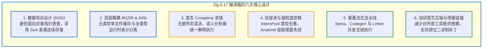

# 总结与未来展望

至此，我们完成了对 **Zig 0.17 编译器架构与核心实现** 的系统性分析。

从系统级工程视角来看，Zig 展示了在兼顾编译吞吐量与目标代码质量的前提下，对现代编译器架构进行分层重构的一种尝试。

---

## 核心工程设计要点总结

回顾全书，Zig 编译器的架构特征可归纳为六大方面：

1. **缓存行友好的数据结构**：针对现代 CPU 微架构的内存层级特性，利用 `MultiArrayList` 与基于索引的零指针 AST 组织数据，提高扫描时的缓存行利用率；
2. **正交与统一的语言模型**：通过 `comptime` 将类型提升为编译期一流值，统一泛型与元编程实现，避免了专用宏系统引入的复杂性；
3. **全流程工具链闭环**：从词法分析器到原生 ELF/Mach-O/COFF 链接器，全链路自主实现，为内存常驻的增量构建提供了条件。

---

## 演进方向与未来规划

随着 0.17 版本的发布，Zig 正在向 1.0 稳定版本推进。从当前源码（如 [`src/dev.zig`](https://codeberg.org/ziglang/zig/src/tag/0.17.0/src/dev.zig) 与 [`src/IncrementalDebugServer.zig`](https://codeberg.org/ziglang/zig/src/tag/0.17.0/src/IncrementalDebugServer.zig)）中可以看出未来的主要演进方向：

1. **自研原生后端的优化器拓展**：
   目前原生自研后端主要服务于 Debug 与快速迭代模式。后续规划在原生后端中逐步引入通用的局部与全局优化通道，在不显著牺牲编译耗时的前提下提升生成代码的质量，减少日常构建对外部 LLVM 运行时的依赖。
2. **增量调试服务（`IncrementalDebugServer`）**：
   源码中正在探索常驻后台的增量调试守护机制：在源码保存后，原位刷新映射的内存二进制，配合调试器实现更低延迟的代码热更新。
3. **语言规范与一致性测试**：
   随着语法体系与 IR 设计的逐步收敛，官方规范与合规测试套件正持续完善，以确保跨平台行为的一致性与稳定性。

---

## 结语

编译系统的设计本质上是算法逻辑与底层硬件物理特性的平衡艺术。

通过对 Zig 0.17 编译器源码的探讨，我们看到了数据导向设计、按需延迟分析与原生增量链接在现代编译器中的工程实践。希望本书能够为读者理解现代系统级语言与编译器的内部实现提供清晰的参考。
