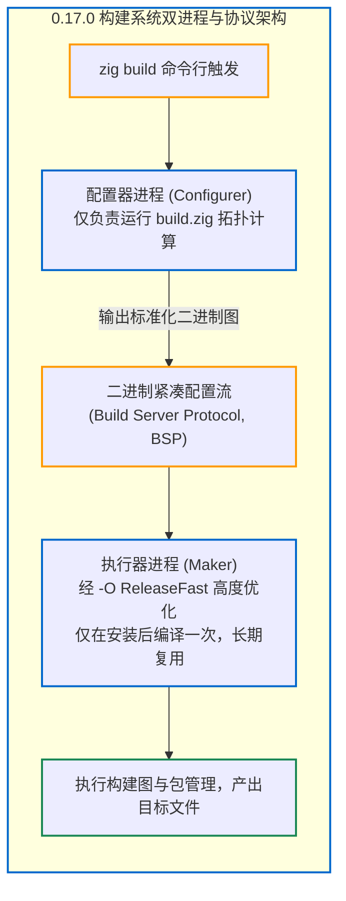

# 附录：Zig 0.17.0 Release Notes 编译架构演进深度解读

随着 **Zig 0.17.0** 官方版本的正式发布，Zig 编译器与构建生态迎来了历时 5 个月、925 次提交的集中蜕变。

官方 [Release Notes](https://ziglang.org/download/0.17.0/release-notes.html) 中涵盖了诸多对于编译技术探索者极具价值的架构演进。本附录将对照前文的核心理论，对 0.17.0 中最为重磅的编译器与构建系统变革进行深度技术解读。

---

## 变革 1：增量编译正式走向实用（`-fincremental --watch`）

在 0.17.0 之前，增量编译虽然在理论上框架完备，但在实际复杂工程中常受制于旧 ELF 链接器的稳定性瓶颈。

在 0.17.0 中，随着**下一代 ELF 链接器（`Elf2.zig`）的成熟**，官方正式宣布：
> **在 `x86_64-linux` 平台上，绝大多数项目已经可以直接启用增量编译！**

### 生产级使用方式：
```bash
zig build -fincremental --watch
```
- **文件监听（File Watcher）**：构建系统自动常驻后台监听源码文件的变动；
- **反应式热更新（Reactive Rebuild）**：一旦文件被修改，仅需数十毫秒的时间，ZIR 缓存校验、Sema 过时分析单元重析、原生代码生成与 `Elf2` 原位二进制热补丁瞬间串联完成，开发者无需手动重新敲击编译命令。

---

## 变革 2：构建系统进程解耦（Maker vs Configurer）

在过去的版本中，`build.zig` 的配置逻辑与构建图的执行逻辑运行在同一个进程中。每次修改 `build.zig`，构建器都需要全量重构。

0.17.0 带来了里程碑式的架构重构——**配置进程（Configurer）与执行进程（Maker）彻底拆分**：



### 这一改进带来的巨大收益：
1. **Maker 进程永久免重构**：`maker` 负责执行构建图和包管理，它在安装 Zig 时就以 `-O ReleaseFast` 优化编译完毕，后续修改 `build.zig` 不会导致 `maker` 重新编译；
2. **引入构建服务器协议（Build Server Protocol, BSP）**：配置数据被序列化为紧凑的二进制格式，第三方 IDE（如 ZLS）可以直接消费这一标准数据流，或通过 `--print-configuration` 直接获取以 `.zon` 表达的构建元数据；
3. **配置缓存污染追踪（Configure Cache Poisoning）**：精确识别 `build.zig` 中的纯逻辑与侧效应，避免不必要的重复配置运行。

---

## 变革 3：缓存系统二进制化与 25% 空间缩减

0.17.0 对 `.zig-cache` 内部的 Manifest 机制进行了重写：
- **全面切换至紧凑二进制格式**：淘汰冗长的文本描述，缓存元数据体积缩小约 **25%**；
- **降低 I/O 压力**：CPU 直接利用内存对齐的方式从磁盘读写二进制字节，无需进行耗时的字符串词法解析，使全工程 Cache Hit 命中速度提升了 **5% ~ 10%**；
- **目录级依赖（Directory Mode）与元数据模式（Metadata Mode）**：支持将“目录内文件的增加/删除”直接作为缓存失效判定条件；
- **官方分析工具 `zig cache-cat`**：提供底层缓存可视化巡检命令。

---

## 变革 4：自研链接器矩阵的跨越式进展

0.17.0 在自研链接器方面取得了爆发式突破：

### 1. `Elf2.zig`（下一代 Linux ELF 链接器）
- 实现了完整的 x86_64 与 SPARC64 支持，并初步支持 LoongArch；
- 完整支持静态库（`.a`）、动态共享库（`.so`）、GOT 表生成、Copy Relocation、GNU 符号版本化（Symbol Versioning）以及 DWARF 调试信息；
- 解决了小块文件系统（Block Size）下的对齐兼容性，为 Linux 平台完全废除旧版遗留 ELF 链接器奠定了最后一步。

### 2. `Coff.zig`（Windows PE/COFF 链接器）
- 原生支持产出目标文件（`.obj`）、静态归档库（`.lib`）与导入库（`implib`）；
- 完整支持线程局部存储（TLS）与导出表（Exports Directory）；
- 原生支持 COMDAT 折叠规则，具备同时链接 MinGW-w64 与 MSVC 原生 C 运行库的工业级能力；
- 深度适配 MSVC 的 `drectve` 链接器指令（`/INCLUDE`, `/MERGE`, `/DEFAULTLIB`）。

### 3. `Spirv.zig`（GPU 着色器链接器）
- SPIR-V 链接器获得完全重写，支持增量编译并能够直接链接外部 `.spv` 二进制对象文件。

---

## 变革 5：后端生态的新生力量

1. **LoongArch64 自研后端贡献**：在 [`src/codegen/loongarch/`](https://codeberg.org/ziglang/zig/src/tag/0.17.0/src/codegen/loongarch) 中合入了原生机器码生成的初步实现；
2. **WebAssembly 后端达到 100% 行为测试通过**：自研 WASM 后端已通过全部 2060 项官方测试，与 LLVM 后端达成功能对齐；
3. **SPIR-V 后端多线程化**：与 x86/ARM 后端一样，全面接入并发任务池调度，并引入了 `spirv_task` 和 `spirv_mesh` 调用约定以支持现代网格着色器。

---

## 变革 6：核心语言与类型反射的进一步深化

1. **`std.lang.Type` 迈向 SoA（Structure of Arrays）**：
   在编译期类型反射中，结构体与联合体的元信息全面摒弃了老旧的字段数组，改为返回平行的 `info.field_names` 与 `info.field_types`，与编译器内部的 SoA 哲学高度统一；
2. **枚举与位域操作符规范化**：
   引入内建函数 `@backingInt` 与 `@fromBackingInt`，统一替代了旧有的零散强转语法；
3. **形式化验证与语法 Fuzzer**：
   对 Zig 官方语法文法进行了形式化规约与基于模糊测试（Fuzzing）的长期收敛，大幅提升了极端边缘代码场景下的编译器健壮性。

---

## 结语

Zig 0.17.0 不是一次简单的小修小补，而是一次**从构建协议、自研链接器到增量内核的全局质变**。

它标志着 Zig 编译器离“彻底抛弃外部链接器、在全平台实现亚秒级热更新构建”的伟大愿景，迈出了最为坚实的一大步。
