# 2.2 MultiArrayList 的奥秘：SoA 代替 AoS 深度剖析

在 Zig 0.17 编译器源码中，标准库中的一个泛型容器被极其广泛地采用：**`std.MultiArrayList`**。无论是语法树定义（`Ast.NodeList`）、词法单元列表（`Ast.TokenList`）、ZIR 指令序列（`Zir.instructions`）还是 AIR 指令序列（`Air.instructions`），底层均基于 `MultiArrayList` 构建。

理解 `MultiArrayList` 的内存结构，是掌握 Zig 编译器内部数据表示的关键一步。

---

## AoS 与 SoA 的内存组织形式

在多数通用编程语言（如 C/C++、Java、Go、Rust）中，当我们声明一个结构体数组或切片时，默认采用的是 **AoS（Array of Structures，结构体数组）** 布局：

```zig
// 传统的 AoS 模式：数组中每个元素都是一个完整的结构体
const Node = struct {
    tag: u8,        // 1 字节
    // 为满足内存对齐，编译器通常会填充 3 字节 (Padding)
    token: u32,     // 4 字节
    lhs: u32,       // 4 字节
    rhs: u32,       // 4 字节
};
const list: []Node = ...;
```

此时的物理内存布局为：
`[tag, pad, token, lhs, rhs] [tag, pad, token, lhs, rhs] [tag, pad, token, lhs, rhs] ...`

与之对应的则是 **SoA（Structure of Arrays，数组结构体）** 布局：
逻辑上依然表达一组 `Node`，但在物理内存中，将结构体的各个字段切开，分别存放在独立的平整数组中：
- `tags:   [tag0, tag1, tag2, tag3, ...]`
- `tokens: [tok0, tok1, tok2, tok3, ...]`
- `lhss:   [lhs0, lhs1, lhs2, lhs3, ...]`
- `rhss:   [rhs0, rhs1, rhs2, rhs3, ...]`

```mermaid
graph TD
    %% Global styles and definitions
    classDef warning stroke:#ffc107,stroke-width:2px;
    classDef success stroke:#198754,stroke-width:2px;
    classDef core stroke:#0066cc,stroke-width:2px;

    subgraph SG_AOS["传统 AoS(Array of Structures) 内存排布"]
        direction LR
        A1["Node[0]<br/>[Tag: 1B | Pad: 3B | Tok: 4B | Data: 8B]"]
        A2["Node[1]<br/>[Tag: 1B | Pad: 3B | Tok: 4B | Data: 8B]"]
        A3["Node[2]<br/>[Tag: 1B | Pad: 3B | Tok: 4B | Data: 8B]"]
        A1 --- A2 --- A3
    end

    subgraph SG_SOA["Zig MultiArrayList(SoA) 内存排布"]
        direction TB
        subgraph Sub_Tags["所有 Tags 连续区 (无字段间填充)"]
            T0["Tag 0(1B)"] --- T1["Tag 1(1B)"] --- T2["Tag 2(1B)"] --- T3["Tag 3(1B)..."]
        end
        subgraph Sub_Tokens["所有 Tokens 连续区"]
            TK0["Tok 0(4B)"] --- TK1["Tok 1(4B)"] --- TK2["Tok 2(4B)"] --- TK3["Tok 3(4B)..."]
        end
        subgraph Sub_Data["所有 Data 连续区"]
            D0["Data 0(8B)"] --- D1["Data 1(8B)"] --- D2["Data 2(8B)"] --- D3["Data 3(8B)..."]
        end
    end

    style SG_AOS stroke:#ff9900,stroke-width:2px;
    style SG_SOA stroke:#198754,stroke-width:2px;
    style Sub_Tags stroke:#0066cc,stroke-width:1px;
    style Sub_Tokens stroke:#ff9900,stroke-width:1px;
    style Sub_Data stroke:#009900,stroke-width:1px;

    class A1,A2,A3 warning;
    class T0,T1,T2,T3 core;
    class TK0,TK1,TK2,TK3 warning;
    class D0,D1,D2,D3 success;
```



---

## SoA 带来的核心工程优势

### 1. 减少内存对齐填充（Padding Elimination）
在 64 位体系结构中，CPU 通常要求 4 字节整数按 4 字节地址对齐，8 字节指针或整数按 8 字节对齐。
- 在 AoS 模式下，若结构体开头为 `u8`（1 字节），其后紧跟 `u32`，编译器会在 `u8` 之后填充 3 字节的空白对齐。在大规模数据场景下，填充字节可能占用结构体总空间的 20% 至 40%。
- 而在 `MultiArrayList` 中，所有 `tag` 存放在连续的一维数组中（`[u8, u8, u8, u8, ...]`），**元素之间不存在对齐填充**；只有在进入下一个字段（如 `tokens`）数组时，才需要做一次起始地址对齐。这一优化显著降低了整体内存占用。

### 2. 提升有效缓存利用率（Cache Line Saturation）
当编译过程执行语法分类扫描时，往往只需要遍历每个节点的 `tag`：
- 在 AoS 模式下，加载 64 字节的缓存行只能包含 4 个 `Node`（每个节点 16 字节），缓存行中 75% 的数据（token、lhs、rhs）在当前判定阶段并未被使用。
- 在 `MultiArrayList` 中，加载 64 字节缓存行可直接包含 **64 个节点的 `tag`**，使得只读扫描的内存带宽利用率得到充分利用。

---

## 源码实现：`MultiArrayList` 的设计细节

查看标准库源码 [`lib/std/multi_array_list.zig`](https://codeberg.org/ziglang/zig/src/tag/0.17.0/lib/std/multi_array_list.zig#L9-L34)：

```zig
/// A MultiArrayList stores a list of a struct or tagged union type.
/// Instead of storing a single list of items, MultiArrayList
/// stores separate lists for each field of the struct or
/// lists of tags and bare unions.
pub fn MultiArrayList(comptime T: type) type {
    return struct {
        bytes: [*]u8 = undefined, // 指向单次批量申请的连续内存块
        len: usize = 0,
        capacity: usize = 0,

        pub const empty: Self = .{
            .bytes = undefined,
            .len = 0,
            .capacity = 0,
        };
        // ...
```

### 单次内存分配机制（Single Allocation）
在很多人的直觉中，维护多个平行数组可能需要为每个字段单独调用一次堆内存分配。但 `MultiArrayList` 并非如此实现：
它在底层**仅向分配器申请一块连续的单一内存段**（通过 `bytes: [*]u8` 指针管理）。在容量调整（扩容）时：
1. 根据各字段类型的大小与对齐要求，依次计算每个字段段落在这块内存中的偏移量（Offset）；
2. 执行一次统一的 `alloc` 或 `realloc`；
3. 暴露 `.slice().items(.tag)` 等方法，根据计算出的偏移量返回目标字段的独立切片。

```zig
// 使用方式示例
var nodes = std.MultiArrayList(Node){};
try nodes.ensureTotalCapacity(gpa, 1000);

// 获取所有 tag 的连续切片
const tags: []Node.Tag = nodes.items(.tag);
for (tags) |tag| {
    if (tag == .root) { ... }
}
```

这种机制既保持了单次内存申请的低系统调用开销，又获得了 SoA 数据布局在连续扫描时的缓存友好性。

在下一节中，我们将看到 Zig 0.17 是如何结合 `MultiArrayList` 构建出无指针 AST 结构的。
