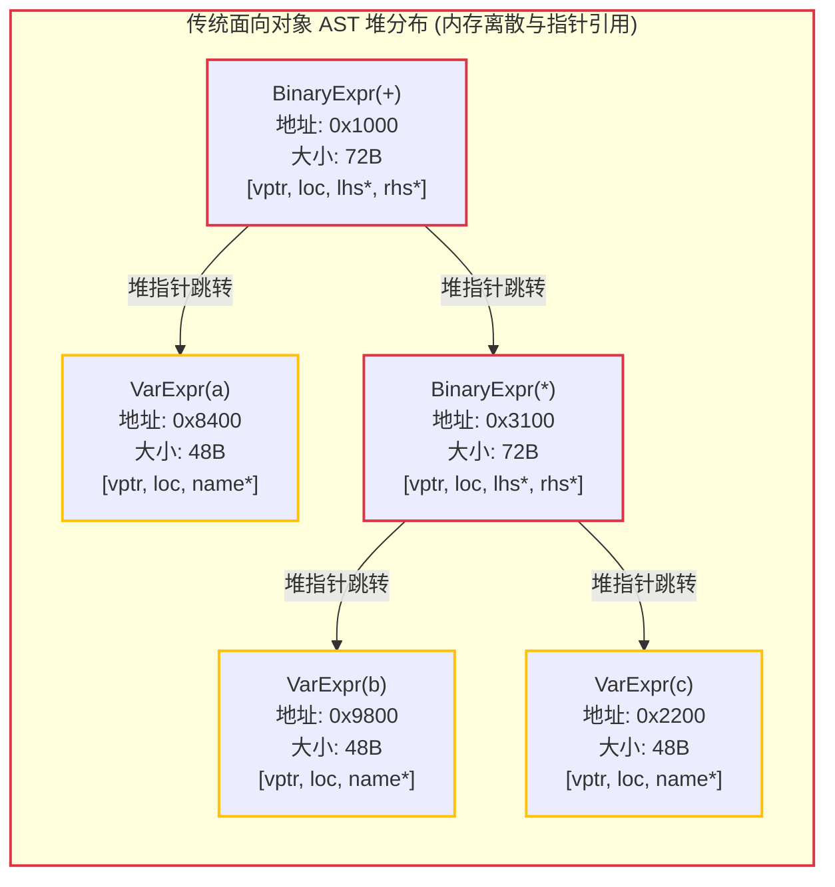

# 2.1 为什么面向对象 AST 会影响 CPU 缓存效率？

在深入研究 Zig 编译器的语法树实现之前，我们需要从现代计算机微架构的角度理解一个关键的工程权衡：**为什么传统的面向对象语法树在现代多核 CPU 上可能会成为性能瓶颈？**

---

## 现代 CPU 的内存层级与“内存墙”（Memory Wall）

现代 CPU 的核心主频通常在 3.0GHz 至 5.0GHz 之间，单时钟周期在 0.3 纳秒以内。然而，主内存（DRAM）的访问延迟通常在 50 至 100 纳秒左右（相当于 200 至 300 个 CPU 时钟周期）。

为了缓解处理器与主存之间的速度落差，现代处理器设计了多级高速缓存层次（L1, L2, L3 Cache）：

| 存储层级 | 典型容量 | 典型访问延迟 (时钟周期) | 说明 |
| :--- | :--- | :--- | :--- |
| **CPU 寄存器** | ~1 KB | 0~1 周期 | 随指令就地读写 |
| **L1 缓存 (L1 D-Cache)** | 32 ~ 64 KB | 4~5 周期 | 每个 CPU 核心独占的高速缓存 |
| **L2 缓存** | 512 KB ~ 2 MB | 10~14 周期 | 核心专用或近距离共享缓存 |
| **L3 缓存 (共享)** | 16 ~ 64 MB | 40~75 周期 | 片上所有计算核心共享 |
| **主内存 (DRAM)** | 16 ~ 128 GB | 200 ~ 300 周期 | 需经过内存控制器与总线访问 |

现代硬件的一个基础特性在于：**CPU 从内存读取数据时，并非以单字节为单位寻址，而是以“缓存行（Cache Line，通常为 64 字节）”为原子单元进行加载与搬运**。

---

## 传统面向对象 AST 的缓存失效特征

假设我们需要在语法树中表达表达式 `a + b * c`。传统的面向对象编译器通常会在堆上分配多态对象节点：

### 这种设计带来的性能代价：
1. **内存空间膨胀与内存碎片**：
   - 多态类节点通常包含虚函数表指针（`vptr`，8 字节）。
   - 每个子节点通过 64 位指针（8 字节）进行连接。
   - 堆内存分配器（如 `malloc`）还会为每个独立分配的小对象维护 8 至 16 字节的元数据头。
   - 加上结构体字段在 64 位架构下的字节对齐填充（Padding），一个本仅需记录“操作符、左操作数索引、右操作数索引”的二元表达式节点，在堆内存中往往膨胀至 64 至 72 字节，跨越两个缓存行。
2. **指针追逐（Pointer Chasing）导致缓存命中率降低**：
   - 当编译器遍历这棵语法树时，执行流必须沿着指针反复跳转：从 `0x1000` 跳转到 `0x8400`，再跳转到 `0x3100`。
   - 这些对象由堆分配器在不同时刻分配，物理内存地址互不连续。
   - CPU 的硬件预取器（Hardware Prefetcher）无法准确预测离散指针的跳转路径，导致编译器在遍历 AST 时，CPU 大量周期处于等待内存回传数据的阻塞状态。

---

## 数据导向设计（Data-Oriented Design, DOD）的核心思想

数据导向设计（Data-Oriented Design, DOD）主张**依据数据实际的读写模式与现代 CPU 缓存行特征来组织内存布局，优先保证批量操作时的空间局部性与时间局部性**。

在编译器解析与检查 AST 时，典型的访问模式如下：
- 当编译器扫描代码结构时，经常需要快速判定每个节点的**类型标签（Tag）**（例如判断“当前语句是否为声明语句”或“是否包含返回指令”）。
- 在初次遍历时，通常不需要立刻读取节点的源码位置、行列号、文档注释等全部元信息。

如果将节点属性按字段拆分，分别放入平行的连续数组中：
- 节点标签集中存储于数组：`[tag0, tag1, tag2, tag3, ...]`
- 节点操作数集中存储于数组：`[data0, data1, data2, data3, ...]`

这样组织的优势在于：
单条 64 字节的缓存行一次可以装入 **64 个 1 字节的节点标签**。CPU 硬件预取器在检测到数组的线性读取时，能够主动将后续连续内存预取至 L1 缓存中，使批量扫描操作保持极高的缓存命中率。

在下一节中，我们将解析 Zig 标准库中支持该数据布局的关键容器——**`MultiArrayList`**。
