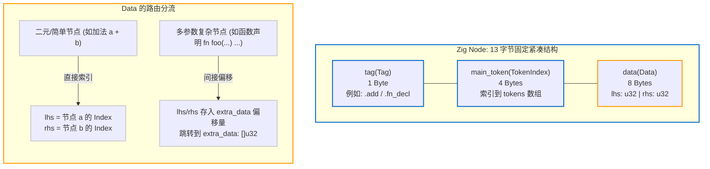

# 2.3 零指针 AST：13 字节紧凑节点与 extra_data

在了解了 `MultiArrayList` 的原理后，我们可以深入分析 Zig 编译器的语法树核心实现：[`lib/std/zig/Ast.zig`](https://codeberg.org/ziglang/zig/src/tag/0.17.0/lib/std/zig/Ast.zig)。

与 Clang 或 GCC 中基于指针互连的多态对象 AST 不同，Zig 的 AST **完全不包含任何指向子节点的物理内存指针**。整棵语法树被紧凑地编码为平行的扁平整型数组。

---

## `Ast` 的结构体顶层定义

在 [`lib/std/zig/Ast.zig`](https://codeberg.org/ziglang/zig/src/tag/0.17.0/lib/std/zig/Ast.zig#L17-L26) 中，整个语法树定义如下：

```zig
pub const Ast = struct {
    /// 外部持有的源代码原始文本切片
    source: [:0]const u8,

    tokens: TokenList.Slice,
    nodes: NodeList.Slice,
    extra_data: []u32,
    mode: Mode = .zig,

    errors: []const Error,
};
```

语法树的全部结构信息集中在以下 4 个连续容器中：
1. `source`：未做修改的源文件 UTF-8 字符切片；
2. `tokens`：词法切词产出的 Token 列表；
3. `nodes`：所有的 AST 节点列表（采用 SoA 存储）；
4. `extra_data`：用于存储可变长或复杂节点参数的紧凑 `u32` 数组。

---

## 13 字节节点（`Node`）结构剖析

查看 AST 节点结构体的定义（参见 [`lib/std/zig/Ast.zig#L2914-L2985`](https://codeberg.org/ziglang/zig/src/tag/0.17.0/lib/std/zig/Ast.zig#L2914-L2985)）：

```zig
pub const Node = struct {
    tag: Tag,                // 1 字节枚举 (Tag)
    main_token: TokenIndex,  // 4 字节整数 (Token 数组下标)
    data: Data,              // 8 字节结构体 (lhs 与 rhs)

    pub const Index = enum(u32) {
        root = 0,
        _,
    };

    pub const Data = struct {
        lhs: Index,
        rhs: Index,
    };

    comptime {
        // 编译期强制断言：Tag 大小必须为 1 字节
        assert(@sizeOf(Tag) == 1);

        if (!std.debug.runtime_safety) {
            // Data 大小严格保证为 8 字节
            assert(@sizeOf(Data) == 8);
        }
    }
};
```

### 1 + 4 + 8 = 13 字节
借助 `MultiArrayList(Node)` 的 SoA 布局：
- `tags` 数组中，每个元素占 **1 字节**；
- `main_tokens` 数组中，每个元素占 **4 字节**；
- `datas` 数组中，每个元素占 **8 字节**。

三者相加，一个基础语法树节点在内存中的均摊物理占用**仅为 13 个字节**。
相较于传统面向对象编译器中包含虚表指针、对齐填充与子节点指针的 64~128 字节节点，Zig 大幅缩减了语法树的常驻内存开销。



---

## 复杂节点处理机制：`extra_data` 紧凑压缩

对于简单的二元操作（如 `a + b`），`lhs` 记录 `a` 的下标，`rhs` 记录 `b` 的下标即可。但在面对**函数定义（`fn_decl`）**等复杂节点时：
- 函数名
- 形参列表（可能包含多个参数）
- 返回值类型声明
- 函数体语句块
- 调用约定（`callconv`）与对齐属性
- 文档注释

仅靠 8 字节的 `data`（`lhs: u32, rhs: u32`）显然无法直接容纳全部信息。

Zig 采用的方案是：**通过 `extra_data: []u32` 处理可变长数据**。

在 `Node.Data` 中，两个 32 位整型具有分流机制：
- 对于简单节点，`lhs` 和 `rhs` 直接表示子节点的 `Node.Index`；
- 对于复杂节点，`lhs` 或 `rhs` 存放的是一个**指向 `extra_data` 数组的起始偏移索引**。

### 源码实现：函数节点的解析
在 `Ast.zig` 中，函数声明节点结构如下：

```zig
pub const FnDecl = struct {
    ast: struct {
        fn_proto: Node.Index,
        fn_body: Node.Index,
    },
};
```
当需要提取函数原型的完整参数列表时，编译器通过辅助结构体从 `extra_data` 中顺序反序列化：

```zig
// 从 extra_data 中解析复杂节点数据
pub fn fnProto(tree: *const Ast, node: Node.Index) FnProto {
    const data = tree.nodes.items(.data)[@backingInt(node)];
    // 若为完整函数原型，从 extra_data 中读取拓展参数
    const extra_index = data.rhs;
    const return_type: Node.Index = @fromBackingInt(tree.extra_data[extra_index]);
    // ...
}
```

### 这种设计的工程收益：
1. **规避内存碎片**：整份源文件的所有可变长附加信息全部存储在单一连续的 `extra_data: []u32` 中，随语法树统一申请与释放，无需频繁在堆上分配小对象；
2. **保持基础遍历的高局部性**：在不需要详细参数的遍历阶段，执行流只访问连续的 `nodes` 数组，不触发 `extra_data` 的读写；仅当确实需要完整元数据时，才进行偏移寻址。

---

## 零字符串拷贝：Token 与 Source 的引用关系

在不少编译器的传统实现中，标识符（Identifier）节点往往会持有独立分配的堆字符串（如 `std::string`）以记录变量名。

在 Zig 0.17 中，**AST 节点内部不进行任何字符串分配**：
- 节点的 `main_token` 记录对应的 Token 索引；
- 通过 `tree.tokenStart(main_token)` 可以直接获取该 Token 在原始 `source` 文本中的**字节偏移量**；
- 当需要获取标识符文本时，直接基于原始文本切片 `source[start..end]` 进行只读引用。

通过这种设计，AST 仅记录语法拓扑与整数索引，避免了在语法分析阶段产生频繁的字符串拷贝开销。
