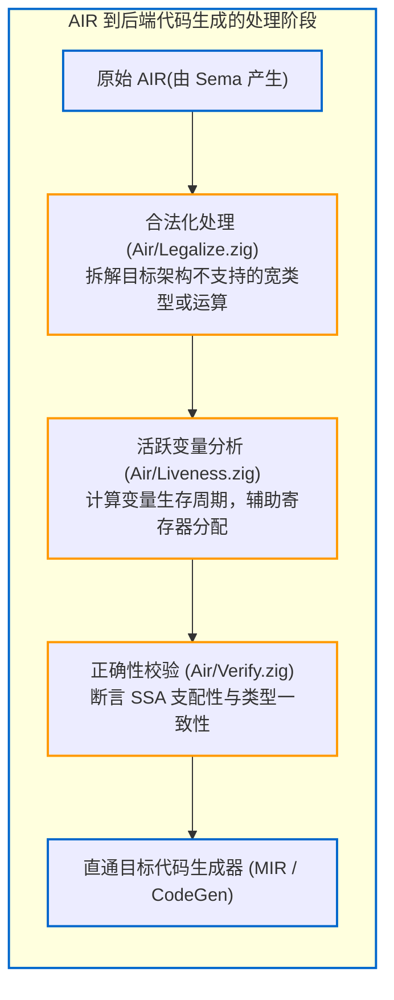

# 3.5 AIR 架构与全类型运行时表示

经过 `Sema.zig`（语义分析器与 Comptime 求值引擎）处理后，无类型的 ZIR 代码被转换为 Zig 编译器的第二层核心中间表示——**AIR（Analyzed Intermediate Representation）**。

AIR 定义在 [`src/Air.zig`](https://codeberg.org/ziglang/zig/src/tag/0.17.0/src/Air.zig) 中。与 ZIR 相比，AIR 已经具备完整的类型信息与平台属性，是直接衔接机器码生成的核心中间格式。

---

## AIR 的核心设计特征

查看 [`src/Air.zig#L1-L6`](https://codeberg.org/ziglang/zig/src/tag/0.17.0/src/Air.zig#L1-L6)：

```zig
//! Analyzed Intermediate Representation.
//!
//! This data is produced by Sema and consumed by codegen.
//! Unlike ZIR where there is one instance for an entire source file, each function
//! gets its own `Air` instance.
```

从官方说明中可以看出 AIR 的基本定位：
1. **由 Sema 负责生成，供 CodeGen 负责消费**；
2. **以函数为管理粒度（Per-Function Scope）**：不同于以整份文件为单位的 ZIR，**AIR 是为每一个具体的运行时函数单独生成的**。当函数被编译生成底层机器指令后，该函数对应的 AIR 内存即可被就地释放或复用。

---

## 显式类型与安全检查指令标记

在 AIR 中，每个操作数的具体类型已完全推导固定，构建模式（Debug、ReleaseSafe、ReleaseFast）下的安全策略也直接落实为明确的指令标签（Tag）。

以加法操作为例，查看 [`src/Air.zig#L44-L70`](https://codeberg.org/ziglang/zig/src/tag/0.17.0/src/Air.zig#L44-L70)：

| AIR 指令 Tag | 语义说明 | 代码生成行为 |
| :--- | :--- | :--- |
| **`add_safe`** | 整数加法（溢出触发安全 Panic） | 在 Debug/ReleaseSafe 模式下生成。后端会发射带溢出检测的汇编指令或跳转至异常处理代码 |
| **`add`** | 无溢出检查的加法 | 在 ReleaseFast 模式下使用，若发生溢出按未定义行为（UB）处理，后端直接生成原生加法指令 |
| **`add_wrap`** | 补码环绕加法（`%+`） | 无论处于何种优化模式，均执行标准的环绕截断运算 |
| **`add_sat`** | 饱和截断加法（`+\|`） | 溢出时自动钳位至类型的极限边界值 |
| **`add_optimized`** | 允许重排优化的浮点加法 | 允许后端利用 FMA 或代数化简进行浮点重排优化 |

这种显式设计使下游的代码生成器（无论是自研 原生后端 还是 LLVM 后端）无需再次推演语言语义，直接将特定指令标签映射为对应硬件架构的最优汇编指令。

---

## AIR 辅助处理管线

AIR 模块在生成与进入后端之间配备了针对性的辅助分析组件：



### 1. 合法化处理（[`Air/Legalize.zig`](https://codeberg.org/ziglang/zig/src/tag/0.17.0/src/Air/Legalize.zig)）
某些硬件平台不具备直接处理特定宽度的指令能力（例如在 32 位架构上进行 `u128` 运算，或在无向量扩展的硬件上执行 SIMD 逻辑）。`Legalize.zig` 负责根据目标平台的实际硬件能力，将高级 AIR 指令合理拆解展开为硬件支持的指令序列。

### 2. 活跃周期分析（[`Air/Liveness.zig`](https://codeberg.org/ziglang/zig/src/tag/0.17.0/src/Air/Liveness.zig)）
为了提升编译性能，Zig 自研原生后端优先采用轻量的线性扫描寄存器分配方案。`Air/Liveness.zig` 在一次遍历中确定各个 AIR 指令产生值的生命周期结束点（Die Point），辅助自研寄存器分配器（[`src/register_manager.zig`](https://codeberg.org/ziglang/zig/src/tag/0.17.0/src/register_manager.zig)）快速完成寄存器复用决策。

### 3. 一致性核验（[`Air/Verify.zig`](https://codeberg.org/ziglang/zig/src/tag/0.17.0/src/Air/Verify.zig)）
在编译器调试或安全构建模式下，`Verify.zig` 会对基本块的 SSA 支配关系（Dominance）与类型一致性进行静态校验，防止未定义引用的出现。

---

## 阶段小结

从源码到中间表示，我们已经梳理了前端处理链路：
`源码 -> Tokenizer -> Ast.zig -> AstGen.zig -> Zir.zig -> Sema.zig -> Air.zig`

那么，作为将 ZIR 转换为 AIR 的核心中枢，**`Sema.zig`** 究竟如何驱动类型推导？Zig 的核心特性 **`comptime`** 又是在何时何处被解释执行的？

接下来的第 4 部分，我们将深入分析语义分析与 `comptime` 的内部运行机制。
