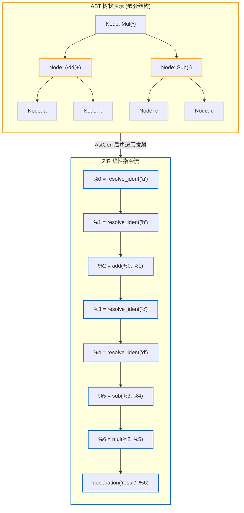

# 3.3 AstGen：AST 如何平铺降级为线性 ZIR

在语法树（AST）构建完成之后，编译器需要将树状嵌套结构转换为便于线性分析的指令流。

在 Zig 0.17 中，负责这一转换的模块为 [`lib/std/zig/AstGen.zig`](https://codeberg.org/ziglang/zig/src/tag/0.17.0/lib/std/zig/AstGen.zig)。

---

## 树状表达式的线性化转换

我们以一个简单的算术表达式为例：

```zig
const result = (a + b) * (c - d);
```

在 AST 中，该表达式表现为一棵二叉树：



`AstGen` 通过后序遍历（Post-order Traversal）递归访问子节点，将基础计算操作依次追加至 `instructions` 数组中。每条新指令通过其数组索引（`Inst.Ref`）引用先前指令的生成结果。

---

## AstGen 的关键机制

查看 [`lib/std/zig/AstGen.zig#L19-L73`](https://codeberg.org/ziglang/zig/src/tag/0.17.0/lib/std/zig/AstGen.zig#L19-L73)，可以观察到 AstGen 内部包含几项关键优化机制：

### 1. 结果位置标注（Result Location Annotation, `AstRlAnnotate`）
```zig
nodes_need_rl: *const AstRlAnnotate.RlNeededSet,
```
在系统编程中，大体积结构体的拷贝会带来性能负担。Zig 支持原地构造语义（In-place Construction）。在 AstGen 生成 ZIR 前，`AstRlAnnotate` 预先扫描语法树，标记出可以直接接受“结果指针（Result Pointer）”的表达式。例如当函数返回复杂结构体时，可直接向调用方提供的栈帧缓冲区写入，避免多余的中间拷贝。

### 2. 线性单向行列号追踪（Linear Source Location Tracking）
```zig
source_offset: u32 = 0,
source_line: u32 = 0,
source_column: u32 = 0,
```
为避免每次记录错误位置时重新从文件开头扫描统计换行符（这容易导致 $O(N^2)$ 的时间开销），AstGen 维护了一个单向递增的源码游标，在整个遍历过程中线性向前推进，以 $O(N)$ 复杂度为各条指令记录精确的源码位置。

### 3. 声明级源码哈希计算（`src_hasher`）
```zig
src_hasher: std.zig.SrcHasher,
```
AstGen 在生成 ZIR 时，会针对文件内的每个独立顶层声明（函数、结构体、全局变量）单独计算其源码内容的哈希值。
当文件内容发生微调时，若前序声明的哈希未发生改变，语义分析阶段即可快速复用先前的分析结果，跳过未修改声明的重复推导。

### 4. 局部字符串去重驻留（String Deduplication）
```zig
string_table: std.HashMapUnmanaged(u32, void, StringIndexContext, ...),
string_bytes: ArrayList(u8),
```
若源文件中频繁出现相同的变量名或标识符，AstGen 通过局部哈希索引确保相同的字符串在当前文件的 `string_bytes` 字节池中仅存储一份物理拷贝，指令只需记录偏移量。

---

## 阶段小结

`AstGen` 将语法树结构平铺转换为易于线性处理的无类型指令流。由于生成的 ZIR 独立于具体的目标平台架构与类型系统，它具备良好的可持久化特征，可直接写入磁盘缓存。

下一节我们将探讨 `.zig-cache` 中的 ZIR 磁盘缓存管理机制。
