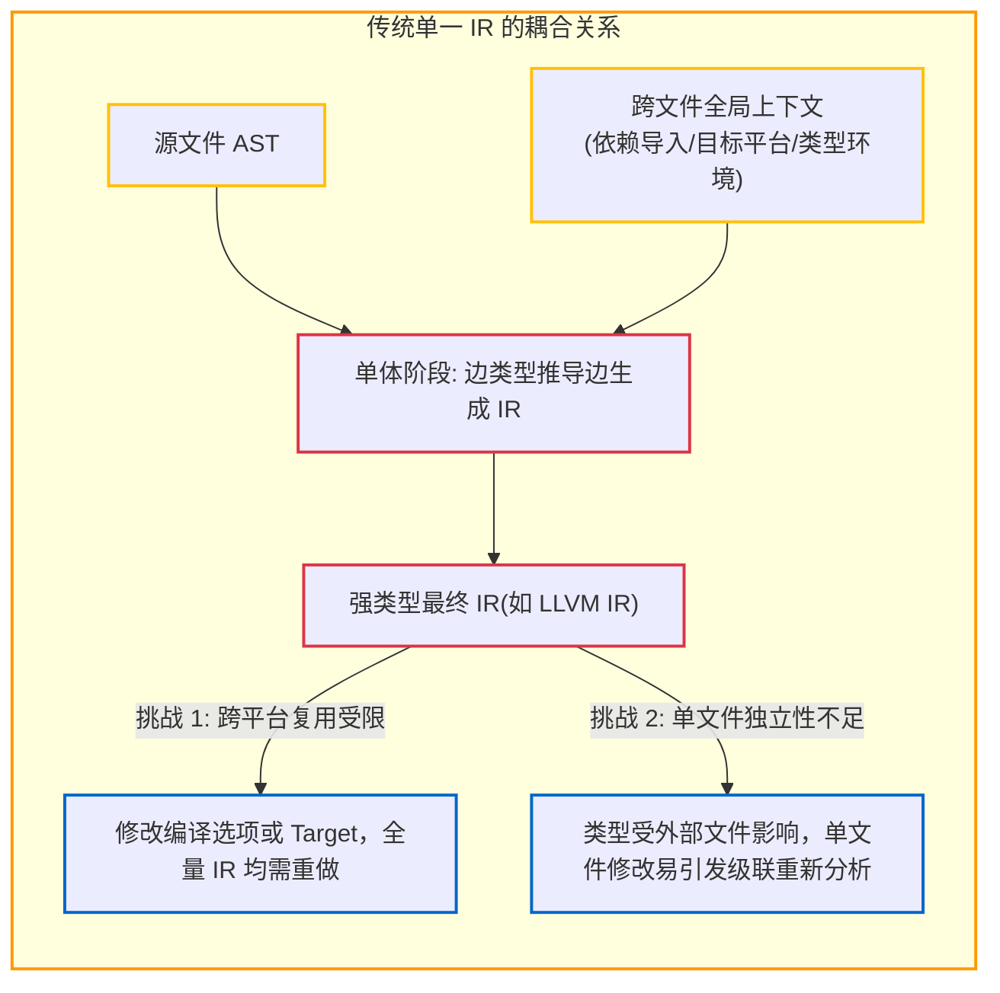
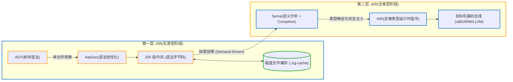

# 3.1 为什么需要两套 IR：无类型与全类型的解耦

在多数经典编译器教材中，关于中间表示（Intermediate Representation, IR）的设计通常是线性推进的：词法/语法分析产出 AST，AST 直接转为统一的 IR（如 LLVM IR 或三地址码），随后在该 IR 上执行类型检查、语义分析与优化，最后交由代码生成器。

但在 Zig 0.17 中，编译器内部设计了**两套职责互补、阶段独立的自研中间表示**：
1. **ZIR（Zig Intermediate Representation）**：无类型的、源文件维度的中间表示；
2. **AIR（Analyzed Intermediate Representation）**：全强类型的、函数维度的中间表示。

本节我们将分析这种双层 IR 体系的设计考量与工程收益。

---

## 传统单一强类型 IR 在增量构建中的瓶颈

在传统编译器设计中，类型检查（Type Checking）与中间表示生成（IR Lowering）往往高度交织。这种耦合通常带来两类工程挑战：

1. **缓存颗粒度受外部环境制约**：
   在 C++ 或 Rust 中，生成中间表示的前提是明确具体类型。这意味着即便是一个通用的辅助模块（如数学计算文件），其生成 IR 时也依赖于目标平台的指针宽度、字节序以及 C 运行时库等全局参数。因此无法脱离全局编译上下文为该文件生成稳定的持久化缓存。
2. **增量重分析成本高**：
   当某个文件发生局部修改时，由于缺少一个与类型解析解耦的语法骨架层，编译器通常需要从头加载源文本并执行完整的跨符号解析与类型推导。

---

## Zig 的分层策略：无类型 ZIR 与全类型 AIR 的职责解耦

Zig 的设计思路是将中端明确切分为两个层级：
- 前端只负责将语法树线性化为结构清晰、但**不包含具体类型推导**的指令流；
- 语义分析阶段再按需结合目标平台上下文，推导出完全强类型的函数级指令流。

---

## 双层 IR 核心特征横向对比

| 对比维度 | 第一层 IR：ZIR ([`Zir.zig`](https://codeberg.org/ziglang/zig/src/tag/0.17.0/lib/std/zig/Zir.zig)) | 第二层 IR：AIR ([`src/Air.zig`](https://codeberg.org/ziglang/zig/src/tag/0.17.0/src/Air.zig)) |
| :--- | :--- | :--- |
| **类型状态** | **完全无类型（Untyped）**。尚未区分整型、浮点型或编译期常量 | **全强类型（Fully-typed）**。每个指令和操作数的类型均已固定并完成合法性检查 |
| **作用域范围** | **单源文件维度（Per-File）**。每个 `.zig` 文件对应独立的 ZIR 实例 | **单函数维度（Per-Function）**。仅对最终需要进入二进制的运行时函数生成 AIR |
| **生成时机** | 前端并行生成（语法分析完成后即可发射） | 语义分析阶段（Sema 确定函数被直接或间接调用时**按需动态生成**） |
| **环境依赖性** | **完全环境无关（Context-free）**。不包含目标 CPU 架构、指针宽度或对齐规则 | **环境相关（Platform-aware）**。显式体现平台字长、溢出控制策略与 ABI 规范 |
| **持久化与缓存** | **直接序列化至磁盘**（跨项目、跨构建目标共享） | **纯内存瞬态对象（Transient）**。交由 CodeGen 完成机器码发射后即可释放 |
| **包含内容** | 顶层声明（`decl`）、结构体定义、全局变量、函数代码块全部并存 | 仅包含需要由机器指令执行的**函数体计算与控制流** |

---

## 工程收益

1. **单文件维度的确定性缓存（Per-file Deterministic Caching）**：
   由于 ZIR 的生成仅取决于当前源码文件的内容，与其他文件及构建参数无关，因此单个文件的 ZIR 产物可以被稳定缓存至 `.zig-cache` 目录中。当仅修改项目中的某个文件时，其他文件的 ZIR 可直接从缓存中读入，避免重新解析。
2. **减少未引用代码的处理开销（Lazy Evaluation）**：
   在大型依赖库中，通常定义了大量的辅助数据结构与函数。ZIR 仅负责线性的语法记录；只有在应用程序入口实际调用特定函数时，**Sema 才会对该函数生成 AIR 并执行类型推导**，未使用的函数则不会进入 AIR 生成与后端代码发射流程。

下一节中，我们将深入剖析 ZIR 的内部指令架构。
