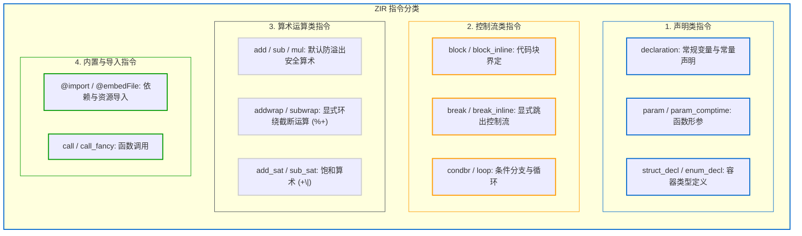

# 3.2 ZIR 架构与指令体系

在 Zig 0.17 编译器中，ZIR（Zig Intermediate Representation）承担着“语法与语义分析隔离”的角色，其定义位于 [`lib/std/zig/Zir.zig`](https://codeberg.org/ziglang/zig/src/tag/0.17.0/lib/std/zig/Zir.zig)。

本节我们将分析 ZIR 的内存组织、指令结构以及其在并发分析下的只读特性。

---

## ZIR 的数据结构顶层组织

查看 [`lib/std/zig/Zir.zig#L26-L37`](https://codeberg.org/ziglang/zig/src/tag/0.17.0/lib/std/zig/Zir.zig#L26-L37)：

```zig
pub const Zir = struct {
    /// 所有的 ZIR 指令 (SoA 格式存储)
    instructions: std.MultiArrayList(Inst).Slice,

    /// 字符串专用压缩池
    string_bytes: []u8,

    /// 复杂指令的动态额外参数池
    extra: []u32,
    // ...
};
```

延续了 AST 的紧凑设计思路，ZIR 同样是一个**零内存指针、完全展平于连续数组中的线性数据结构**：
1. `instructions`：基于 `MultiArrayList(Inst)` 存储的指令序列；
2. `string_bytes`：记录当前文件内所有标识符名称与字符串字面量的紧凑字节数组。指令引用字符串时仅记录 32 位整型偏移量；
3. `extra`：用于承载变长参数列表、Switch 分支项等附加数据的 `u32` 数组。

---

## 基础单元：`Inst` 与 `Inst.Ref`

### 1. 指令单体结构
在 [`lib/std/zig/Zir.zig#L161-L164`](https://codeberg.org/ziglang/zig/src/tag/0.17.0/lib/std/zig/Zir.zig#L161-L164) 中：

```zig
pub const Inst = struct {
    tag: Tag,    // 1 字节枚举 (表示算术、分支、声明等操作)
    data: Data,  // 8 字节联合体 (存储操作数或 extra 索引)
};
```

每条 ZIR 指令的基础物理大小为 **9 字节**（在 SoA 布局下字段无缝排列）。

### 2. `Inst.Ref` 的引用机制
在静态单赋值（SSA）形态的指令流中，指令通常需要引用先前指令的计算结果。在 ZIR 中，这种引用统一表示为 `Inst.Ref`：
- 底层类型为 `enum(u32)`；
- 既可以索引指向 `instructions` 数组中前序指令的产出结果；
- 也可以通过保留的高位编码直接表达特定的常量值（如 `none`、`unreachable` 等特殊符号）。

---

## ZIR 指令体系分类

ZIR 包含百余种指令（`Inst.Tag`），覆盖声明、控制流与操作符等分类（参见 [`lib/std/zig/Zir.zig#L167-L250`](https://codeberg.org/ziglang/zig/src/tag/0.17.0/lib/std/zig/Zir.zig#L167-L250)）：



需要注意的是：
- **操作符语义在 ZIR 阶段已完成词法映射**：例如常规加法 `+` 发射为 `add`，环绕加法 `%+` 发射为 `addwrap`。但在此阶段，指令两侧的操作数尚无具体的整型或浮点型标记；
- 直到进入后续 `Sema.zig` 语义分析阶段，编译器才会根据操作数的实际类型确定是否生成溢出检查指令。

---

## 并发访问安全：ZIR 的不可变性（Immutability）

在源码 [`lib/std/zig/Zir.zig#L158-L160`](https://codeberg.org/ziglang/zig/src/tag/0.17.0/lib/std/zig/Zir.zig#L158-L160) 中明确注明：

> *"These are untyped instructions generated from an Abstract Syntax Tree. **The data here is immutable** because it is possible to have multiple analyses on the same ZIR happening at the same time."*

在多模块并行编译中，通用的标准库文件（如 `std/mem.zig`）经常会被多个编译线程同时引用：
- 线程 1 可能在分析 `allocator.alloc(u32, 10)`；
- 线程 2 可能在分析 `allocator.alloc(f64, 20)`。

由于 ZIR 在由 AstGen 生成后即处于只读状态，多个工作线程可以无锁并发读取同一份 ZIR 数据，无需加锁或管理原子计数器，降低了多核编译时的同步开销。
