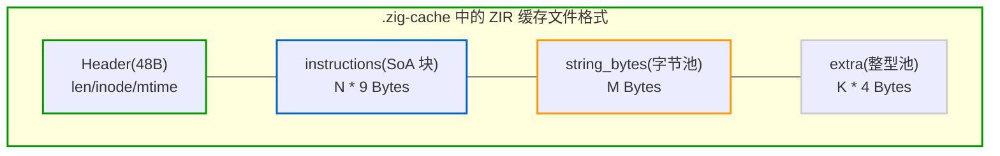

# 3.4 ZIR 独立磁盘缓存与增量编译机制

在日常开发与持续集成中，每次重新构建时，大部分源文件往往并未发生变更。编译器如何快速跳过未改动文件，是决定增量构建速度的关键因素。

在 C/C++ 中，预编译头（PCH）机制通常受编译器参数、宏展开顺序等环境因素影响，跨编译单元的缓存复用门槛较高；而在 Rust 中，增量编译缓存涉及深度交织的类型推导系统，缓存数据体积较大。

Zig 0.17 凭借 ZIR 的**无类型（Untyped）与单文件独立（Context-free）**特征，构建了一套轻量且确定性的磁盘缓存机制。

---

## 紧凑的二进制镜像文件头（`Zir.Header`）

查看 [`lib/std/zig/Zir.zig#L39-L51`](https://codeberg.org/ziglang/zig/src/tag/0.17.0/lib/std/zig/Zir.zig#L39-L51)：

```zig
/// The data stored at byte offset 0 when ZIR is stored in a file.
pub const Header = extern struct {
    instructions_len: u32,
    string_bytes_len: u32,
    extra_len: u32,
    unused: u32 = 0,
    stat_inode: Io.File.INode,
    stat_size: u64,
    stat_mtime: i128,
};
```

这是一个定长的 `extern struct`（保持严格的 C 内存布局）。
由于 ZIR 本身是由三个连续数组（`instructions`, `string_bytes`, `extra`）构成的一维数据体，其序列化过程非常直接。

### 磁盘缓存的写入流程（`saveZirCache`）
查看 [`src/Zcu.zig#L3099-L3140`](https://codeberg.org/ziglang/zig/src/tag/0.17.0/src/Zcu.zig#L3099-L3140)：
当源文件完成 `AstGen` 后，序列化主要包括以下步骤：
1. 写入 `Header`，记录指令数量、字符串池长度、额外数据长度，以及源文件的 `inode`、`size` 和修改时间 `mtime`；
2. 直接将内存中的 `instructions` 数组二进制数据顺序写出；
3. 顺序写出 `string_bytes` 字节流；
4. 顺序写出 `extra` 整型数组。

数据以平整二进制形式直接写入，无需额外的结构编解码转换。



---

## 缓存命中校验与快速加载（`loadZirCache`）

当发起后续构建，或编译线程需要加载被 `@import` 引用的模块时（参见 [`src/Zcu/PerThread.zig#L480-L500`](https://codeberg.org/ziglang/zig/src/tag/0.17.0/src/Zcu/PerThread.zig#L480-L500)）：

1. **计算缓存哈希键**：
   ```zig
   var h: Cache.HashHelper = .{};
   file.path.addToHasher(&h.hasher);
   h.addBytes(build_options.version); // 编译器版本号
   h.add(builtin.zig_backend);
   const hex_digest = h.final();
   ```
2. **校验文件元数据**：
   读取 `.zig-cache/z/<hex_digest>` 文件头部的 48 字节 `Header`，直接对比源文件当前的 `stat` 属性（如文件大小与修改时间）。
3. **内存直接加载**：
   若元数据校验完全一致，只需顺序读取文件数据填充至内存切片。

在此情况下：
- 无需重新执行文件的词法扫描（Tokenizer）；
- 无需执行语法树解析（Parser 与 AST 构造）；
- 无需重复执行 AstGen 线性化转换。

对于包含大量源文件的大型工程，文件维度的无类型缓存可使非初次构建快速完成前端扫描阶段，为后续按需语义分析节省时间。
