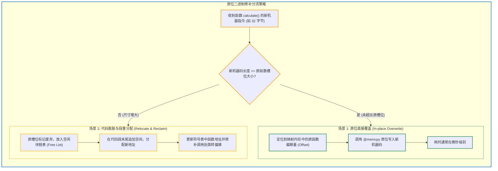

# 7.3 内存原位增量二进制重写：无需全量重新链接

在编译器增量构建体系中，Zig 0.17 实现了**内存映射原位增量二进制修补（In-place Binary Patching）**。

传统增量编译通常仅局限在“增量生成 `.o` 目标文件”，最终链接阶段仍然需要将整个输出文件重新写入磁盘；
而 Zig 借助常驻内存链接器，实现了**仅更新发生变动的局部字节，未变更的代码段和数据段保持原样**。

这一机制的实现基础位于 [`src/link/MappedFile.zig`](https://codeberg.org/ziglang/zig/src/tag/0.17.0/src/link/MappedFile.zig) 与 [`src/link/Elf2.zig`](https://codeberg.org/ziglang/zig/src/tag/0.17.0/src/link/Elf2.zig) 中。

---

## 核心支撑：内存映射文件（`MappedFile.zig`）

在开启增量构建（`-fincremental`）时，链接器并不在每次编译结束后关闭文件，而是通过操作系统的**内存映射技术（`mmap` / `MapViewOfFile`）**将目标二进制文件常驻映射至编译器的虚拟内存中：

```zig
pub const MappedFile = struct {
    file: Io.File,
    mem: []align(std.heap.page_size_min) u8,
    // ...
};
```

此时，磁盘上的二进制文件直接体现为内存中的一段可读写字节切片（`[]u8`）。

---

## 原位修补的两种基本场景

当开发者修改了某个函数 `calculate()` 并保存时，Sema 产出 AIR，原生后端生成了对应的机器码。链接器根据新旧机器码的尺寸进行分支处理：



### 场景 1：代码尺寸未超出原分配槽位（原位覆盖）
若修改仅改变了内部运算或减少了代码逻辑，使得新生成的机器码尺寸小于或等于原有槽位大小：
- 链接器直接在映射内存的原偏移地址执行 `@memcpy` 覆盖；
- 符号表、段偏移以及其他函数的物理内存地址保持不变；
- 增量写入耗时极低。

### 场景 2：代码体积膨胀（动态段内分配）
若修改增加了代码逻辑，导致新机器码超出原槽位容量：
- 链接器将旧槽位回收并登记至代码段的空闲链表（Free List）中；
- 在代码段（`.text`）末尾分配足够尺寸的新槽位；
- 写入新机器码并更新符号表中该函数的虚拟地址；
- 顺着依赖关系修补直接调用该函数的跳转指令相对偏移。

---

## 增量链接机制对比

| 考量维度 | 传统外部链接器 (GNU ld / lld) | Zig 原位增量链接器 |
| :--- | :--- | :--- |
| **磁盘读写量** | 重新扫描全部目标文件，全量重写输出二进制 | **仅覆写变动函数对应的字节范围** |
| **链接耗时** | 数秒至数十秒（随工程规模递增） | **通常数毫秒级** |
| **I/O 负载** | 每次构建触发较多磁盘写操作 | 仅对变动页面执行写回，降低写放大 |
| **进程开销** | 每次需冷启动独立的链接器进程 | **常驻编译器内存，无进程切换开销** |

---

## 0.17 进展：`-fincremental --watch` 在 Linux x86_64 上支持

在 **Zig 0.17.0** 中，得益于下一代自研链接器 [`Elf2.zig`](https://codeberg.org/ziglang/zig/src/tag/0.17.0/src/link/Elf2.zig) 的成熟，官方宣布：**针对 `x86_64-linux` 平台的大多数项目，已可使用增量编译机制**。

```bash
# 0.17 推荐的增量开发命令：
zig build -fincremental --watch
```
- 构建系统常驻后台，监听项目源码改动；
- 检测到变更时保持进程常驻，复用已初始化的 `Zcu` 状态机与映射二进制句柄，执行**原位二进制补丁更新**；
- 局部的单文件修改通常在数十毫秒内完成重新生成与补丁写回。

---

## 阶段小结

原位增量二进制修补技术使 Zig 在增量构建时能够避免全量链接开销。

下一节中，我们将分析链接器与前端是如何在同一个进程中实现紧密协同的。
