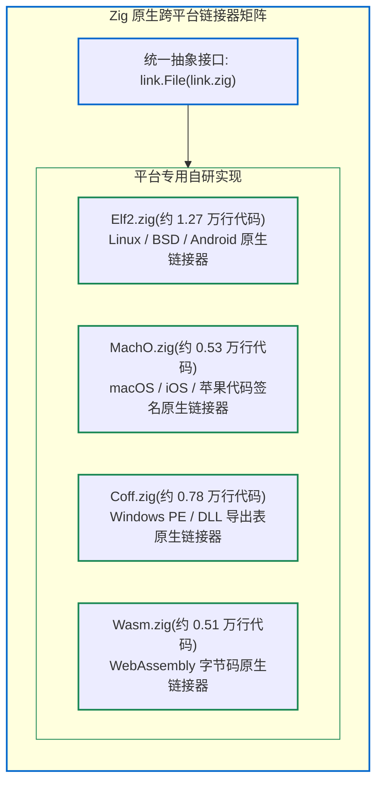

# 7.2 Zig 自研链接器矩阵：ELF, Mach-O, COFF, WASM

主流操作系统在底层采用了不同的目标二进制格式：
- Linux / BSD 等类 Unix 系统使用 **ELF（Executable and Linkable Format）**；
- macOS / iOS 等苹果平台使用 **Mach-O**；
- Windows 平台使用 **PE/COFF（Portable Executable / Common Object File Format）**；
- 浏览器与 Web 端环境使用 **WebAssembly（WASM）**。

传统编译器大多调用目标系统预装的链接器。而 Zig 0.17 在 [`src/link/`](https://codeberg.org/ziglang/zig/src/tag/0.17.0/src/link) 目录下，**使用纯 Zig 实现了支持这四大格式的原生链接器**。

---

## 统一抽象接口：`link.File`

查看 [`src/link.zig#L1352-L1377`](https://codeberg.org/ziglang/zig/src/tag/0.17.0/src/link.zig#L1352-L1377)：

```zig
pub const Tag = enum {
    coff,     // Windows PE/COFF
    elf,      // Linux ELF (初代)
    elf2,     // Linux ELF (下一代增量重构版)
    macho,    // macOS Mach-O (初代)
    macho2,   // macOS Mach-O (下一代重构版)
    c,        // C 代码拼装器
    wasm,     // WebAssembly 专用链接器
    spirv,    // GPU SPIR-V 链接器
    lld,      // LLVM LLD 回退支持
    spork8,
    plan9,
};
```

各平台链接器统一封装在 `link.File` 联合体中。编译器前端仅面向抽象的 `link.File` 提交符号与机器码，底层依据目标平台路由至具体的链接实现。



---

## 四大原生链接器的功能特性

### 1. ELF 链接器（[`src/link/Elf2.zig`](https://codeberg.org/ziglang/zig/src/tag/0.17.0/src/link/Elf2.zig)）
- 包含超过 1.2 万行自研代码，在 **Zig 0.17.0 中取得了重要进展**：
  - 支持 **x86_64** 与 **SPARC64** 目标架构，初步支持 LoongArch；
  - 支持输出静态归档库（`.a`）与动态共享库（`.so`）；
  - 实现了全局偏移表（GOT）、过程链接表（PLT）、Copy Relocation、GNU 符号版本化（GNU Symbol Versioning）与 DWARF 调试符号映射；
  - 解决了宿主文件系统块大小（Host Block Size）下的对齐问题与确定性复现构建（Reproducible Binaries），作为 Linux 平台增量编译（`-fincremental`）的基础引擎。

### 2. Mach-O 链接器（[`src/link/MachO.zig`](https://codeberg.org/ziglang/zig/src/tag/0.17.0/src/link/MachO.zig)）
- 原生处理苹果平台的加载命令（Load Commands，如 `LC_SEGMENT_64`、`LC_LOAD_DYLIB`）；
- 支持紧凑展开信息（Compact Unwind Info）与原生代码签名（Code Signing，[`src/link/tapi.zig`](https://codeberg.org/ziglang/zig/src/tag/0.17.0/src/link/tapi.zig)）；
- **在 macOS 上编译 Zig 程序，无需预装 Xcode 命令行工具**。

### 3. COFF 链接器（[`src/link/Coff.zig`](https://codeberg.org/ziglang/zig/src/tag/0.17.0/src/link/Coff.zig)）
- 在 0.17.0 中获得了显著增强（PR #35674）：
  - 支持输出 Windows 目标文件（`.obj`）、静态库（`.lib`）与导入库（`implib`）；
  - 完整支持线程局部存储（TLS）与导出表（Exports Directory）；
  - 支持 COMDAT 折叠规则，具备同时链接 MinGW-w64 与微软原生 MSVC C 运行库的能力；
  - 支持 `__dllimport` 解析以及微软链接器专有的 `.drectve` 指令（如 `/INCLUDE`, `/ALTERNATENAME`, `/DEFAULTLIB`）。

### 4. WebAssembly 链接器（[`src/link/Wasm.zig`](https://codeberg.org/ziglang/zig/src/tag/0.17.0/src/link/Wasm.zig)）
- 原生组织 WASM 的 Type、Function、Table、Memory 与 Export 等段；
- 直接生成无额外运行时依赖的独立 `.wasm` 字节码文件。

### 5. SPIR-V 增量链接器（[`src/link/Spirv.zig`](https://codeberg.org/ziglang/zig/src/tag/0.17.0/src/link/Spirv.zig)）
- 在 0.17.0 中完成重写（PR #36828），支持 GPU 着色器的增量链接，并可直接链接外部第三方 `.spv` 二进制对象文件。

---

## 质量保障：快照式链接器测试框架（Linker Snapshot Testing）

在 0.17.0 中，Zig 引入了基于反汇编快照对比的测试框架：
通过 `zig build -Dlink-snapshot-update`，编译器可将各平台链接产物的段分布、符号表及 `objdump` 反汇编输出记录为快照基准文件（`.dmp`）。微小的重定位偏差或段对齐错误可在持续集成（CI）阶段被自动化捕获，保证了跨平台自研链接器的稳定性。

---

## 阶段小结

通过完全自研跨平台的原生链接器，Zig 打破了传统外部链接器的独立进程黑盒。

下一节中，我们将探讨基于常驻内存链接器的核心能力——**内存原位增量二进制重写**。
