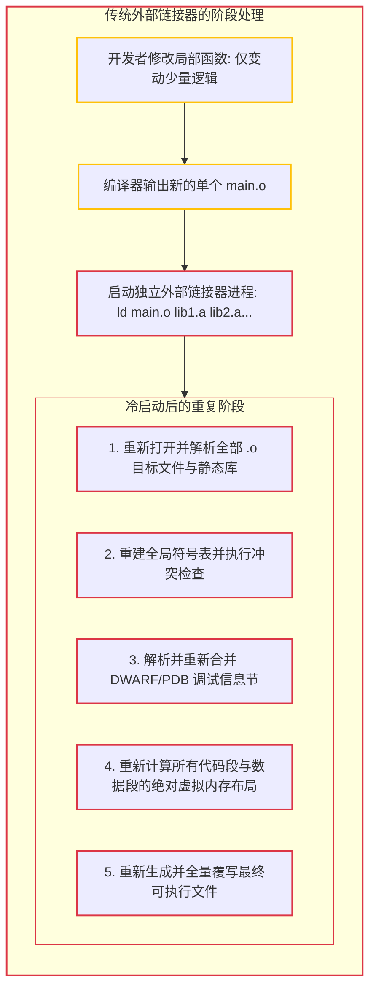

# 7.1 为什么外部链接器会成为增量构建的瓶颈？

在大型系统级工程中，开发者常遇到类似现象：
修改单行逻辑后，前中端代码生成在数十毫秒内即可结束，但随后的链接阶段却可能耗费数秒乃至数十秒。

无论是数百万行规模的大型 C/C++ 项目还是复杂的 Rust 工程，链接阶段往往占据了增量构建耗时的主要部分。

本节我们将分析传统外部链接器的运行瓶颈，以及 Zig 为什么选择在编译器内部自研全套原生链接器。

---

## 传统外部链接器的无状态模型

在通用构建体系中（如 GNU `ld`、macOS `ld64`、LLVM `lld`），链接器通常被设计为一个**完全独立的命令行可执行程序**。

每次开发者发起编译，构建系统都会启动一个全新的链接器进程：

### 传统外部链接的核心开销：
1. **冷启动与全量 I/O 读取**：
   链接器独立运行，每次都需要从磁盘重新扫描、解析所有参与链接的目标文件与静态依赖库（`.a`/`.lib`）；
2. **调试信息全量合并**：
   在带调试符号的构建中，调试信息（如 DWARF 或 PDB）占据了输出产物的大部分体积。外部链接器每次通常需要重新遍历并重新排列各段调试表项；
3. **产物全量重新覆写**：
   即使变动的仅是某一个函数的几十字节机器码，独立的外部链接器通常也需要将数兆至数十兆的目标二进制完整重写到磁盘。

---

## Zig 的选择：将链接器深度内置于编译器

为了真正实现端到端的快速增量构建，Zig 团队做出了工程决策：
**在 Zig 编译器进程中，用 Zig 语言从零实现针对各主流平台的原生静态链接器。**

将链接器作为编译器的常驻内存组件后：
- 编译器前端、中端与链接器共享同一进程空间与符号数据；
- 发生增量修改时，前端可以直接通知驻留的链接器：“第 N 号函数的机器码已更新”，链接器即可在已映射的二进制文件中实施定向原位覆写，无需从头重构整个二进制文件。

下一节中，我们将分析 Zig 源码中的**自研跨平台链接器矩阵**。
