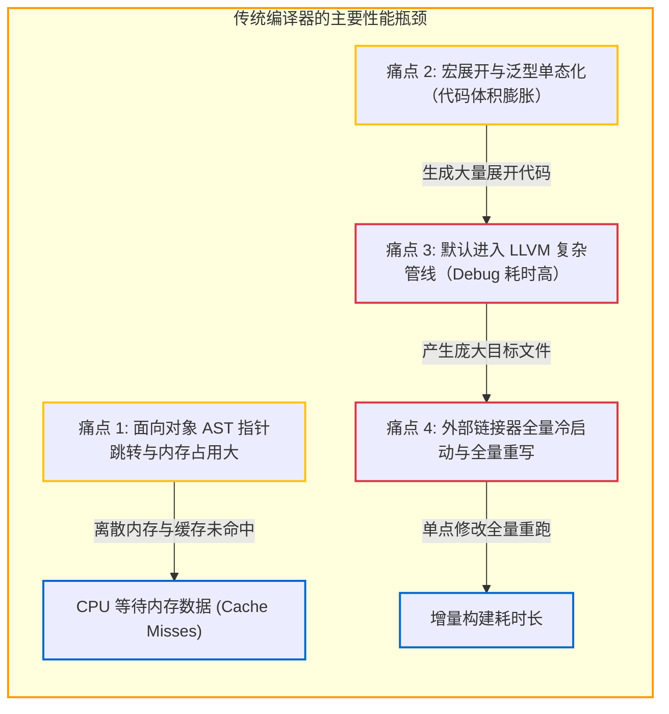

# 1.2 经典编译器的痛点与反思

在大型项目中（如 C++ 或 Rust 工程），代码修改后的重新编译耗时往往成为影响开发效率的重要因素。尽管现代 CPU 核心数与内存带宽大幅提升，大型工程的构建与链接耗时依然居高不下。

分析传统编译器（如 GCC、Clang、Rustc）的底层工程实现，其主要性能瓶颈集中在以下四个方面：

---

## 传统编译器的四大核心痛点



---

## 痛点 1：面向对象 AST 的指针寻址（Pointer Chasing）

许多主流编译器（如 Clang）通常以类继承体系来组织抽象语法树：

```cpp
// 典型的面向对象 AST 节点定义 (伪代码)
class AstNode {
    SourceLocation loc;
    NodeKind kind;
    virtual ~AstNode() = default;
};

class BinaryExpr : public AstNode {
    BinaryOp op;
    AstNode* lhs; // 堆内存指针
    AstNode* rhs; // 堆内存指针
};
```

这种设计在工程抽象上直观，但在硬件执行效率上面临瓶颈：
1. **内存占用偏大**：多态基类包含虚函数表指针（vptr，8 字节），加上指针寻址、对齐填充与堆分配元数据，简单二元运算节点在内存中常达 64 至 128 字节；
2. **堆离散分配与缓存未命中**：语法树节点分散在堆内存的不同地址。编译器遍历树结构时，指针间接跳转导致硬件预取器难以有效工作，频繁产生缓存缺失（Cache Miss），增加等待内存的时间。

---

## 痛点 2：宏展开与泛型单态化的重复计算

- **C/C++ 的头文件包含机制**：C/C++ 的编译单元相互独立。同一个基础头文件（如 `<vector>` 或 `<windows.h>`）在 100 个 `.cpp` 文件中被引入，编译器就需要独立解析 100 次并生成 100 份语法树。预编译头文件（PCH）能缓解该问题，但在跨目标和配置变更时易失效。
- **模板与泛型单态化（Monomorphization）**：在 C++ 与 Rust 中，泛型类型针对每个具体参数类型（如 `Vec<i32>`, `Vec<u8>`）独立展开并生成独立的底层代码。若代码库广泛依赖深层泛型，生成的中间代码规模会迅速膨胀，加重后续阶段的负担。

---

## 痛点 3：默认依赖重型中间优化管线

LLVM 拥有成熟且强大的优化管线，其设计目标偏向生成高质量代码，而非专注开发调试阶段的编译速度。
- LLVM IR 采用复杂的 C++ 对象图表示（`llvm::Instruction`、`llvm::BasicBlock` 等），构建与遍历本身开销较高。
- 在开发日常调试（Debug 阶段）中，更关注快速获得可执行产物，并不需要复杂的循环优化或自动向量化。但若前端与 LLVM 强绑定，即便在 `-O0` 下仍需承担生成 LLVM 模块、指令选择与后端运行的固定开销。

---

## 痛点 4：独立的外部静态链接器

在传统工具链中，编译器与链接器通常是独立的进程（如 GNU `ld`、macOS `ld64`、LLVM `lld`）。

由于链接器在每次构建中独立启动，无法直接复用编译器的内存状态：
1. 链接器每次都需要重新读取所有参与链接的目标文件与静态库；
2. 重新解析所有目标文件中的 DWARF 或 PDB 调试信息并合并；
3. 全局重定位符号表后，将几十兆乃至上百兆的可执行文件全量覆写到磁盘。

在大型项目中，即使源码只修改了一处小逻辑，外部链接器也往往需要耗费数十秒完成整包重排。

---

## Zig 的设计思考

针对上述问题，Zig 在设计编译器时做出了对应的架构选择：

1. **能否避免指针引用来构建 AST？** 通过平铺数组与索引，提高 CPU 缓存行的利用率。
2. **能否消除宏语言与额外展开层？** 将 Comptime（编译期求值）直接与语义分析合并，避免单独的代码生成膨胀。
3. **能否按需延迟编译？** 只有在运行时实际被引用的函数才进入代码生成，未使用的声明不产生中间表示。
4. **能否自研轻量原生后端？** 在日常开发调试时绕过 LLVM，由轻量后端快速生成机器码。
5. **能否内置增量链接器？** 编译器修改函数后，链接器直接在现有二进制对应的偏移位置覆盖写入，无需整包重新链接。

下一节将介绍 Zig 0.17 针对这些目标设计的整体流水线架构。
