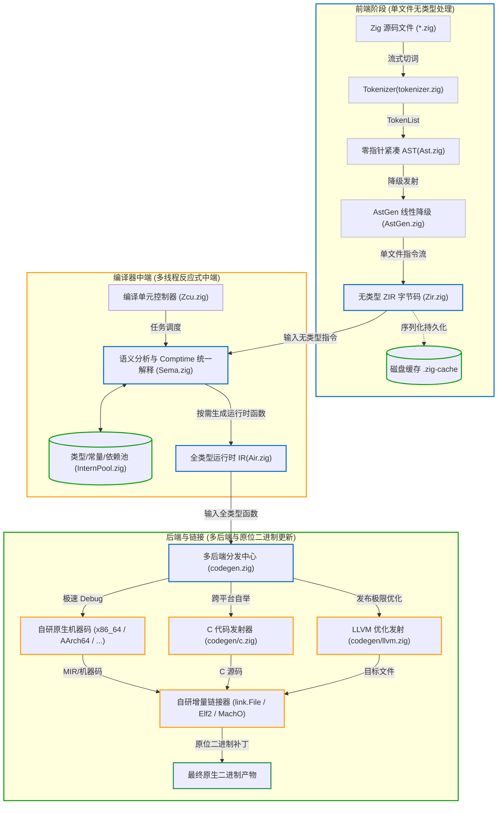

# 1.3 Zig 0.17 编译器全景架构

Zig 0.17 编译器围绕硬件缓存特性与按需增量响应进行设计，采用了多阶段解耦、双层中间表示（ZIR 与 AIR）以及细粒度依赖图体系。

本节梳理其核心组件与整体流水线。

---

## Zig 0.17 编译器流水线全景图

---

## 核心组件与关键职责速览

以下结合 Zig 0.17 源码库中的文件路径，梳理各阶段组件与职责：

### 1. 前端：词法、语法与 AST 线性化
- **[`lib/std/zig/tokenizer.zig`](https://codeberg.org/ziglang/zig/src/tag/0.17.0/lib/std/zig/tokenizer.zig)**：
  无状态游标切词器。零堆内存分配，负责生成 Token 序列。
- **[`lib/std/zig/Ast.zig`](https://codeberg.org/ziglang/zig/src/tag/0.17.0/lib/std/zig/Ast.zig)**：
  采用 `MultiArrayList` 结构体数组（SoA）设计组织语法树，节点之间无指针引用。每个 AST 节点占 13 字节，子节点与 Token 均通过 32 位整型索引（`u32`）关联。
- **[`lib/std/zig/AstGen.zig`](https://codeberg.org/ziglang/zig/src/tag/0.17.0/lib/std/zig/AstGen.zig)**：
  将层级嵌套的 AST 树结构平铺展开为单文件的线性无类型中间代码（ZIR）。

### 2. 第一层 IR：ZIR（Zig Intermediate Representation）
- **[`lib/std/zig/Zir.zig`](https://codeberg.org/ziglang/zig/src/tag/0.17.0/lib/std/zig/Zir.zig)**：
  **无类型（Untyped）、基于单文件（Per-file）**的指令流。
  - ZIR 不依赖跨文件类型推导，也不包含目标架构信息，其生成过程不依赖外部上下文。
  - ZIR 包含二进制头（`Zir.Header`），可直接序列化并缓存于 `.zig-cache` 目录中。当源文件未变动时，可直接读取磁盘缓存，跳过 Tokenizer、Parser 和 AstGen。

### 3. 编译器核心状态机：Zcu、InternPool 与 Sema
- **[`src/Zcu.zig`](https://codeberg.org/ziglang/zig/src/tag/0.17.0/src/Zcu.zig) (Zig Compilation Unit)**：
  管理 Zig 编译任务的状态机，负责源文件模块、分析队列与线程调度的协调。
- **[`src/InternPool.zig`](https://codeberg.org/ziglang/zig/src/tag/0.17.0/src/InternPool.zig) (驻留池与依赖图)**：
  管理所有已解析的类型（Type）、常量（Value）和声明（Nav/Decl）。
  - 相同的类型在编译器内存中只保存一份，由 32 位整数 `InternPool.Index` 标识。
  - 维护细粒度依赖图（`dep_entries`），记录分析单元之间的依赖关系，用于增量失效计算。
- **[`src/Sema.zig`](https://codeberg.org/ziglang/zig/src/tag/0.17.0/src/Sema.zig) (语义分析与 Comptime 引擎)**：
  负责静态类型检查，并在分析过程中直接求值编译期逻辑（`comptime`）。
  - 编译期确定的表达式直接在编译器内部求值并存入 `InternPool`；
  - 运行时逻辑则被翻译为全类型的第二层 IR——**AIR**。

### 4. 第二层 IR：AIR（Analyzed Intermediate Representation）
- **[`src/Air.zig`](https://codeberg.org/ziglang/zig/src/tag/0.17.0/src/Air.zig)**：
  **全类型（Fully-typed）、基于单个函数（Per-function）**的 SSA 中间表示。
  - 每一个需要生成机器码的运行时函数拥有独立的 `Air` 实例。
  - 类型完全决议，溢出安全检查指令（如 `add_safe`）显式生成，作为后端代码生成的输入。

### 5. 后端与增量链接
- **[`src/codegen.zig`](https://codeberg.org/ziglang/zig/src/tag/0.17.0/src/codegen.zig)**：
  后端调度入口。根据构建模式与目标平台，将 AIR 分发至不同后端：
  - **自研原生后端（Self-hosted Native）**：如 [`src/codegen/x86_64/`](https://codeberg.org/ziglang/zig/src/tag/0.17.0/src/codegen/x86_64) 与 [`src/codegen/aarch64/`](https://codeberg.org/ziglang/zig/src/tag/0.17.0/src/codegen/aarch64)，将 AIR 转换为机器中间表示（MIR）后直接生成机器指令，不依赖 LLVM；
  - **C 后端（`codegen/c.zig`）**：将 AIR 转换为 ANSI C99 代码；
  - **LLVM 后端（`codegen/llvm.zig`）**：将 AIR 转换为 LLVM IR，用于优化构建。
- **[`src/link.zig`](https://codeberg.org/ziglang/zig/src/tag/0.17.0/src/link.zig) (自研链接器)**：
  内置支持 ELF、Mach-O、COFF、WASM 格式。具备**内存映射原位补丁机制（In-place Binary Patching）**：修改单个函数时，在现有输出文件的代码段相应位置覆盖写入，无需重新全量链接。

---

## 本节小结

本节梳理了 Zig 0.17 从词法分析到最终二进制链接的整体流水线。下一节将通过对比矩阵，说明 Zig 与 GCC、Clang、Rustc 在各编译维度的具体差异。
