# 5.1 编译单元管家：Compilation.zig 与 Zcu.zig

在前面的章节中，我们分别讨论了词法分析、语法树 AST、两套中间表示（ZIR/AIR）、Sema 语义分析器以及 InternPool 驻留池。

在编译器顶层，需要相应的控制结构来协调命令行参数、目标输出格式、多模块依赖关系以及 C 与 Zig 源码的混合编译。

在 Zig 0.17 中，宏观调度的职责主要由以下两个模块承担：
1. **[`src/Compilation.zig`](https://codeberg.org/ziglang/zig/src/tag/0.17.0/src/Compilation.zig)**：负责全局构建任务调度、输出目标管理与外部工具链抽象；
2. **[`src/Zcu.zig`](https://codeberg.org/ziglang/zig/src/tag/0.17.0/src/Zcu.zig)**：专门管理 Zig 源码编译单元的状态机与语义依赖。

---

## 全局构建管理器：`Compilation.zig`

查看 [`src/Compilation.zig#L49-L80`](https://codeberg.org/ziglang/zig/src/tag/0.17.0/src/Compilation.zig#L49-L80)：

```zig
const Compilation = @This();

gpa: Allocator,
arena: Allocator,
io: Io,

/// 当次编译任务不一定包含 Zig 源码
/// 例如执行 `zig build-exe foo.o bar.c` (Zig 作为纯粹的 C/C++ 编译器或通用链接器)
zcu: ?*Zcu,

/// 缓存策略 (none / incremental / whole)
cache_use: CacheUse,

/// 目标可执行文件或动态库对象
bin_file: ?*link.File,

/// 根模块
root_mod: *Module,

/// 全局用户构建配置 (目标平台架构, 优化级别, 安全检查开关)
config: Config,
```

### 为什么 `zcu` 是一个可选指针（`?*Zcu`）？
这种设计体现了工具链的正交性：
**Zig 编译器除了编译 Zig 语言本身，同时也是一个通用的交叉工具链与链接器管理器。**
例如在执行以下命令时：
```bash
zig cc -O2 hello.c -o hello
# 或者
zig build-exe obj1.o obj2.o
```
`Compilation` 会正常启动，负责驱动内置的 Clang/LLVM C 前端，或调用内部链接器合并目标文件。在该场景下，**无需初始化针对 Zig 语言本身的 ZCU 状态机**，降低了内存占用与启动开销。

---

## Zig 代码编译单元：`Zcu.zig`（Zig Compilation Unit）

当编译任务包含 Zig 源码时，`Compilation` 将挂载专用的 `Zcu` 实例。

查看 [`src/Zcu.zig#L1-L6`](https://codeberg.org/ziglang/zig/src/tag/0.17.0/src/Zcu.zig#L1-L6)：

> *"Zig Compilation Unit. Compilation of all Zig source code is represented by one `Zcu`. Each `Compilation` has exactly one or zero `Zcu`."*

```mermaid
graph TD
    %% Global styles and definitions
    classDef core stroke:#0066cc,stroke-width:2px;
    classDef middle stroke:#ff9900,stroke-width:2px;
    classDef mem stroke:#009900,stroke-width:2px;
    classDef edge stroke:#ccc,stroke-width:2px;

    subgraph SG_Compilation["Compilation: 全局构建总控"]
        direction TB
        Node_Config["构建配置 Config(Target / Mode)"]
        Node_LinkFiles["输出二进制对象 link.File(ELF / MachO / COFF)"]
        Node_CObjs["C 语言编译目标 c_objects"]

        subgraph SG_ZCU["Zcu: Zig 编译单元调度"]
            direction TB
            Node_IP[("类型/依赖驻留池 InternPool")]
            Node_Files["文件与模块表 import_table / alive_files"]
            Node_TaskPool["后端生成任务池 codegen_task_pool"]
            Node_OutdatedQueue["增量失效队列 outdated"]
        end
    end

    SG_Compilation --> SG_ZCU

    style SG_Compilation stroke:#495057,stroke-width:2px;
    style SG_ZCU stroke:#0066cc,stroke-width:2px;

    class Node_Config,Node_LinkFiles,Node_CObjs middle;
    class Node_IP mem;
    class Node_Files,Node_TaskPool,Node_OutdatedQueue core;
```



### `Zcu` 的核心职能：
1. **模块依赖网络维护**：
   维护根模块（`root_mod`）、测试模块（`main_mod`）以及标准库模块（`std_mod`），跟踪活跃可达的源文件集合（`alive_files`）；
2. **增量失效队列调度**：
   维护 `outdated`、`potentially_outdated` 等待处理集合，向工作线程分发需要更新的 `AnalUnit`；
3. **代码生成任务分发**：
   通过 `codegen_task_pool`，将完成语义分析的函数分发至后台任务池进行代码生成。

---

## 阶段小结

`Compilation` 负责全局构建目标与系统资源，`Zcu` 负责 Zig 源代码的分析状态管理。

在下一节中，我们将分析 Zig 0.17 的多线程协作模型：**`PerThread` 与分片架构**。
