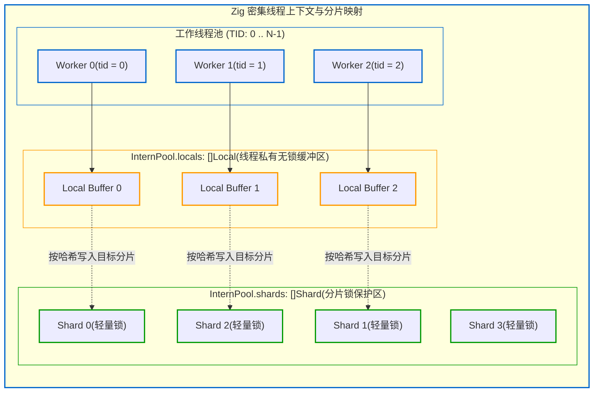

# 5.2 线程模型与分片架构：PerThread 与 Shards

在多核处理器普及的背景下，充分发挥硬件并发性能是现代编译器提升吞吐量的核心途径之一。

传统 C/C++ 工具链常采用基于多进程的模型（如通过构建工具执行 `make -j16` 并发启动多个独立编译进程）。这种机制下，各进程地址空间互相独立，每个进程通常需要独立解析头文件并维护各自的符号表，无法在内存中共享全局类型驻留信息。

Zig 0.17 在单一进程地址空间内设计了一套以**密集线程 ID（Dense Thread ID）**与**分片驻留池（Sharded Pool）**为基础的多线程并发模型。

---

## 密集线程 ID 与 `PerThread` 上下文

操作系统的线程原生标识（如 POSIX 的 `pthread_t` 或系统 `tid`）通常为较大的数值或指针地址，不适合直接作为密集数组的下标进行寻址。

Zig 0.17 采用了密集线程编号策略：
在编译器初始化阶段，根据可用的 CPU 核心数分配一组范围在 `0` 到 `N - 1` 的连续整数 `PerThread.Id`。

查看 [`src/Zcu.zig#L5564-L5583`](https://codeberg.org/ziglang/zig/src/tag/0.17.0/src/Zcu.zig#L5564-L5583)：

```zig
pub const Active = struct {
    pt: Zcu.PerThread,
    ip: InternPool.Active,

    pub fn release(active: Active) void {
        active.deactivate();
        active.pt.tid.release(active.pt.zcu.comp.io);
    }
};

pub fn acquire(zcu: *Zcu) Active {
    return zcu.activate(.acquire(zcu.comp.io));
}
```



### 并发控制机制：
1. **线程私有缓存（Thread-local Buffer）**：
   每个工作线程在 `InternPool.locals[tid]` 中拥有独立的局部缓冲。在进行临时求值与未定型分析时，线程优先在私有缓冲区中操作，无需与其他线程同步。
2. **全局驻留的分片路由（Sharded Pool）**：
   当需要将类型或常量提交至全局共享池时，编译器通过计算哈希值将其路由至具体的 `Shard`。由于分片数量通常大于并发工作线程数，各线程同时访问同一分片的概率较低，有效平摊了锁竞争。

---

## 阶段小结

通过密集线程 ID 与分片式驻留池，Zig 0.17 在单进程内实现了较低锁开销的并发分析。

除了水平方向上的跨文件并发，编译器在纵向的处理阶段上也进行了重叠设计。

下一节中，我们将分析 Zig 编译器的**重叠流水线（Overlapped Pipeline）**架构。
