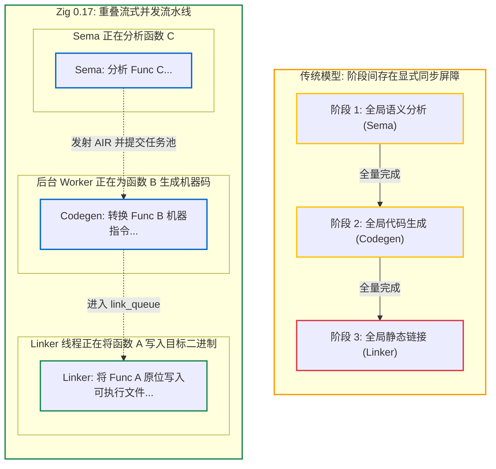

# 5.3 重叠流水线：Sema、Codegen 与 Linker 的异步并发

在传统编译器工具链（如 GCC、Clang 或 Rustc）的常规工作流中，编译阶段通常具有明确的串行屏障：
1. 等待全部源文件完成语法与语义分析；
2. 随后启动代码生成，输出所有目标文件（`.o`）；
3. 待全部目标文件写盘完毕，调用系统链接器执行符号解析与最终二进制重写。

这种阶段同步屏障（Global Barrier）可能导致硬件资源的利用不均衡：在链接阶段单核读取目标文件时，多核 CPU 的前中端分析线程可能处于等待空闲状态。

Zig 0.17 采用了**重叠流水线（Overlapped Pipeline）**设计，使语义分析、代码生成与链接写入并发重叠进行。

---

## 阶段屏障模型与重叠流水线模型对比



---

## 源码实现：函数分析完成后的即时链接流转

查看核心驱动代码：[`src/Zcu/PerThread.zig#L2310-L2324`](https://codeberg.org/ziglang/zig/src/tag/0.17.0/src/Zcu/PerThread.zig#L2310-L2324)：

```zig
// 当 Sema 刚刚完成某个函数体 (func_index) 的分析并产出 air 时：
if (comp.bin_file != null or zcu.llvm_object != null or dump_air) {
    zcu.codegen_prog_node.increaseEstimatedTotalItems(1);
    comp.link_prog_node.increaseEstimatedTotalItems(1);

    // 1. 将函数代码生成任务放入任务池
    const codegen_task = try zcu.codegen_task_pool.start(zcu, func_index, &air, disown_air);
    if (disown_air) air_owned = false;

    // 2. 将该任务压入链接队列 (link_queue)
    try comp.link_queue.enqueueZcu(comp, pt.tid, .{ .link_func = codegen_task });
}
```

### 流水线流转逻辑：
1. **Sema 连续推进**：
   函数 `foo` 分析完成后，Sema 将其打包提交至任务队列，随即继续分析下一个函数 `bar`；
2. **多线程并发代码生成**：
   线程池中的空闲线程提取 `foo` 的任务，将 AIR 指令翻译为目标机器汇编指令；
3. **链接器流式消费与写入**：
   常驻运行的内部链接器从 `link_queue` 消费已生成的机器码片段，在内存映射的目标二进制文件（如 ELF 或 Mach-O）中计算偏移，并直接写入目标段。

这种流式重叠使得在语义分析完成阶段，大部分函数的机器指令已经完成了二进制写盘，避免了编译后期出现长耗时的全量重新链接等待。

---

## 阶段总结

在本部分中，我们分析了 Zig 0.17 的宏观架构设计：
- `Compilation` 与 `Zcu` 实现了工程配置与语言语义的解耦分治；
- `PerThread` 与分片架构降低了多线程并发时的锁争用；
- **重叠流水线** 实现了分析、代码生成与链接写入的并发重叠推进。

接下来，我们将进入代码生成与后端体系。Zig 提供了哪些后端实现？自研原生后端又是如何在不依赖 LLVM 的情况下生成机器码的？

第 6 部分将探讨 **多后端生态与机器码生成**。
