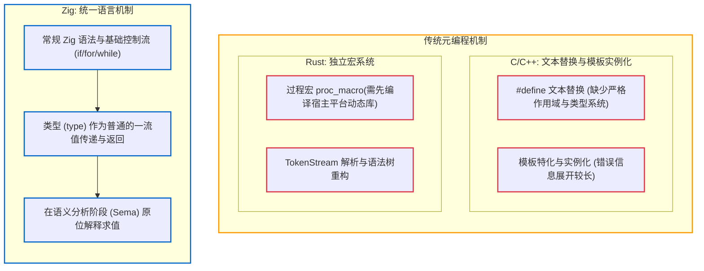

# 4.1 Comptime 机制解析：统一元编程与泛型实现

在系统级编程语言中，编译期元编程（Metaprogramming）通常有不同的工程实现路径：
- C 语言使用 **预处理器宏（C Preprocessor）** 执行文本级替换；
- C++ 采用 **模板（Templates）** 与 `constexpr`，借助模板特化与 SFINAE 实现编译期推导；
- Rust 采用 **声明宏（`macro_rules!`）与过程宏（Procedural Macros）**，通过操作 AST / TokenStream 进行语法展开。

Zig 则采用了 **`comptime`（编译期求值）** 机制。

本节我们将从编译器实现视角，分析 `comptime` 的运行机制及其与传统宏、模板的区别。

---

## 常见编译期元编程方案对比

在传统语言中，元编程逻辑往往脱离核心语法，存在额外的机制层：



1. **语法体系的统一性**：
   在 C++ 和 Rust 中，编译期代码往往需要使用特定的语法构造（如 C++ 的模板参数列表与特化规则，或 Rust 的宏规则定义与 AST 节点构建）。而在 Zig 中，编译期执行的代码与常规运行期代码使用相同的语法构造。
2. **构建流程与依赖处理**：
   在 Rust 中，过程宏本质上是由编译器先为宿主架构编译独立的动态库（`.so`/`.dylib`），随后在编译主程序时通过动态链接加载该库。而在 Zig 中，编译期计算在编译器主进程的语义分析阶段直接求值，无需额外的宿主库构建与动态加载步骤。
3. **泛型实现形式**：
   传统泛型单态化（Monomorphization）通常依赖专有的模板语法。Zig 将泛型统一规约为“接收类型作为参数并返回类型的普通函数”。

---

## 类型作为一流值（Types are First-Class Values）

在 Zig 中，类型系统的一个基本属性是：**类型（`type`）本身是一个可以在编译期流转的一流值（First-Class Value）**。

### 泛型函数的本质
Zig 中没有 `<T>` 的专用泛型声明语法，泛型结构体或泛型算法通过普通函数表示：

```zig
// 普通函数：参数 T 的类型为 'type'，函数返回值也是 'type'
fn List(comptime T: type) type {
    return struct {
        items: []T,
        len: usize,

        pub fn append(self: *List(T), item: T) void {
            // ...
        }
    };
}

// 实例化泛型
var my_list: List(u32) = undefined;
```

运行逻辑：
- `T` 作为形参传入，在编译期被标记为 `comptime`；
- 函数内部依据传入的具体类型构造并返回一个新的匿名结构体类型；
- 函数内部可直接使用常规的条件判断（如 `if (T == u8)`）或循环逻辑。

---

## 编译期分支修剪（Comptime Branch Pruning）

`comptime` 在语义分析期的一个显著特征是：**已知为假的分支在语义分析的最早阶段即被剪除，不进入后续的类型推导与代码生成**。

示例：

```zig
fn serialize(writer: anytype, value: anytype) !void {
    const T = @TypeOf(value);
    if (T == u32) {
        try writer.writeInt(u32, value, .little);
    } else if (T == []const u8) {
        try writer.writeAll(value);
    } else {
        @compileError("Unsupported type: " ++ @typeName(T));
    }
}
```

当在调用处传入 `serialize(w, @as(u32, 100))` 时：
1. 编译期确定 `T == u32` 为 `true`；
2. **编译器对 `else if` 和 `else` 分支不做语义分析与类型检查**；
3. 未命中的分支即使包含 `@compileError` 或在当前类型上不合法的成员调用，也不会被触发。

这种分支修剪特性使开发者可以使用直接的条件语句实现静态分发，而无需复杂的模板元编程技巧。

下一节我们将查看 [`src/Sema.zig`](https://codeberg.org/ziglang/zig/src/tag/0.17.0/src/Sema.zig)，分析语义分析与 `comptime` 的具体协作流程。
