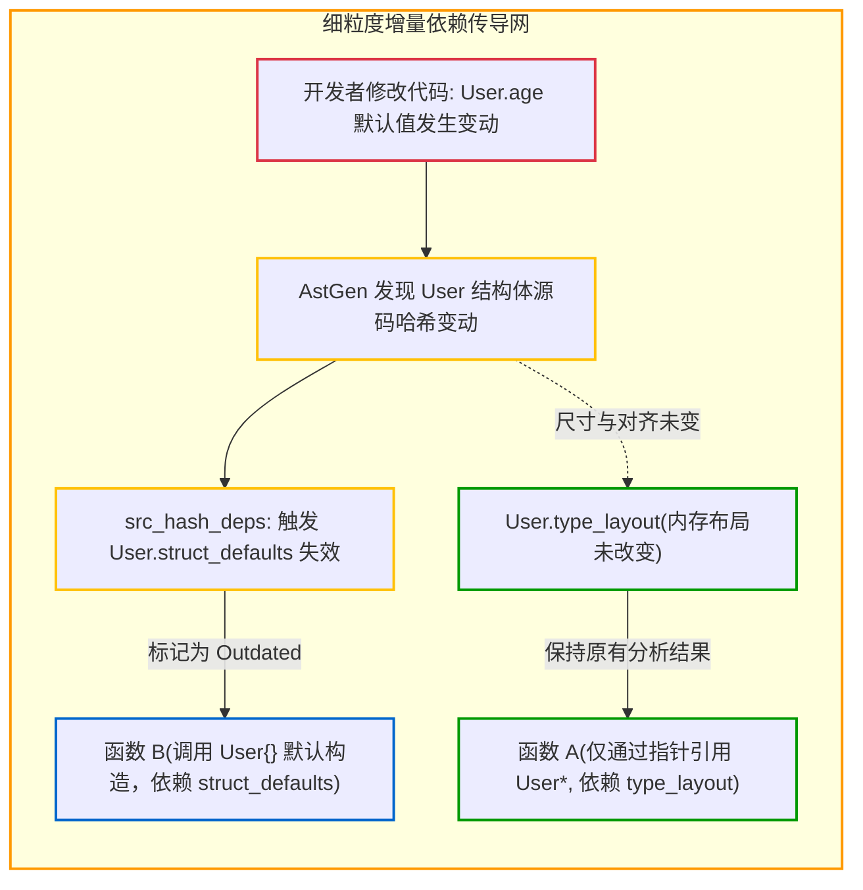

# 4.5 细粒度增量依赖追踪：AnalUnit 与级联失效

在增量编译（Incremental Compilation）中，核心挑战在于：
**“当源代码发生局部修改时，如何精准确定哪些函数和类型需要重新分析，哪些可以安全复用？”**

若以源文件为追踪粒度，头文件或公共模块的轻微改动往往导致下游所有文件重新编译；若追踪粒度过细，构建和维护依赖图本身的内存与遍历开销可能会抵消增量带来的收益。

Zig 0.17 在 [`src/InternPool.zig`](https://codeberg.org/ziglang/zig/src/tag/0.17.0/src/InternPool.zig) 中设计了以 **`AnalUnit`** 为基础单元的紧凑依赖追踪体系。

---

## 最小分析实体：`AnalUnit`（Analysis Unit）

查看 [`src/InternPool.zig#L420-L452`](https://codeberg.org/ziglang/zig/src/tag/0.17.0/src/InternPool.zig#L420-L452)：

```zig
/// Analysis Unit. Represents a single entity which undergoes semantic analysis.
/// This is the "source" of an incremental dependency edge.
pub const AnalUnit = packed struct(u64) {
    kind: Kind,
    id: u32,

    pub const Kind = enum(u32) {
        @"comptime",      // 编译期独立声明
        nav_val,          // 全局变量/常量的值解析
        nav_ty,           // 全局变量/常量的类型解析
        type_layout,      // 结构体/联合体的内存布局解析
        struct_defaults,  // 结构体字段默认初始值解析
        func,             // 具体函数的函数体分析
        memoized_state,   // 内部记忆化状态
    };
    // ...
};
```

结构设计特点：
- `AnalUnit` 采用 `packed struct(u64)`，刚好占用一个 64 位机器字，可直接作为哈希表的 Key 在寄存器中高效传递。
- **解耦“类型”与“值”**：一个全局常量（`Nav`）的**类型解析（`nav_ty`）**与**值计算（`nav_val`）**被作为两个独立的分析单元。若常量的具体取值修改但其类型未变，下游仅依赖其类型的函数无需重新分析。

---

## 依赖关系分类

在 [`src/InternPool.zig#L44-L95`](https://codeberg.org/ziglang/zig/src/tag/0.17.0/src/InternPool.zig#L44-L95) 中，`InternPool` 维护了细分领域的依赖映射表：



主要依赖类型包括：
1. `src_hash_deps`：依赖特定 ZIR 声明的源码哈希；
2. `nav_val_deps`：依赖某个全局常量的具体求值；
3. `nav_ty_deps`：依赖某个全局常量的类型；
4. `type_layout_deps`：依赖类型的内存大小与对齐方式；
5. `struct_defaults_deps`：依赖结构体字段的默认初始值；
6. `source_file_deps`：依赖引入的源文件。

---

## 增量判定与失效唤醒

当文件在监视构建模式下被保存时：

1. **源码哈希比对**：
   AstGen 对修改的文件重新生成 ZIR，并将顶层声明的源码哈希与上一轮构建保留的哈希进行对比。
2. **定向失效标记（`markDependeeOutdated`）**：
   若哈希改变，调用 `markDependeeOutdated`，顺着依赖链将受直接影响的 `AnalUnit` 标记为 `outdated`（已过时）或 `potentially_outdated`（潜在过时）。未受波及的函数与类型保持已分析状态。
3. **按需补齐分析（`findOutdatedToAnalyze`）**：
   语义分析主循环通过 `zcu.findOutdatedToAnalyze()` 仅调度处理被标记为过时的单元，重新生成对应函数的 AIR，并将变动结果提交给增量链接器执行原位补丁。

---

## 阶段小结

通过本部分的分析，我们了解了 Zig 语义分析与增量追踪机制：
- **`comptime`** 在 Sema 中直接求值，统一了泛型与元编程实现；
- **按需延迟分析** 使未被调用的代码免于多余的类型检查；
- **`InternPool`** 实现了常数时间类型等价比较与分片并发；
- **`AnalUnit` 依赖图** 为增量编译提供了字段级别的精确失效定位。

接下来的第 5 部分，我们将探讨编译器的全局调度中心——**`Compilation.zig` 与重叠流水线并发模型**。
