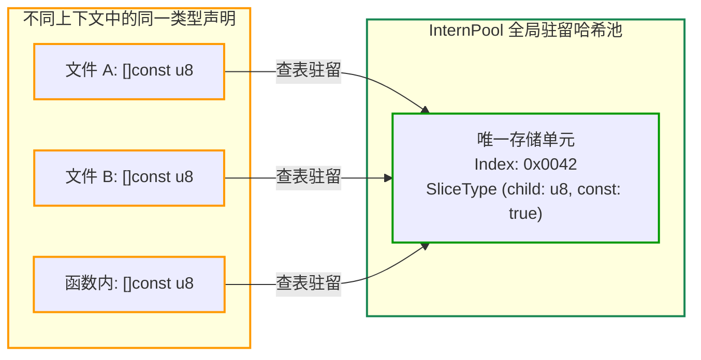

# 4.4 类型与常量驻留池：InternPool.zig 深度剖析

在编译器设计中，类型（Type）和常量（Constant Value）的内存表示方式对编译吞吐量与内存占用有直接影响。

如果编译器各处均采用独立的堆分配对象来表示类型结构（例如嵌套定义指针与类型描述符），在类型检查与等价性判定时往往需要遍历深层指针结构，且容易产生大量短生命周期的临时分配。

Zig 0.17 在 [`src/InternPool.zig`](https://codeberg.org/ziglang/zig/src/tag/0.17.0/src/InternPool.zig) 中采用**全局驻留池（Intern Pool）**统一管理类型与编译期常量。

---

## 驻留（Interning）机制：类型与常量的索引化

查看源码头部注释 [`src/InternPool.zig#L1-L2`](https://codeberg.org/ziglang/zig/src/tag/0.17.0/src/InternPool.zig#L1-L2)：

> *"All interned objects have both a value and a type. This data structure is self-contained."*

在 `InternPool` 中，无论是基础类型 `u32`、切片类型 `[]const u8`、结构体定义，还是大整型常量：
**相同的类型或常量在全局驻留池中仅保存一份物理数据。**

在编译器内部流动与引用时，这些对象被统一表达为 32 位整型索引（`InternPool.Index`）：



### 类型等价性比较的开销
在未采用全局驻留的系统中，判定两个复杂类型是否等价通常需要递归比对子类型、修饰符与对齐要求。

而在 `InternPool` 架构下，类型等价性比较退化为简单的整型比较：

```zig
// 在 Sema 中判断两个类型是否完全相同：
if (type_a.ip_index == type_b.ip_index) {
    // 两个类型完全相同，耗时为 O(1)
}
```

---

## 分片并发设计（Sharded Architecture）

在多线程并行编译时，多个线程可能会并发请求向 `InternPool` 写入新构造的类型或常量。如果采用单一互斥锁，可能会在高并发下形成排队瓶颈。

查看 [`src/InternPool.zig#L22-L26`](https://codeberg.org/ziglang/zig/src/tag/0.17.0/src/InternPool.zig#L22-L26)：

```zig
/// 每一个编译线程独享一个 Local 缓存，以线程 ID (tid) 为索引
locals: []Local,

/// 分片数组，长度通常为 2 的整数次幂 (如 64、128)
/// 决定可以同时并发写入独立分片的最大并发数
shards: []Shard,
```

### 分片锁的执行逻辑：
1. 当某个工作线程构造并尝试驻留一个新类型时，首先计算该类型的哈希值 `full_hash`；
2. 依据低位掩码计算出目标分片索引：`shard_index = full_hash & (shards.len - 1)`；
3. **仅对目标分片（Shard）加锁**；
4. 访问其他分片的线程互不干扰，降低锁争用概率。

---

## 阶段小结

`InternPool` 在实现类型去重与常数时间判等的同时，还为增量编译提供了关键支撑——细粒度依赖追踪。

在下一节中，我们将分析基于 `AnalUnit` 的依赖追踪与级联失效算法。
