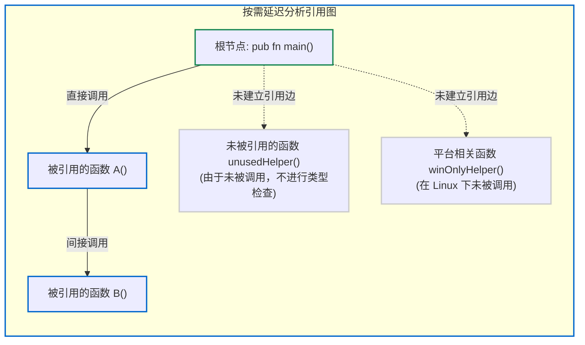

# 4.3 按需延迟分析：Lazy Analysis 机制

在多数传统静态类型语言的编译器中，编译单元内的所有顶层声明通常都会被无差别地执行语义分析与类型检查，无论这些声明在最终程序中是否被实际调用。

而在 Zig 0.17 中，顶层声明采用**按需延迟分析（Lazy Analysis）**策略：**未被根符号（如 `main` 或 `export` 声明）直接或间接引用的顶层函数或变量，Sema 不会对其进行类型推导与语义检查。**

---

## 分析起点：分析根（Analysis Roots）的设定

在 [`src/Zcu/PerThread.zig#L303-L325`](https://codeberg.org/ziglang/zig/src/tag/0.17.0/src/Zcu/PerThread.zig#L303-L325) 中，整个编译器的语义分析过程是由特定的**“分析根（Analysis Roots）”**触发的：

```zig
// 仅从少数几个确定的入口开始播种：
// 1. 显式标记为 export 的 C ABI 导出函数
// 2. 顶层的 comptime 代码块
// 3. main 入口函数
// 4. 测试构建模式下的 test 块
for (zcu.analysisRoots()) |analysis_root_mod| {
    const analysis_root_file = zcu.module_roots.get(analysis_root_mod).?.unwrap().?;
    try pt.ensureFilePopulated(analysis_root_file);
}
```



---

## 延迟分析的行为特征与应用场景

看一个典型的代码示例：

```zig
const std = @import("std");

pub fn main() void {
    std.debug.print("Hello, Zig!\n", .{});
}

// 该函数语法合法，但内部类型赋值明显不兼容
fn unusedFunction() void {
    var x: u32 = "invalid string literal";
    var y: bool = 12345;
}
```

在 C++ 或 Rust 等编译器中编译该文件，编译器在模块语义检查阶段会直接报错中断。

而在 Zig 0.17 中执行 `zig build-exe main.zig` 时：
该命令会顺利编译完成，程序输出 `Hello, Zig!`。

### 这种机制的设计目的：
1. **减少平台兼容代码中宏包裹的需求**：
   在 C 语言中，为适配跨平台差异，通常需要使用大量 `#ifdef _WIN32` 或 `#ifdef __linux__` 宏将特定平台代码包裹起来。而在 Zig 中，若某个包含特定平台系统调用的函数在当前平台逻辑分支下未被调用，该函数在 ZIR 阶段保持未激活状态，不会触发类型分析。
2. **降低引入大型标准库时的编译成本**：
   当源文件使用 `@import("std")` 引入包含数十万行代码的标准库时，若程序仅调用了少数几个打印函数，由于惰性分析的存在，编译器仅对实际调用的函数链路进行类型推导与代码生成，未使用的模块不会带来语义分析开销。

下一节我们将探讨类型与常量的全局管理容器——[`src/InternPool.zig`](https://codeberg.org/ziglang/zig/src/tag/0.17.0/src/InternPool.zig)。
