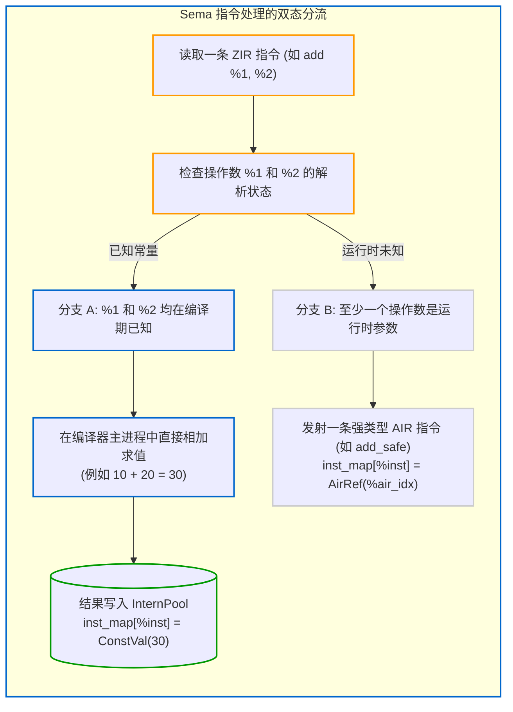

# 4.2 统一语义分析与解释器：Sema.zig 剖析

在 Zig 0.17 编译器中，[`src/Sema.zig`](https://codeberg.org/ziglang/zig/src/tag/0.17.0/src/Sema.zig) 是处理类型推断、合法性校验与编译期计算的核心枢纽。

`Sema.zig` 的核心职责为：**读取无类型的 ZIR 指令，结合当前上下文推导类型与约束，直接解释执行 Comptime 表达式，并将需要在运行期计算的代码生成为全类型的 AIR 指令。**

---

## `Sema` 的核心状态机

查看 [`src/Sema.zig#L40-L115`](https://codeberg.org/ziglang/zig/src/tag/0.17.0/src/Sema.zig#L40-L115)，Sema 结构体包含以下关键运行字段：

```zig
const Sema = @This();

pt: Zcu.PerThread,
gpa: Allocator,
arena: Allocator, // 伴随本次分析生命周期的临时 Arena 内存

/// 当前正在分析的源文件 ZIR 指令流
code: Zir,

/// 正在构建的函数级 AIR 指令缓冲
air_instructions: std.MultiArrayList(Air.Inst) = .{},
air_extra: std.ArrayList(u32) = .empty,

/// 核心映射表：记录某个 ZIR 指令对应解析成了什么 (常量值还是 AIR 运行时结果)
inst_map: InstMap = .{},

/// 本次分析的目标实体 (函数 / 全局变量 / Comptime 块)
owner: AnalUnit,

/// 编译期分支配额限制 (防止 comptime 死循环挂起编译器)
branch_quota: u32 = default_branch_quota,
branch_count: u32 = 0,

/// 编译期堆内存分配追踪器
comptime_allocs: std.ArrayList(ComptimeAlloc) = .empty,
```

---

## 双态处理模式：编译期已知还是运行期未知？

Zig 编译器内部并未引入外部的独立虚拟机或额外解释器进程，`Sema` 自身在遍历 ZIR 时按操作数状态进行双态处理：



1. **若操作数在编译期已知（Comptime-known）**：
   例如 `const a = 10; const b = 20; const c = a + b;`
   当 Sema 判定 `a` 和 `b` 在 `inst_map` 中均映射至常量时，Sema **直接在宿主机进程中计算该结果**。计算产出的常量 `30` 被存入 `InternPool` 固化。下游的后端代码生成器不会收到这条加法指令，因为它在编译期已被折叠。
2. **若操作数包含运行期变量（Runtime-known）**：
   例如 `fn add(x: u32, y: u32) u32 { return x + y; }`
   `x` 和 `y` 为函数的运行时参数。Sema 进行类型匹配与合法性核验后，向 `air_instructions` 中追加一条具体的 AIR 指令（例如根据当前构建安全模式追加 `add_safe`）。

这种将类型检查、常量折叠与求值统一于单次遍历的处理机制，减少了多次中间转换的开销。

---

## 编译期保护机制与内存生命周期跟踪

### 1. 分支配额机制（Branch Quota）
由于 Zig 允许在编译期执行图灵完备的逻辑，若代码中出现无限循环，编译器可能无法终止。

Sema 引入了 `branch_quota`（默认 1000 次限制）：
在编译期执行分支或循环跳转时，`branch_count` 会递增。若超出配额，Sema 终止分析并返回编译提示：`evaluation exceeded quota`。若项目确实需要大规模的编译期计算，可通过内置函数 `@setEvalBranchQuota(...)` 显式调整配额上限。

### 2. 编译期堆内存分配跟踪（`comptime_allocs`）
在 Zig 中，开发者可以在 `comptime` 语句块中使用内存分配器进行动态内存分配：
```zig
comptime {
    var list = std.ArrayList(u32).init(std.heap.page_allocator);
    // 在编译期进行动态分配与处理
}
```
Sema 会通过 `comptime_allocs` 跟踪这些内存分配的生命周期：
- 若编译期分配的数据最终被绑定至只读全局常量，该部分内存内容会被固化写入目标可执行文件的只读数据段（如 `.rodata`）；
- 若分配的数据在作用域结束时未被有效引用且未被释放，编译器能够在编译期检测并报告内存问题。

下一节中，我们将探讨 Sema 的另一项基础特性——**按需延迟分析（Lazy Analysis）**。
