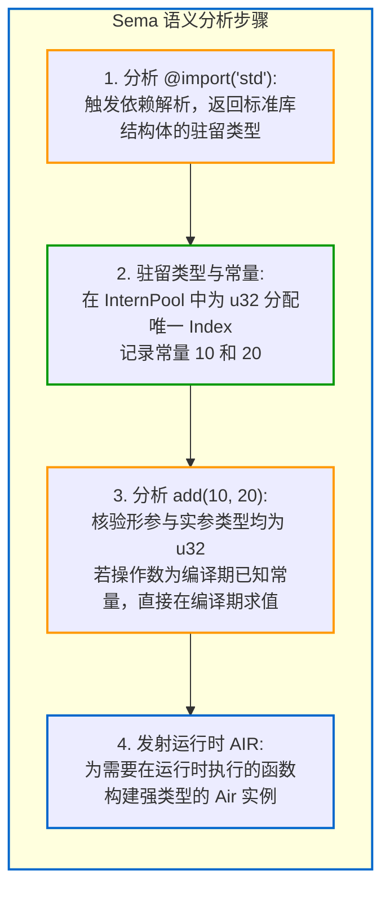

# 8.1 一个完整 main.zig 程序的端到端编译流程

在前七个部分中，我们分别分析了 Zig 0.17 编译器的各个核心子系统。为了将这些阶段连贯起来，本节将通过一个基础的 Zig 源程序，演示它在编译器内部经历的完整编译阶段。

---

## 示例源码：基础加法程序

```zig
// main.zig
const std = @import("std");

fn add(a: u32, b: u32) u32 {
    return a + b;
}

pub fn main() void {
    const x: u32 = 10;
    const y: u32 = 20;
    const z = add(x, y);
    std.debug.print("sum = {d}\n", .{z});
}
```

---

## 阶段一：词法分析（`tokenizer.zig`）

执行 `zig build-exe main.zig` 时，源码切片首先传入 [`lib/std/zig/tokenizer.zig`](https://codeberg.org/ziglang/zig/src/tag/0.17.0/lib/std/zig/tokenizer.zig)。

- **容量预分配**：文本长度约 200 字节。依据 `8:1` 经验法则，`Ast.TokenList` 一次性预分配容纳约 25 个 Token 的空间；
- **词法扫描**：
  - `const` -> `Token.Tag.keyword_const`
  - `std` -> `Token.Tag.identifier`
  - `=` -> `Token.Tag.equal`
  - `@import` -> `Token.Tag.builtin`
  - `"std"` -> `Token.Tag.string_literal`
  - ...
- **产出结果**：紧凑的 `Ast.TokenList`（每个 Token 占用 5 字节，记录 `tag` 与 `start` 偏移）。过程中不发生字符串复制。

---

## 阶段二：语法分析（`Parse.zig` 与 `Ast.zig`）

Token 序列经由递归下降分析器 [`lib/std/zig/Parse.zig`](https://codeberg.org/ziglang/zig/src/tag/0.17.0/lib/std/zig/Parse.zig)，构建出基于平整数组的语法树：

- 节点以 SoA 形式记录在 `tree.nodes` 中：
  - `Node[0]`（根节点）：Tag 为 `.root`，索引顶层声明列表；
  - `Node[1]`：Tag 为 `.simple_var_decl`，定义了常量 `std`；
  - `Node[2]`：Tag 为 `.fn_decl`，定义了函数 `add`；
  - `Node[3]`：Tag 为 `.fn_decl`，定义了函数 `main`；
- 函数形参列表（`(a: u32, b: u32)`）与函数体语句块等附加索引记录在平整的 `tree.extra_data: []u32` 数组中。

在此阶段，AST 节点均摊大小为 13 字节，不使用指针互连。

---

## 阶段三：降级为无类型字节码（`AstGen.zig` -> `Zir.zig`）

前端模块启动 [`lib/std/zig/AstGen.zig`](https://codeberg.org/ziglang/zig/src/tag/0.17.0/lib/std/zig/AstGen.zig)，将树状 AST 展平为单文件独立的 ZIR 字节码序列：

```
// ZIR 结构示意 (无类型指令流)
%0 = import("std")
%1 = declaration("std", %0)

%2 = param("a")
%3 = param("b")
%4 = add(%2, %3)            // 此时尚未标注具体类型
%5 = func_decl("add", body=%4)

%6 = int(10)
%7 = int(20)
%8 = call(%5, args=[%6, %7])
// ...
```

在此阶段：
1. 编译器计算 `main.zig` 中每个函数的独立源码哈希；
2. 将平整的 ZIR 数组序列化写入 `.zig-cache/z/<hash>`，供后续增量构建复用。

---

## 阶段四：语义分析与 Comptime 求值（`Sema.zig` + `InternPool.zig`）

这是语义分析与类型推导的关键阶段。
`Zcu` 检测到 `main` 为分析入口根节点，唤醒 [`src/Sema.zig`](https://codeberg.org/ziglang/zig/src/tag/0.17.0/src/Sema.zig)：



若 `add` 函数在运行时接收外部参数，Sema 将向 `Air` 中发射一条带安全检查的强类型加法：
```
%res = Air.Inst.add_safe(%param_a, %param_b)
```

---

## 阶段五：机器代码生成（`codegen/aarch64` 或 `x86_64`）

Sema 完成函数 `main()` 的 AIR 分析后，向 `link_queue` 提交异步 Codegen 任务：

1. **`Air/Liveness.zig`**：计算变量的生存周期，辅助寄存器分配；
2. **`Select.zig`**：将 `add_safe` 映射为目标架构的物理汇编：
   - 在 x86_64 架构下：生成 `add eax, ecx`，并配合溢出跳转检查；
   - 在 AArch64 架构下：生成 `adds w0, w0, w1`，并配合溢出跳转检查；
3. **`Assemble.zig`**：通过位操作拼接将汇编助记符编码为物理机器指令字节序列。

---

## 阶段六：自研链接器装配与输出（`src/link/`）

在独立线程中运行的自研链接器（如 Linux 下的 [`src/link/Elf2.zig`](https://codeberg.org/ziglang/zig/src/tag/0.17.0/src/link/Elf2.zig) 或 macOS 下的 [`src/link/MachO.zig`](https://codeberg.org/ziglang/zig/src/tag/0.17.0/src/link/MachO.zig)）接管机器码：

1. 打开目标输出文件并建立内存映射（`MappedFile`）；
2. 将机器码字节写入可执行文件的 `.text` 代码段对应偏移位置；
3. 构造 ELF/Mach-O 文件头、段表和程序入口点（Entry Point）；
4. 调用 `msync` 同步刷盘，输出具备可执行权限的最终二进制。

---

## 全流程映射图

```
[main.zig 文本]
      ↓ (tokenizer.zig - 词法切词)
[TokenList (SoA, 5B/Token)]
      ↓ (Parse.zig - 递归下降)
[Ast.zig (零指针, 13B/Node)]
      ↓ (AstGen.zig - 语法线性化)
[Zir.zig (无类型单文件字节码, 支持磁盘缓存)]
      ↓ (Sema.zig - 语义分析 + Comptime 求值)
[Air.zig (强类型单函数运行时 IR)]
      ↓ (codegen - 指令选择与汇编编码)
[原生机器码二进制片段]
      ↓ (link.File - 内存映射写入与增量补丁)
[目标可执行文件]
```

这构成了 Zig 0.17 编译器从源码到二进制产物的完整端到端执行流。
